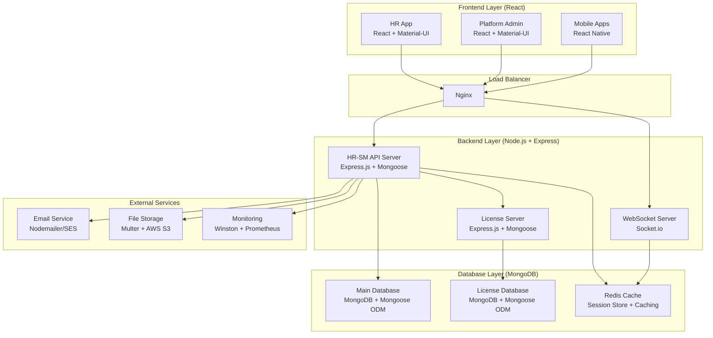
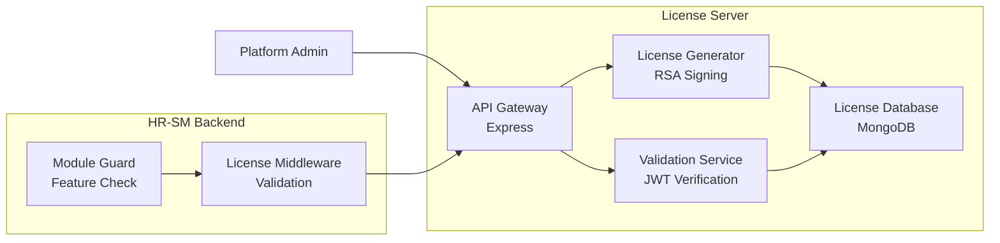

# Design Document

## Overview

The HR-SM Enterprise Enhancement transforms the existing MERN stack multi-tenant SaaS platform into a fully professional, license-controlled enterprise system with production-ready operational capabilities. This design builds upon the current modular architecture while adding comprehensive enterprise components: enhanced platform administration with real-time monitoring, a separate license server with RSA encryption and machine binding, a complete life insurance management module, advanced security features, disaster recovery capabilities, and scalability optimizations.

The enhancement maintains backward compatibility with the existing system while introducing enterprise-grade features including real-time monitoring with WebSocket updates, advanced tenant management with usage analytics, secure license enforcement with JWT tokens, complete insurance policy lifecycle management, automated backup and recovery systems, performance optimization with Redis caching, and comprehensive deployment and maintenance procedures for production environments.

## Architecture

### MERN Stack Architecture



### Enhanced Platform Architecture

The platform maintains the existing dual-namespace API design while adding new enterprise features:

**Existing Namespaces:**
- `/api/v1/*` - Tenant operations (HR users, employees)
- `/platform/*` - Platform administration

**New Enterprise Features:**
- Real-time monitoring dashboard
- Advanced tenant analytics
- License server integration
- Life insurance module
- Enhanced security and audit logging

### License Server Architecture



## Components and Interfaces

### 1. Enhanced Platform Admin Dashboard (React Frontend)

**Location:** `client/platform-admin/src/`

**MERN Stack Implementation:**

**React Components with Hooks:**
```javascript
// EnhancedDashboard.jsx - Main dashboard component
import React, { useState, useEffect } from 'react';
import { Grid, Paper, Typography, Box } from '@mui/material';
import { io } from 'socket.io-client';
import SystemMetrics from './SystemMetrics';
import TenantHealthMonitor from './TenantHealthMonitor';
import RevenueAnalytics from './RevenueAnalytics';

const EnhancedDashboard = () => {
  const [metrics, setMetrics] = useState({});
  const [socket, setSocket] = useState(null);

  useEffect(() => {
    // Socket.io client connection
    const newSocket = io('/platform-metrics');
    setSocket(newSocket);

    newSocket.on('metrics-update', (data) => {
      setMetrics(data);
    });

    return () => newSocket.close();
  }, []);

  return (
    <Grid container spacing={3}>
      <Grid item xs={12} md={6}>
        <SystemMetrics data={metrics.system} />
      </Grid>
      <Grid item xs={12} md={6}>
        <TenantHealthMonitor data={metrics.tenants} />
      </Grid>
      <Grid item xs={12}>
        <RevenueAnalytics data={metrics.revenue} />
      </Grid>
    </Grid>
  );
};
```

**Material-UI Components:**
- **SystemMetrics.jsx**: Real-time system monitoring with Chart.js
- **TenantHealthMonitor.jsx**: Tenant status grid with color indicators
- **RevenueAnalytics.jsx**: Financial charts using Recharts
- **AlertsPanel.jsx**: Notification system with Snackbar

**State Management:**
```javascript
// Using React Context for global state
import { createContext, useContext, useReducer } from 'react';

const PlatformContext = createContext();

export const usePlatform = () => {
  const context = useContext(PlatformContext);
  if (!context) {
    throw new Error('usePlatform must be used within PlatformProvider');
  }
  return context;
};
```

### 2. Advanced Tenant Management (Express + Mongoose)

**Location:** `server/platform/tenants/`

**Mongoose Schema with MERN Patterns:**
```javascript
// models/Tenant.js
import mongoose from 'mongoose';

const tenantSchema = new mongoose.Schema({
  // Existing fields...
  name: { type: String, required: true },
  subdomain: { type: String, required: true, unique: true },
  
  // Enhanced metrics with Mongoose subdocuments
  metrics: {
    totalUsers: { type: Number, default: 0 },
    activeUsers: { type: Number, default: 0 },
    storageUsed: { type: Number, default: 0 }, // MB
    apiCallsThisMonth: { type: Number, default: 0 },
    lastActivityAt: { type: Date, default: Date.now }
  },
  
  // Billing subdocument
  billing: {
    currentPlan: { 
      type: String, 
      enum: ['trial', 'basic', 'professional', 'enterprise'],
      default: 'trial'
    },
    billingCycle: { 
      type: String, 
      enum: ['monthly', 'yearly'],
      default: 'monthly'
    },
    nextBillingDate: Date,
    paymentStatus: { 
      type: String, 
      enum: ['active', 'past_due', 'canceled'],
      default: 'active'
    },
    totalRevenue: { type: Number, default: 0 }
  },
  
  // Usage restrictions
  restrictions: {
    maxUsers: { type: Number, default: 50 },
    maxStorage: { type: Number, default: 1024 }, // MB
    maxAPICallsPerMonth: { type: Number, default: 10000 }
  },
  
  // License integration
  license: {
    licenseKey: String,
    licenseType: String,
    expiresAt: Date,
    machineId: String,
    activatedAt: Date
  },
  
  // Compliance tracking
  compliance: {
    dataResidency: { 
      type: String, 
      enum: ['US', 'EU', 'ASIA'],
      default: 'US'
    },
    gdprCompliant: { type: Boolean, default: false },
    soc2Certified: { type: Boolean, default: false },
    lastAuditDate: Date
  }
}, { 
  timestamps: true,
  toJSON: { virtuals: true },
  toObject: { virtuals: true }
});

// Mongoose virtual for computed fields
tenantSchema.virtual('storageUsagePercentage').get(function() {
  return (this.metrics.storageUsed / this.restrictions.maxStorage) * 100;
});

// Mongoose middleware for automatic updates
tenantSchema.pre('save', function(next) {
  if (this.isModified('metrics.storageUsed')) {
    this.metrics.lastActivityAt = new Date();
  }
  next();
});

export default mongoose.model('Tenant', tenantSchema);
```

**Express Controllers with Async/Await:**
```javascript
// controllers/tenantController.js
import Tenant from '../models/Tenant.js';
import { asyncHandler } from '../../../core/utils/asyncHandler.js';

export const getTenantMetrics = asyncHandler(async (req, res) => {
  const { tenantId } = req.params;
  
  const tenant = await Tenant.findById(tenantId)
    .select('metrics billing restrictions')
    .lean(); // Mongoose optimization
  
  if (!tenant) {
    return res.status(404).json({
      success: false,
      message: 'Tenant not found'
    });
  }
  
  res.json({
    success: true,
    data: tenant
  });
});

export const bulkUpdateTenants = asyncHandler(async (req, res) => {
  const { tenantIds, updates } = req.body;
  
  // Mongoose bulk operation
  const result = await Tenant.updateMany(
    { _id: { $in: tenantIds } },
    { $set: updates },
    { runValidators: true }
  );
  
  res.json({
    success: true,
    data: {
      modifiedCount: result.modifiedCount,
      matchedCount: result.matchedCount
    }
  });
});
```

### 3. System Monitoring Service (Node.js + Express + Socket.io)

**Location:** `server/core/monitoring/`

**Node.js System Metrics with Express:**
```javascript
// services/systemMetrics.js
import os from 'os';
import process from 'process';
import mongoose from 'mongoose';

class SystemMetrics {
  static getMetrics() {
    return {
      cpu: {
        usage: process.cpuUsage(),
        loadAverage: os.loadavg(),
        cores: os.cpus().length
      },
      memory: {
        total: os.totalmem(),
        free: os.freemem(),
        used: os.totalmem() - os.freemem(),
        percentage: ((os.totalmem() - os.freemem()) / os.totalmem()) * 100
      },
      uptime: process.uptime(),
      platform: os.platform(),
      nodeVersion: process.version
    };
  }
  
  // MongoDB metrics using Mongoose
  static async getDatabaseMetrics() {
    try {
      const stats = await mongoose.connection.db.stats();
      return {
        collections: stats.collections,
        dataSize: stats.dataSize,
        storageSize: stats.storageSize,
        indexes: stats.indexes,
        avgObjSize: stats.avgObjSize,
        connected: mongoose.connection.readyState === 1
      };
    } catch (error) {
      return { error: error.message, connected: false };
    }
  }
}

export default SystemMetrics;
```

**Socket.io Real-time Updates:**
```javascript
// services/realtimeMonitoring.js
import { Server } from 'socket.io';
import SystemMetrics from './systemMetrics.js';

class RealtimeMonitoring {
  constructor(server) {
    this.io = new Server(server, {
      cors: {
        origin: process.env.CLIENT_URL || "http://localhost:3000",
        methods: ["GET", "POST"]
      }
    });
    
    this.setupNamespaces();
    this.startMetricsCollection();
  }
  
  setupNamespaces() {
    // Platform metrics namespace
    this.platformNamespace = this.io.of('/platform-metrics');
    
    this.platformNamespace.on('connection', (socket) => {
      console.log('Platform admin connected:', socket.id);
      
      socket.on('disconnect', () => {
        console.log('Platform admin disconnected:', socket.id);
      });
    });
  }
  
  startMetricsCollection() {
    // Emit metrics every 30 seconds
    setInterval(async () => {
      try {
        const systemMetrics = SystemMetrics.getMetrics();
        const dbMetrics = await SystemMetrics.getDatabaseMetrics();
        
        const metricsData = {
          system: systemMetrics,
          database: dbMetrics,
          timestamp: new Date().toISOString()
        };
        
        this.platformNamespace.emit('metrics-update', metricsData);
      } catch (error) {
        console.error('Error collecting metrics:', error);
      }
    }, 30000);
  }
}

export default RealtimeMonitoring;
```

**Express Alert System with Nodemailer:**
```javascript
// services/alertSystem.js
import nodemailer from 'nodemailer';
import SystemMetrics from './systemMetrics.js';

class AlertSystem {
  constructor() {
    this.transporter = nodemailer.createTransporter({
      host: process.env.SMTP_HOST,
      port: process.env.SMTP_PORT,
      secure: false,
      auth: {
        user: process.env.SMTP_USER,
        pass: process.env.SMTP_PASS
      }
    });
  }
  
  static async checkSystemHealth() {
    const metrics = SystemMetrics.getMetrics();
    const alerts = [];
    
    // CPU alert at 80%
    if (metrics.cpu.loadAverage[0] > 0.8) {
      alerts.push({
        level: 'warning',
        type: 'cpu',
        message: 'High CPU usage detected',
        value: metrics.cpu.loadAverage[0],
        timestamp: new Date()
      });
    }
    
    // Memory alert at 85%
    if (metrics.memory.percentage > 85) {
      alerts.push({
        level: 'critical',
        type: 'memory',
        message: 'Memory usage critical',
        value: metrics.memory.percentage,
        timestamp: new Date()
      });
    }
    
    return alerts;
  }
  
  async sendAlert(alert) {
    const mailOptions = {
      from: process.env.SMTP_FROM,
      to: process.env.ADMIN_EMAIL,
      subject: `[${alert.level.toUpperCase()}] System Alert: ${alert.type}`,
      html: `
        <h2>System Alert</h2>
        <p><strong>Type:</strong> ${alert.type}</p>
        <p><strong>Level:</strong> ${alert.level}</p>
        <p><strong>Message:</strong> ${alert.message}</p>
        <p><strong>Value:</strong> ${alert.value}</p>
        <p><strong>Time:</strong> ${alert.timestamp}</p>
      `
    };
    
    try {
      await this.transporter.sendMail(mailOptions);
      console.log('Alert email sent successfully');
    } catch (error) {
      console.error('Failed to send alert email:', error);
    }
  }
}

export default AlertSystem;
```

### 4. License Server Components (Express + Mongoose + JWT)

**Location:** `hrsm-license-server/src/`

**Mongoose License Schema:**
```javascript
// models/License.js
import mongoose from 'mongoose';
import crypto from 'crypto';

const licenseSchema = new mongoose.Schema({
  licenseNumber: { 
    type: String, 
    required: true, 
    unique: true,
    index: true 
  },
  tenantId: { 
    type: String, 
    required: true,
    index: true 
  },
  tenantName: { type: String, required: true },
  
  type: { 
    type: String, 
    enum: ['trial', 'basic', 'professional', 'enterprise', 'unlimited'],
    required: true 
  },
  
  // Mongoose subdocument for features
  features: {
    modules: [{ 
      type: String, 
      enum: ['hr-core', 'tasks', 'clinic', 'payroll', 'reports', 'life-insurance'] 
    }],
    maxUsers: { type: Number, required: true },
    maxStorage: { type: Number, default: 10240 }, // MB
    maxAPICallsPerMonth: { type: Number, default: 100000 }
  },
  
  // Machine binding subdocument
  binding: {
    boundDomain: String,
    machineHash: String,
    ipWhitelist: [String]
  },
  
  issuedAt: { type: Date, default: Date.now },
  expiresAt: { type: Date, required: true },
  
  status: { 
    type: String, 
    enum: ['active', 'suspended', 'expired', 'revoked'], 
    default: 'active' 
  },
  
  // Array of activation subdocuments
  activations: [{
    machineId: String,
    activatedAt: { type: Date, default: Date.now },
    lastValidatedAt: Date,
    ipAddress: String
  }],
  
  maxActivations: { type: Number, default: 1 },
  
  // Usage tracking subdocument
  usage: {
    lastValidatedAt: Date,
    totalValidations: { type: Number, default: 0 },
    currentUsers: { type: Number, default: 0 },
    currentStorage: { type: Number, default: 0 }
  },
  
  createdBy: { type: mongoose.Schema.Types.ObjectId, ref: 'Admin' },
  notes: String
}, { 
  timestamps: true,
  toJSON: { virtuals: true }
});

// Mongoose virtual methods
licenseSchema.virtual('isExpired').get(function() {
  return new Date() > this.expiresAt;
});

licenseSchema.virtual('isValid').get(function() {
  return this.status === 'active' && !this.isExpired;
});

// Mongoose middleware for auto-generating license number
licenseSchema.pre('save', function(next) {
  if (this.isNew && !this.licenseNumber) {
    const timestamp = Date.now().toString(16).toUpperCase();
    const random = crypto.randomBytes(4).toString('hex').toUpperCase();
    this.licenseNumber = `HRSM-${timestamp}-${random}`;
  }
  next();
});

export default mongoose.model('License', licenseSchema);
```

**Express License Generator Service:**
```javascript
// services/licenseGenerator.js
import jwt from 'jsonwebtoken';
import fs from 'fs';
import path from 'path';
import crypto from 'crypto';
import License from '../models/License.js';

class LicenseGenerator {
  constructor() {
    this.privateKey = null;
    this.loadPrivateKey();
  }
  
  loadPrivateKey() {
    try {
      const keyPath = path.resolve(process.env.JWT_PRIVATE_KEY_PATH || './keys/private.pem');
      this.privateKey = fs.readFileSync(keyPath, 'utf8');
    } catch (error) {
      console.error('❌ Failed to load private key:', error.message);
      throw new Error('Private key not found. Generate RSA keys first.');
    }
  }
  
  static generateLicenseNumber() {
    const timestamp = Date.now().toString(16).toUpperCase();
    const random = crypto.randomBytes(4).toString('hex').toUpperCase();
    return `HRSM-${timestamp}-${random}`;
  }
  
  async createLicense(data) {
    // Create Mongoose document
    const license = new License({
      tenantId: data.tenantId,
      tenantName: data.tenantName,
      type: data.type,
      features: {
        modules: data.modules || ['hr-core'],
        maxUsers: data.maxUsers || 50,
        maxStorage: data.maxStorage || 10240,
        maxAPICallsPerMonth: data.maxAPICallsPerMonth || 100000
      },
      binding: {
        boundDomain: data.domain,
        machineHash: data.machineHash,
        ipWhitelist: data.ipWhitelist || []
      },
      expiresAt: data.expiresAt,
      maxActivations: data.maxActivations || 1,
      createdBy: data.createdBy,
      notes: data.notes
    });
    
    // Save to MongoDB
    await license.save();
    
    // Generate JWT token
    const token = this.generateToken(license);
    
    return { license, token };
  }
  
  generateToken(license) {
    const payload = {
      ln: license.licenseNumber,
      tid: license.tenantId,
      type: license.type,
      features: license.features.modules,
      maxUsers: license.features.maxUsers,
      maxStorage: license.features.maxStorage,
      maxAPI: license.features.maxAPICallsPerMonth,
      domain: license.binding.boundDomain,
      machineHash: license.binding.machineHash,
      exp: Math.floor(new Date(license.expiresAt).getTime() / 1000)
    };
    
    return jwt.sign(payload, this.privateKey, { 
      algorithm: 'RS256',
      issuer: 'HRSM-License-Server',
      subject: license.tenantId
    });
  }
  
  async revokeLicense(licenseNumber, reason) {
    const license = await License.findOne({ licenseNumber });
    if (!license) throw new Error('License not found');
    
    license.status = 'revoked';
    license.notes = `${license.notes || ''}\nRevoked: ${reason} (${new Date().toISOString()})`;
    await license.save();
    
    return license;
  }
}

export default new LicenseGenerator();
```

**Express API Routes:**
```javascript
// routes/licenseRoutes.js
import express from 'express';
import { body, validationResult } from 'express-validator';
import LicenseGenerator from '../services/licenseGenerator.js';
import ValidationService from '../services/validationService.js';
import { authenticatePlatformAdmin } from '../middleware/auth.js';

const router = express.Router();

// Create License (Platform Admin only)
router.post('/create', 
  authenticatePlatformAdmin,
  [
    body('tenantId').notEmpty().withMessage('Tenant ID is required'),
    body('tenantName').notEmpty().withMessage('Tenant name is required'),
    body('type').isIn(['trial', 'basic', 'professional', 'enterprise', 'unlimited']),
    body('expiresAt').isISO8601().withMessage('Valid expiry date required')
  ],
  async (req, res) => {
    try {
      const errors = validationResult(req);
      if (!errors.isEmpty()) {
        return res.status(400).json({
          success: false,
          errors: errors.array()
        });
      }
      
      const { license, token } = await LicenseGenerator.createLicense(req.body);
      
      res.status(201).json({
        success: true,
        data: {
          licenseNumber: license.licenseNumber,
          token,
          expiresAt: license.expiresAt
        }
      });
    } catch (error) {
      res.status(400).json({ 
        success: false, 
        error: error.message 
      });
    }
  }
);

// Validate License (HR-SM Backend calls this)
router.post('/validate', async (req, res) => {
  try {
    const { token, machineId } = req.body;
    const result = await ValidationService.validateToken(token, machineId);
    res.json(result);
  } catch (error) {
    res.status(400).json({ 
      valid: false, 
      error: error.message 
    });
  }
});

export default router;
```

### 5. Life Insurance Module (Express + Mongoose + React)

**Location:** `server/modules/life-insurance/`

**MERN Module Structure:**
```
life-insurance/
├── controllers/
│   ├── insuranceController.js    # Express controllers with async/await
│   ├── policyController.js       # Policy CRUD operations
│   ├── claimController.js        # Claims processing
│   └── beneficiaryController.js  # Beneficiary management
├── models/
│   ├── InsurancePolicy.js        # Mongoose schemas
│   ├── InsuranceClaim.js         # With validation & middleware
│   ├── FamilyMember.js           # Auto-generated fields
│   └── Beneficiary.js            # Percentage validation
├── routes/
│   └── insuranceRoutes.js        # Express router with middleware
├── services/
│   ├── policyService.js          # Business logic layer
│   ├── claimService.js           # Workflow management
│   └── reportService.js          # PDF/Excel generation
├── validators/
│   └── insuranceValidators.js    # Express-validator rules
├── frontend/                     # React components
│   ├── components/
│   │   ├── PolicyList.jsx        # Material-UI DataGrid
│   │   ├── PolicyForm.jsx        # Formik + Yup validation
│   │   ├── ClaimForm.jsx         # File upload with Multer
│   │   └── ReportsPanel.jsx      # Chart.js integration
│   ├── hooks/
│   │   ├── usePolicies.js        # Custom React hooks
│   │   ├── useClaims.js          # API integration
│   │   └── useInsuranceReports.js
│   └── services/
│       └── insuranceAPI.js       # Axios HTTP client
└── config.js                     # Module configuration
```

**Express Controller Example:**
```javascript
// controllers/insuranceController.js
import { asyncHandler } from '../../../core/utils/asyncHandler.js';
import InsurancePolicy from '../models/InsurancePolicy.js';
import FamilyMember from '../models/FamilyMember.js';
import User from '../../hr-core/models/User.js';

export const createPolicy = asyncHandler(async (req, res) => {
  const { employeeId, policyType, coverageAmount, premium, startDate, endDate } = req.body;
  
  // Validate employee exists using Mongoose
  const employee = await User.findOne({
    _id: employeeId,
    tenantId: req.tenantId
  });
  
  if (!employee) {
    return res.status(404).json({
      success: false,
      message: 'Employee not found'
    });
  }
  
  // Check for existing active policy
  const existingPolicy = await InsurancePolicy.findOne({
    tenantId: req.tenantId,
    employeeId,
    status: 'active'
  });
  
  if (existingPolicy) {
    return res.status(400).json({
      success: false,
      message: 'Employee already has an active policy'
    });
  }
  
  // Create new policy with Mongoose
  const policy = new InsurancePolicy({
    tenantId: req.tenantId,
    employeeId,
    employeeNumber: employee.employeeNumber,
    policyType,
    coverageAmount,
    premium,
    startDate,
    endDate
  });
  
  // Add to history
  policy.history.push({
    action: 'created',
    performedBy: req.user._id,
    timestamp: new Date(),
    notes: 'Initial policy creation'
  });
  
  await policy.save();
  
  res.status(201).json({
    success: true,
    data: policy
  });
});

export const addFamilyMember = asyncHandler(async (req, res) => {
  const { policyId } = req.params;
  const familyMemberData = req.body;
  
  // Find policy with Mongoose populate
  const policy = await InsurancePolicy.findOne({
    _id: policyId,
    tenantId: req.tenantId
  });
  
  if (!policy) {
    return res.status(404).json({
      success: false,
      message: 'Policy not found'
    });
  }
  
  // Generate derived insurance number
  const familyMemberCount = await FamilyMember.countDocuments({
    policyId: policy._id
  });
  
  const insuranceNumber = `${policy.policyNumber}-${familyMemberCount + 1}`;
  
  // Create family member with Mongoose validation
  const familyMember = new FamilyMember({
    tenantId: req.tenantId,
    employeeId: policy.employeeId,
    policyId: policy._id,
    insuranceNumber,
    ...familyMemberData,
    coverageStartDate: policy.startDate,
    coverageEndDate: policy.endDate
  });
  
  await familyMember.save();
  
  // Update policy with new family member
  policy.familyMembers.push(familyMember._id);
  await policy.save();
  
  res.status(201).json({
    success: true,
    data: familyMember
  });
});
```

**React Frontend Component:**
```javascript
// frontend/components/PolicyForm.jsx
import React, { useState } from 'react';
import { 
  Dialog, 
  DialogTitle, 
  DialogContent, 
  DialogActions,
  TextField,
  Button,
  MenuItem,
  Grid,
  Box
} from '@mui/material';
import { useFormik } from 'formik';
import * as Yup from 'yup';
import { DatePicker } from '@mui/x-date-pickers/DatePicker';
import { usePolicies } from '../hooks/usePolicies';

const PolicyForm = ({ open, onClose, employeeId }) => {
  const { createPolicy, loading } = usePolicies();
  
  const validationSchema = Yup.object({
    policyType: Yup.string()
      .oneOf(['CAT_A', 'CAT_B', 'CAT_C'])
      .required('Policy type is required'),
    coverageAmount: Yup.number()
      .positive('Coverage amount must be positive')
      .required('Coverage amount is required'),
    premium: Yup.number()
      .positive('Premium must be positive')
      .required('Premium is required'),
    startDate: Yup.date()
      .required('Start date is required'),
    endDate: Yup.date()
      .min(Yup.ref('startDate'), 'End date must be after start date')
      .required('End date is required')
  });
  
  const formik = useFormik({
    initialValues: {
      policyType: 'CAT_C',
      coverageAmount: '',
      premium: '',
      startDate: null,
      endDate: null,
      deductible: 0
    },
    validationSchema,
    onSubmit: async (values) => {
      try {
        await createPolicy({
          employeeId,
          ...values
        });
        onClose();
        formik.resetForm();
      } catch (error) {
        console.error('Failed to create policy:', error);
      }
    }
  });
  
  return (
    <Dialog open={open} onClose={onClose} maxWidth="md" fullWidth>
      <form onSubmit={formik.handleSubmit}>
        <DialogTitle>Create Insurance Policy</DialogTitle>
        <DialogContent>
          <Grid container spacing={2} sx={{ mt: 1 }}>
            <Grid item xs={12} sm={6}>
              <TextField
                select
                fullWidth
                name="policyType"
                label="Policy Type"
                value={formik.values.policyType}
                onChange={formik.handleChange}
                error={formik.touched.policyType && Boolean(formik.errors.policyType)}
                helperText={formik.touched.policyType && formik.errors.policyType}
              >
                <MenuItem value="CAT_A">Category A</MenuItem>
                <MenuItem value="CAT_B">Category B</MenuItem>
                <MenuItem value="CAT_C">Category C</MenuItem>
              </TextField>
            </Grid>
            
            <Grid item xs={12} sm={6}>
              <TextField
                fullWidth
                name="coverageAmount"
                label="Coverage Amount"
                type="number"
                value={formik.values.coverageAmount}
                onChange={formik.handleChange}
                error={formik.touched.coverageAmount && Boolean(formik.errors.coverageAmount)}
                helperText={formik.touched.coverageAmount && formik.errors.coverageAmount}
              />
            </Grid>
            
            <Grid item xs={12} sm={6}>
              <TextField
                fullWidth
                name="premium"
                label="Premium"
                type="number"
                value={formik.values.premium}
                onChange={formik.handleChange}
                error={formik.touched.premium && Boolean(formik.errors.premium)}
                helperText={formik.touched.premium && formik.errors.premium}
              />
            </Grid>
            
            <Grid item xs={12} sm={6}>
              <TextField
                fullWidth
                name="deductible"
                label="Deductible"
                type="number"
                value={formik.values.deductible}
                onChange={formik.handleChange}
              />
            </Grid>
            
            <Grid item xs={12} sm={6}>
              <DatePicker
                label="Start Date"
                value={formik.values.startDate}
                onChange={(value) => formik.setFieldValue('startDate', value)}
                renderInput={(params) => (
                  <TextField
                    {...params}
                    fullWidth
                    error={formik.touched.startDate && Boolean(formik.errors.startDate)}
                    helperText={formik.touched.startDate && formik.errors.startDate}
                  />
                )}
              />
            </Grid>
            
            <Grid item xs={12} sm={6}>
              <DatePicker
                label="End Date"
                value={formik.values.endDate}
                onChange={(value) => formik.setFieldValue('endDate', value)}
                renderInput={(params) => (
                  <TextField
                    {...params}
                    fullWidth
                    error={formik.touched.endDate && Boolean(formik.errors.endDate)}
                    helperText={formik.touched.endDate && formik.errors.endDate}
                  />
                )}
              />
            </Grid>
          </Grid>
        </DialogContent>
        
        <DialogActions>
          <Button onClick={onClose}>Cancel</Button>
          <Button 
            type="submit" 
            variant="contained" 
            disabled={loading}
          >
            Create Policy
          </Button>
        </DialogActions>
      </form>
    </Dialog>
  );
};

export default PolicyForm;
```

## Data Models

### Enhanced Tenant Model

```javascript
const tenantSchema = new mongoose.Schema({
  // Existing fields...
  name: { type: String, required: true },
  subdomain: { type: String, required: true, unique: true },
  status: { type: String, enum: ['active', 'suspended', 'trial'], default: 'trial' },
  
  // NEW: Enhanced metrics tracking
  metrics: {
    totalUsers: { type: Number, default: 0 },
    activeUsers: { type: Number, default: 0 },
    storageUsed: { type: Number, default: 0 }, // in MB
    apiCallsThisMonth: { type: Number, default: 0 },
    lastActivityAt: Date
  },
  
  // NEW: Billing information
  billing: {
    currentPlan: { type: String, enum: ['trial', 'basic', 'professional', 'enterprise'] },
    billingCycle: { type: String, enum: ['monthly', 'yearly'] },
    nextBillingDate: Date,
    paymentStatus: { type: String, enum: ['active', 'past_due', 'canceled'] },
    totalRevenue: { type: Number, default: 0 }
  },
  
  // NEW: Usage restrictions
  restrictions: {
    maxUsers: { type: Number, default: 50 },
    maxStorage: { type: Number, default: 1024 }, // MB
    maxAPICallsPerMonth: { type: Number, default: 10000 }
  },
  
  // NEW: License integration
  license: {
    licenseKey: String,
    licenseType: String,
    expiresAt: Date,
    machineId: String,
    activatedAt: Date
  },
  
  // NEW: Compliance tracking
  compliance: {
    dataResidency: String, // 'US', 'EU', 'ASIA'
    gdprCompliant: { type: Boolean, default: false },
    soc2Certified: { type: Boolean, default: false },
    lastAuditDate: Date
  }
});
```

### Insurance Policy Model

```javascript
const insurancePolicySchema = new mongoose.Schema({
  tenantId: { type: mongoose.Schema.Types.ObjectId, ref: 'Tenant', required: true, index: true },
  
  // Employee Information
  employeeId: { type: mongoose.Schema.Types.ObjectId, ref: 'User', required: true, index: true },
  employeeNumber: String,
  
  // Policy Details
  policyNumber: { type: String, required: true, unique: true, index: true },
  policyType: { type: String, enum: ['CAT_A', 'CAT_B', 'CAT_C'], default: 'CAT_C' },
  
  // Coverage Period
  startDate: { type: Date, required: true },
  endDate: { type: Date, required: true },
  
  // Coverage Details
  coverageAmount: { type: Number, required: true },
  premium: { type: Number, required: true },
  deductible: { type: Number, default: 0 },
  
  // Status
  status: { type: String, enum: ['active', 'expired', 'cancelled', 'suspended'], default: 'active' },
  
  // Relationships
  familyMembers: [{ type: mongoose.Schema.Types.ObjectId, ref: 'FamilyMember' }],
  beneficiaries: [{ type: mongoose.Schema.Types.ObjectId, ref: 'Beneficiary' }],
  
  // History tracking
  history: [{
    action: String, // 'created', 'renewed', 'modified', 'cancelled'
    performedBy: { type: mongoose.Schema.Types.ObjectId, ref: 'User' },
    timestamp: { type: Date, default: Date.now },
    changes: mongoose.Schema.Types.Mixed,
    notes: String
  }]
}, { timestamps: true });

// Auto-generate policy number
insurancePolicySchema.pre('save', async function(next) {
  if (this.isNew && !this.policyNumber) {
    const year = new Date().getFullYear();
    const count = await this.constructor.countDocuments({ tenantId: this.tenantId });
    this.policyNumber = `INS-${year}-${String(count + 1).padStart(6, '0')}`;
  }
  next();
});
```

### Family Member Model

```javascript
const familyMemberSchema = new mongoose.Schema({
  tenantId: { type: mongoose.Schema.Types.ObjectId, ref: 'Tenant', required: true, index: true },
  
  // References
  employeeId: { type: mongoose.Schema.Types.ObjectId, ref: 'User', required: true },
  policyId: { type: mongoose.Schema.Types.ObjectId, ref: 'InsurancePolicy', required: true },
  
  // Derived Insurance Number
  insuranceNumber: { type: String, required: true, unique: true }, // Format: PolicyNumber-1, -2, -3
  
  // Personal Information
  firstName: { type: String, required: true },
  middleName: String,
  lastName: { type: String, required: true },
  fullName: String, // Auto-generated
  dateOfBirth: { type: Date, required: true },
  gender: { type: String, enum: ['M', 'F'], required: true },
  nationalId: { type: String, required: true, index: true },
  nationality: { type: String, required: true },
  
  // Relationship
  relationship: { type: String, enum: ['spouse', 'child', 'parent'], required: true },
  
  // Contact Information
  email: String,
  phoneNumber: String,
  address: String,
  
  // Status
  status: { type: String, enum: ['active', 'inactive', 'removed'], default: 'active' },
  
  // Coverage Details
  coverageStartDate: Date,
  coverageEndDate: Date
}, { timestamps: true });

// Auto-generate full name
familyMemberSchema.pre('save', function(next) {
  this.fullName = `${this.firstName} ${this.middleName || ''} ${this.lastName}`.trim();
  next();
});

// Validate age for children
familyMemberSchema.pre('save', function(next) {
  if (this.relationship === 'child') {
    const age = (Date.now() - this.dateOfBirth.getTime()) / (1000 * 60 * 60 * 24 * 365);
    if (age > 25) {
      return next(new Error('Child must be under 25 years old'));
    }
  }
  next();
});
```

### Insurance Claim Model

```javascript
const insuranceClaimSchema = new mongoose.Schema({
  tenantId: { type: mongoose.Schema.Types.ObjectId, ref: 'Tenant', required: true, index: true },
  
  // Claim Information
  claimNumber: { type: String, required: true, unique: true, index: true },
  
  // Policy Reference
  policyId: { type: mongoose.Schema.Types.ObjectId, ref: 'InsurancePolicy', required: true },
  
  // Claimant
  claimantType: { type: String, enum: ['employee', 'family_member', 'beneficiary'], required: true },
  claimantId: { type: mongoose.Schema.Types.ObjectId, required: true, refPath: 'claimantModel' },
  claimantModel: { type: String, enum: ['User', 'FamilyMember', 'Beneficiary'] },
  
  // Claim Details
  claimType: { type: String, enum: ['medical', 'death', 'disability', 'critical_illness', 'other'], required: true },
  claimDate: { type: Date, required: true },
  incidentDate: { type: Date, required: true },
  description: { type: String, required: true },
  claimAmount: { type: Number, required: true },
  approvedAmount: Number,
  
  // Status
  status: { type: String, enum: ['pending', 'under_review', 'approved', 'rejected', 'paid'], default: 'pending' },
  
  // Review Process
  reviewedBy: { type: mongoose.Schema.Types.ObjectId, ref: 'User' },
  reviewedAt: Date,
  reviewNotes: String,
  rejectionReason: String,
  
  // Payment
  paymentDate: Date,
  paymentMethod: String,
  paymentReference: String,
  
  // Documents
  supportingDocuments: [{
    name: String,
    type: String, // 'medical_report', 'death_certificate', 'hospital_bill'
    url: String,
    uploadedAt: Date
  }]
}, { timestamps: true });

// Auto-generate claim number
insuranceClaimSchema.pre('save', async function(next) {
  if (this.isNew && !this.claimNumber) {
    const year = new Date().getFullYear();
    const count = await this.constructor.countDocuments({ tenantId: this.tenantId });
    this.claimNumber = `CLM-${year}-${String(count + 1).padStart(6, '0')}`;
  }
  next();
});
```

### Audit Log Model

```javascript
const auditLogSchema = new mongoose.Schema({
  tenantId: { type: mongoose.Schema.Types.ObjectId, ref: 'Tenant', index: true },
  userId: { type: mongoose.Schema.Types.ObjectId, ref: 'User', index: true },
  action: { type: String, required: true, index: true },
  resource: { type: String, required: true },
  resourceId: mongoose.Schema.Types.ObjectId,
  changes: {
    before: mongoose.Schema.Types.Mixed,
    after: mongoose.Schema.Types.Mixed
  },
  ipAddress: String,
  userAgent: String,
  timestamp: { type: Date, default: Date.now, index: true },
  severity: { type: String, enum: ['info', 'warning', 'critical'], default: 'info' }
});
```

Now I need to complete the design document with the correctness properties section. First, let me use the prework tool to analyze the acceptance criteria.

<function_calls>
<invoke name="prework">
<parameter name="featureName">hr-sm-enterprise-enhancement

## Correctness Properties

*A property is a characteristic or behavior that should hold true across all valid executions of a system-essentially, a formal statement about what the system should do. Properties serve as the bridge between human-readable specifications and machine-verifiable correctness guarantees.*

Based on the prework analysis, the following correctness properties have been identified for property-based testing. After property reflection to eliminate redundancy, these properties provide comprehensive validation coverage without overlap:

### Property 1: Real-time Dashboard Metrics Display
*For any* platform administrator accessing the dashboard, all required metrics (CPU usage, memory consumption, active tenants, system health) should be present with valid data types and proper formatting
**Validates: Requirements 1.1**

### Property 2: System Alert Generation
*For any* system metrics that exceed predefined thresholds (CPU > 80%, Memory > 85%), the system should generate appropriate alerts with correct severity levels and visual indicators
**Validates: Requirements 1.2, 3.1**

### Property 3: Tenant Metrics Completeness
*For any* tenant in the system, viewing tenant information should display all required metrics fields (user count, storage usage, API statistics, billing information) with valid data types and ranges
**Validates: Requirements 1.3**

### Property 4: Report Generation Consistency
*For any* valid report parameters, the system should generate reports in the requested format (PDF/Excel) containing all specified data fields without corruption or missing information
**Validates: Requirements 1.4, 7.5**

### Property 5: WebSocket Real-time Updates
*For any* dashboard metrics update, the WebSocket connection should deliver updates within 30 seconds with proper connection handling and error recovery
**Validates: Requirements 1.5**

### Property 6: Tenant Metrics Tracking
*For any* tenant account operations, the system should accurately track and update all metrics (total users, active users, storage consumption, API calls) with correct calculations
**Validates: Requirements 2.1**

### Property 7: Billing Information Integrity
*For any* tenant with billing enabled, all billing fields (plan, cycle, payment status, revenue) should be present and maintain data consistency across operations
**Validates: Requirements 2.2**

### Property 8: Tenant Restriction Enforcement
*For any* tenant with defined limits, the system should enforce restrictions for users, storage, and API calls, preventing operations that exceed the limits
**Validates: Requirements 2.3**

### Property 9: Bulk Operation Atomicity
*For any* set of tenants selected for bulk operations, either all operations should succeed or all should fail, maintaining data consistency
**Validates: Requirements 2.4**

### Property 10: Audit Trail Completeness
*For any* administrative action performed, an audit log entry should be created with all required fields (action, user, timestamp, changes, reason)
**Validates: Requirements 2.5, 6.1**

### Property 9: Performance Metrics Collection
*For any* system request or operation, performance metrics (response time, error rate, resource usage) should be collected and stored with accurate timestamps
**Validates: Requirements 3.2, 7.4**

### Property 10: Alert Generation and Notification
*For any* detected system anomaly or threshold breach, alerts should be generated and notifications sent via configured channels (email, logs)
**Validates: Requirements 3.3**

### Property 11: License Number Format Validation
*For any* generated license, the license number should follow the exact format HRSM-{timestamp}-{random} and be unique across all licenses
**Validates: Requirements 4.1**

### Property 12: License Validation Round Trip
*For any* valid license token, validating the token should return the same license information that was used to generate it, ensuring JWT integrity
**Validates: Requirements 4.2**

### Property 13: License Activation Limits
*For any* license with defined activation limits, the system should prevent activations beyond the maximum allowed and track all activation attempts
**Validates: Requirements 4.3**

### Property 14: License Lifecycle Audit
*For any* license operation (creation, renewal, revocation), complete audit trails should be maintained with timestamps and responsible parties
**Validates: Requirements 4.4**

### Property 15: Policy Number Generation
*For any* new insurance policy, the system should auto-generate a unique policy number following format INS-YYYY-NNNNNN with sequential numbering per tenant
**Validates: Requirements 5.1**

### Property 16: Family Member Insurance Number Derivation
*For any* family member added to a policy, the insurance number should be derived as {PolicyNumber}-N where N is the sequential number of family members
**Validates: Requirements 5.2**

### Property 17: Family Member Age Validation
*For any* family member with relationship "child", the system should validate that their age is under 25 years and reject invalid entries
**Validates: Requirements 5.2**

### Property 18: Claim Number Generation and Workflow
*For any* new insurance claim, the system should auto-generate a unique claim number following format CLM-YYYY-NNNNNN and support proper workflow transitions
**Validates: Requirements 5.3**

### Property 19: Beneficiary Percentage Validation
*For any* policy with beneficiaries, the total benefit percentages should equal exactly 100%, and the system should enforce this constraint
**Validates: Requirements 5.4**

### Property 20: Insurance Report Completeness
*For any* insurance report generation request, the output should contain all required fields (employee details, policy info, family members, claims) in the correct format
**Validates: Requirements 5.5**

### Property 21: Input Sanitization Effectiveness
*For any* user input containing potentially malicious content (XSS, injection attempts), the system should sanitize the input and prevent security vulnerabilities
**Validates: Requirements 6.3**

### Property 22: Rate Limiting by License Type
*For any* tenant making API requests, the rate limiting should be enforced according to their license type with appropriate limits and reset periods
**Validates: Requirements 6.2**

### Property 23: Password Policy Enforcement
*For any* password creation or update attempt, the system should enforce strong password policies and reject non-compliant passwords
**Validates: Requirements 6.4**

### Property 24: Revenue Calculation Accuracy
*For any* set of billing data, revenue calculations (MRR, ARR, churn rates) should be mathematically correct and consistent across different time periods
**Validates: Requirements 7.1**

### Property 25: Usage Tracking Accuracy
*For any* tenant activity (API calls, storage usage, user actions), the tracking should accurately record and aggregate usage statistics
**Validates: Requirements 7.2**

### Property 26: Security Event Documentation
*For any* security event (failed login, suspicious activity), the system should create detailed audit entries with all relevant context information
**Validates: Requirements 7.3**

### Property 27: Backup Content Integrity
*For any* automated backup operation, the backup should contain all required components (database, files, configuration) and be restorable
**Validates: Requirements 8.1**

### Property 28: Database Repair and Verification
*For any* database corruption scenario, the repair procedures should restore data integrity and verification should confirm completeness
**Validates: Requirements 8.3**

### Property 29: Cloud Storage Integration
*For any* backup storage operation, the integration with cloud storage should work correctly with proper encryption and compression
**Validates: Requirements 8.4**

### Property 30: Session Management in Load Balanced Environment
*For any* user session in a load-balanced setup, session data should be consistent across all backend instances using Redis
**Validates: Requirements 9.1**

### Property 31: Database Performance Optimization
*For any* database query, proper indexes should be utilized and connection pooling should manage connections efficiently
**Validates: Requirements 9.2**

### Property 32: Cache Invalidation Strategy
*For any* cached data that gets updated, the cache invalidation should work correctly and subsequent reads should return fresh data
**Validates: Requirements 9.3**

### Property 33: File Upload Validation
*For any* file upload attempt, the system should validate file size, type, and content according to defined rules and reject invalid files
**Validates: Requirements 9.4**

### Property 34: Audit Log Immutability
*For any* audit log entry created, the entry should be immutable with proper timestamps and digital signatures for integrity verification
**Validates: Requirements 10.1**

### Property 35: Data Retention Policy Enforcement
*For any* data subject to retention policies, the system should automatically delete or archive data according to the configured retention period
**Validates: Requirements 10.3**

### Property 36: Compliance Report Generation
*For any* compliance report request, the system should generate reports with detailed activity logs and user access patterns for the specified time period
**Validates: Requirements 10.4**

### Property 37: Prometheus Metrics Integration
*For any* metrics export request, the Prometheus endpoint should return properly formatted metrics with correct labels and values
**Validates: Requirements 3.5, 11.2**

### Property 38: Maintenance Script Execution
*For any* automated maintenance script execution, the script should complete successfully with proper logging and error handling
**Validates: Requirements 11.3**

### Property 39: Horizontal Scaling Session Consistency
*For any* user session in a horizontally scaled environment, session data should remain consistent across all backend instances
**Validates: Requirements 9.1, 11.5**

### Property 40: Backup Verification Integrity
*For any* backup verification process, the verification should confirm that all backup components are complete and restorable
**Validates: Requirements 8.5, 12.1**

### Property 41: Migration Data Validation
*For any* legacy data migration, the migration scripts should properly validate data format, relationships, and completeness with error handling
**Validates: Requirements 12.2**

### Property 42: Migration Verification Completeness
*For any* completed migration, verification scripts should confirm data completeness, format compliance, and relationship integrity
**Validates: Requirements 12.3**

## Error Handling

### Centralized Error Management

The system implements a comprehensive error handling strategy using the existing error handling infrastructure:

```javascript
// Core error types
class LicenseError extends AppError {
  constructor(message, statusCode = 403) {
    super(message, statusCode);
    this.name = 'LicenseError';
  }
}

class InsuranceError extends AppError {
  constructor(message, statusCode = 400) {
    super(message, statusCode);
    this.name = 'InsuranceError';
  }
}

class MonitoringError extends AppError {
  constructor(message, statusCode = 500) {
    super(message, statusCode);
    this.name = 'MonitoringError';
  }
}
```

### Error Handling Patterns

1. **License Validation Errors**
   - Invalid license tokens
   - Expired licenses
   - Machine binding violations
   - Activation limit exceeded

2. **Insurance Processing Errors**
   - Invalid policy data
   - Family member validation failures
   - Claim processing errors
   - Beneficiary percentage validation

3. **System Monitoring Errors**
   - Metric collection failures
   - Alert generation errors
   - Dashboard update failures

4. **Platform Administration Errors**
   - Tenant management failures
   - Bulk operation errors
   - Report generation failures

### Error Recovery Strategies

- **Graceful Degradation**: System continues operating with reduced functionality when non-critical components fail
- **Retry Mechanisms**: Automatic retry for transient failures with exponential backoff
- **Circuit Breakers**: Prevent cascade failures by temporarily disabling failing services
- **Fallback Responses**: Provide cached or default responses when primary services are unavailable

## Testing Strategy

### Dual Testing Approach

The testing strategy combines unit testing and property-based testing to ensure comprehensive coverage:

**Unit Testing Requirements:**
- Test specific examples and edge cases
- Verify integration points between components
- Test error conditions and boundary values
- Mock external dependencies for isolated testing

**Property-Based Testing Requirements:**
- Use **fast-check** library for JavaScript property-based testing
- Configure each property test to run a minimum of 100 iterations
- Tag each property test with the format: `**Feature: hr-sm-enterprise-enhancement, Property {number}: {property_text}**`
- Each correctness property must be implemented by a single property-based test
- Focus on universal properties that should hold across all inputs

### MERN Stack Testing Framework Configuration

```javascript
// Jest configuration for MERN stack testing
module.exports = {
  testEnvironment: 'node',
  setupFilesAfterEnv: ['<rootDir>/server/testing/setup.js'],
  testMatch: [
    '<rootDir>/server/**/*.test.js',
    '<rootDir>/server/**/*.property.test.js',
    '<rootDir>/client/**/*.test.js',
    '<rootDir>/client/**/*.test.jsx'
  ],
  collectCoverageFrom: [
    'server/**/*.js',
    'client/*/src/**/*.{js,jsx}',
    '!server/testing/**',
    '!server/**/*.test.js',
    '!client/**/node_modules/**',
    '!client/**/build/**'
  ],
  coverageThreshold: {
    global: {
      branches: 80,
      functions: 80,
      lines: 80,
      statements: 80
    }
  },
  // MongoDB Memory Server for testing
  globalSetup: '<rootDir>/server/testing/globalSetup.js',
  globalTeardown: '<rootDir>/server/testing/globalTeardown.js',
  // Transform JSX for React components
  transform: {
    '^.+\\.(js|jsx)$': 'babel-jest'
  },
  moduleNameMapping: {
    '\\.(css|less|scss|sass)$': 'identity-obj-proxy'
  }
};
```

**MongoDB Memory Server Setup:**
```javascript
// server/testing/globalSetup.js
import { MongoMemoryServer } from 'mongodb-memory-server';
import mongoose from 'mongoose';

export default async function globalSetup() {
  // Start in-memory MongoDB instance
  const mongod = await MongoMemoryServer.create();
  const uri = mongod.getUri();
  
  // Store URI for tests
  process.env.MONGODB_TEST_URI = uri;
  global.__MONGOD__ = mongod;
  
  // Connect mongoose for testing
  await mongoose.connect(uri);
}
```

**React Testing Library Setup:**
```javascript
// client/hr-app/src/setupTests.js
import '@testing-library/jest-dom';
import { configure } from '@testing-library/react';

// Configure testing library
configure({ testIdAttribute: 'data-testid' });

// Mock Material-UI components that cause issues in tests
jest.mock('@mui/x-date-pickers/DatePicker', () => ({
  DatePicker: ({ onChange, renderInput, ...props }) => {
    const MockedDatePicker = renderInput({
      ...props,
      onChange: (e) => onChange(new Date(e.target.value))
    });
    return MockedDatePicker;
  }
}));
```

### MERN Stack Testing Examples

**Backend Property Test (Node.js + Mongoose):**
```javascript
// server/modules/life-insurance/__tests__/insurance.property.test.js
import fc from 'fast-check';
import { describe, test, expect, beforeEach, afterEach } from '@jest/globals';
import mongoose from 'mongoose';
import InsurancePolicy from '../models/InsurancePolicy.js';
import FamilyMember from '../models/FamilyMember.js';
import User from '../../hr-core/models/User.js';

describe('Insurance Policy Properties', () => {
  beforeEach(async () => {
    // Clean database before each test
    await mongoose.connection.db.dropDatabase();
  });
  
  test('Property 15: Policy Number Generation', () => {
    /**
     * Feature: hr-sm-enterprise-enhancement, Property 15: Policy Number Generation
     * Validates: Requirements 5.1
     */
    fc.assert(fc.property(
      fc.record({
        tenantId: fc.string({ minLength: 1 }),
        employeeId: fc.string({ minLength: 1 }),
        policyType: fc.constantFrom('CAT_A', 'CAT_B', 'CAT_C'),
        coverageAmount: fc.integer({ min: 1000, max: 1000000 }),
        premium: fc.integer({ min: 100, max: 10000 }),
        startDate: fc.date(),
        endDate: fc.date()
      }),
      async (policyData) => {
        // Ensure endDate is after startDate
        if (policyData.endDate <= policyData.startDate) {
          policyData.endDate = new Date(policyData.startDate.getTime() + 365 * 24 * 60 * 60 * 1000);
        }
        
        const policy = new InsurancePolicy(policyData);
        await policy.save();
        
        // Verify format: INS-YYYY-NNNNNN
        const currentYear = new Date().getFullYear();
        const formatRegex = new RegExp(`^INS-${currentYear}-\\d{6}$`);
        expect(policy.policyNumber).toMatch(formatRegex);
        
        // Verify uniqueness
        const existingPolicy = await InsurancePolicy.findOne({
          policyNumber: policy.policyNumber,
          _id: { $ne: policy._id }
        });
        expect(existingPolicy).toBeNull();
      }
    ), { numRuns: 100 });
  });
  
  test('Property 16: Family Member Insurance Number Derivation', () => {
    /**
     * Feature: hr-sm-enterprise-enhancement, Property 16: Family Member Insurance Number Derivation
     * Validates: Requirements 5.2
     */
    fc.assert(fc.property(
      fc.record({
        tenantId: fc.string({ minLength: 1 }),
        firstName: fc.string({ minLength: 1 }),
        lastName: fc.string({ minLength: 1 }),
        dateOfBirth: fc.date({ max: new Date(Date.now() - 18 * 365 * 24 * 60 * 60 * 1000) }),
        gender: fc.constantFrom('M', 'F'),
        nationalId: fc.string({ minLength: 10 }),
        relationship: fc.constantFrom('spouse', 'child', 'parent')
      }),
      async (memberData) => {
        // Create a policy first
        const policy = new InsurancePolicy({
          tenantId: memberData.tenantId,
          employeeId: new mongoose.Types.ObjectId(),
          policyType: 'CAT_C',
          coverageAmount: 100000,
          premium: 1000,
          startDate: new Date(),
          endDate: new Date(Date.now() + 365 * 24 * 60 * 60 * 1000)
        });
        await policy.save();
        
        // Create family member
        const familyMember = new FamilyMember({
          ...memberData,
          employeeId: policy.employeeId,
          policyId: policy._id
        });
        await familyMember.save();
        
        // Verify derived insurance number format: PolicyNumber-N
        const expectedFormat = `${policy.policyNumber}-1`;
        expect(familyMember.insuranceNumber).toBe(expectedFormat);
      }
    ), { numRuns: 50 });
  });
});
```

**Frontend Component Test (React + Testing Library):**
```javascript
// client/hr-app/src/modules/life-insurance/__tests__/PolicyForm.test.jsx
import React from 'react';
import { render, screen, fireEvent, waitFor } from '@testing-library/react';
import userEvent from '@testing-library/user-event';
import { ThemeProvider, createTheme } from '@mui/material/styles';
import { LocalizationProvider } from '@mui/x-date-pickers/LocalizationProvider';
import { AdapterDateFns } from '@mui/x-date-pickers/AdapterDateFns';
import PolicyForm from '../components/PolicyForm';

const theme = createTheme();

const renderWithProviders = (component) => {
  return render(
    <ThemeProvider theme={theme}>
      <LocalizationProvider dateAdapter={AdapterDateFns}>
        {component}
      </LocalizationProvider>
    </ThemeProvider>
  );
};

describe('PolicyForm Component', () => {
  const mockOnClose = jest.fn();
  const mockCreatePolicy = jest.fn();
  
  beforeEach(() => {
    jest.clearAllMocks();
  });
  
  test('renders policy form with all required fields', () => {
    renderWithProviders(
      <PolicyForm 
        open={true} 
        onClose={mockOnClose} 
        employeeId="123" 
      />
    );
    
    expect(screen.getByLabelText(/policy type/i)).toBeInTheDocument();
    expect(screen.getByLabelText(/coverage amount/i)).toBeInTheDocument();
    expect(screen.getByLabelText(/premium/i)).toBeInTheDocument();
    expect(screen.getByLabelText(/start date/i)).toBeInTheDocument();
    expect(screen.getByLabelText(/end date/i)).toBeInTheDocument();
  });
  
  test('validates required fields', async () => {
    const user = userEvent.setup();
    
    renderWithProviders(
      <PolicyForm 
        open={true} 
        onClose={mockOnClose} 
        employeeId="123" 
      />
    );
    
    // Try to submit without filling required fields
    const submitButton = screen.getByRole('button', { name: /create policy/i });
    await user.click(submitButton);
    
    await waitFor(() => {
      expect(screen.getByText(/coverage amount is required/i)).toBeInTheDocument();
      expect(screen.getByText(/premium is required/i)).toBeInTheDocument();
    });
  });
  
  test('submits form with valid data', async () => {
    const user = userEvent.setup();
    
    renderWithProviders(
      <PolicyForm 
        open={true} 
        onClose={mockOnClose} 
        employeeId="123" 
      />
    );
    
    // Fill form fields
    await user.type(screen.getByLabelText(/coverage amount/i), '100000');
    await user.type(screen.getByLabelText(/premium/i), '1000');
    
    // Submit form
    const submitButton = screen.getByRole('button', { name: /create policy/i });
    await user.click(submitButton);
    
    await waitFor(() => {
      expect(mockCreatePolicy).toHaveBeenCalledWith(
        expect.objectContaining({
          employeeId: '123',
          coverageAmount: 100000,
          premium: 1000
        })
      );
    });
  });
});
```

**Integration Test (Express + Supertest + MongoDB):**
```javascript
// server/modules/life-insurance/__tests__/insurance.integration.test.js
import request from 'supertest';
import { describe, test, expect, beforeEach, afterEach } from '@jest/globals';
import mongoose from 'mongoose';
import app from '../../../app.js';
import User from '../../hr-core/models/User.js';
import InsurancePolicy from '../models/InsurancePolicy.js';

describe('Insurance API Integration', () => {
  let authToken;
  let tenantId;
  let employeeId;
  
  beforeEach(async () => {
    // Clean database
    await mongoose.connection.db.dropDatabase();
    
    // Create test tenant and user
    tenantId = new mongoose.Types.ObjectId();
    
    const user = new User({
      tenantId,
      firstName: 'John',
      lastName: 'Doe',
      email: 'john@test.com',
      employeeNumber: 'EMP001',
      role: 'Admin'
    });
    await user.save();
    employeeId = user._id;
    
    // Get auth token (mock JWT for testing)
    const loginResponse = await request(app)
      .post('/api/v1/auth/login')
      .send({
        email: 'john@test.com',
        password: 'password123',
        tenantId: tenantId.toString()
      });
    
    authToken = loginResponse.body.token;
  });
  
  test('POST /api/v1/life-insurance/policies - creates new policy', async () => {
    const policyData = {
      employeeId: employeeId.toString(),
      policyType: 'CAT_A',
      coverageAmount: 500000,
      premium: 5000,
      startDate: '2024-01-01',
      endDate: '2024-12-31'
    };
    
    const response = await request(app)
      .post('/api/v1/life-insurance/policies')
      .set('Authorization', `Bearer ${authToken}`)
      .send(policyData)
      .expect(201);
    
    expect(response.body.success).toBe(true);
    expect(response.body.data.policyNumber).toMatch(/^INS-\d{4}-\d{6}$/);
    expect(response.body.data.coverageAmount).toBe(500000);
    
    // Verify in database
    const savedPolicy = await InsurancePolicy.findById(response.body.data._id);
    expect(savedPolicy).toBeTruthy();
    expect(savedPolicy.tenantId.toString()).toBe(tenantId.toString());
  });
  
  test('POST /api/v1/life-insurance/policies/:policyId/family-members - adds family member', async () => {
    // Create policy first
    const policy = new InsurancePolicy({
      tenantId,
      employeeId,
      policyType: 'CAT_B',
      coverageAmount: 300000,
      premium: 3000,
      startDate: new Date('2024-01-01'),
      endDate: new Date('2024-12-31')
    });
    await policy.save();
    
    const familyMemberData = {
      firstName: 'Jane',
      lastName: 'Doe',
      dateOfBirth: '1990-05-15',
      gender: 'F',
      nationalId: '1234567890',
      nationality: 'Egyptian',
      relationship: 'spouse'
    };
    
    const response = await request(app)
      .post(`/api/v1/life-insurance/policies/${policy._id}/family-members`)
      .set('Authorization', `Bearer ${authToken}`)
      .send(familyMemberData)
      .expect(201);
    
    expect(response.body.success).toBe(true);
    expect(response.body.data.insuranceNumber).toBe(`${policy.policyNumber}-1`);
    expect(response.body.data.fullName).toBe('Jane Doe');
  });
});
```

### Integration Testing

- **End-to-end license validation flow**
- **Insurance policy lifecycle testing**
- **Platform administration workflows**
- **Real-time monitoring and alerting**
- **Multi-tenant data isolation verification**

### Performance Testing

- **Load testing for concurrent users**
- **Stress testing for system limits**
- **License validation performance under load**
- **Database query optimization verification**
- **WebSocket connection scalability**

### Security Testing

- **Input validation and sanitization**
- **Authentication and authorization**
- **License token security**
- **Audit trail integrity**
- **Data encryption verification**