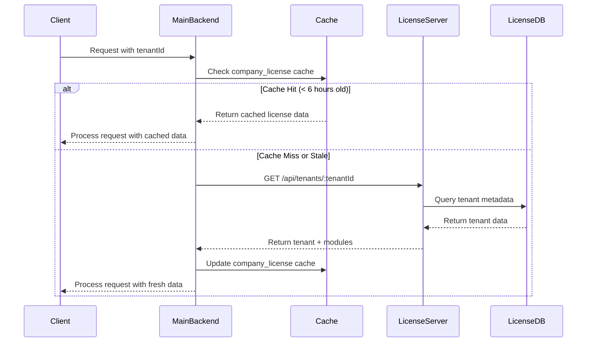

# Design Document: Platform Data Migration

## Overview

This design describes the migration of platform metadata (tenant information, subscriptions, and module configurations) from the main application database (`hrsm_platform`) to the license server database (`hrsm-licenses`). The migration establishes proper architectural separation between platform control (license server) and business operations (main application).

The design follows a phased approach to minimize risk and ensure system availability during the transition. It includes data migration scripts, new API endpoints, updated integration patterns, and a comprehensive caching strategy for performance optimization.

## Architecture

### Current Architecture (Before Migration)

```
┌─────────────────────────────────────────────────────────────┐
│ Database: hrsm-licenses (License Server - Port 4000)       │
├─────────────────────────────────────────────────────────────┤
│ ✅ licenses (license records)                               │
│ ✅ license_validations (audit logs)                         │
│ ❌ MISSING: tenants (should be here)                        │
└─────────────────────────────────────────────────────────────┘

┌─────────────────────────────────────────────────────────────┐
│ Database: hrsm_platform (Main App - Port 5000)             │
├─────────────────────────────────────────────────────────────┤
│ ❌ tenants (WRONG LOCATION - should be in license server)  │
│ ✅ users (with tenantId)                                    │
│ ✅ attendances (with tenantId)                              │
│ ✅ surveys (with tenantId)                                  │
│ ✅ company_license (cached copy - OK)                       │
└─────────────────────────────────────────────────────────────┘
```

### Target Architecture (After Migration)

```
┌─────────────────────────────────────────────────────────────┐
│ Database: hrsm-licenses (License Server - Port 4000)       │
├─────────────────────────────────────────────────────────────┤
│ ✅ tenants (MOVED HERE - platform metadata)                │
│    - tenantId, name, domain, contact                        │
│    - subscription info, billing data                        │
│    - enabled modules, usage limits                          │
│ ✅ subscriptions (billing details)                          │
│ ✅ enabled_modules (feature flags)                          │
│ ✅ licenses (license records)                               │
│ ✅ license_validations (audit logs)                         │
└─────────────────────────────────────────────────────────────┘
                    │
                    │ REST API (HTTPS)
                    │ Authentication: API Keys
                    ▼
┌─────────────────────────────────────────────────────────────┐
│ Database: hrsm_platform (Main App - Port 5000)             │
├─────────────────────────────────────────────────────────────┤
│ ✅ users (with tenantId)                                    │
│ ✅ attendances (with tenantId)                              │
│ ✅ surveys (with tenantId)                                  │
│ ✅ events (with tenantId)                                   │
│ ✅ company_license (cached copy from license server)        │
│    - Synced every 6 hours                                   │
│    - Used for fast local validation                         │
└─────────────────────────────────────────────────────────────┘
```

### Data Flow



## Components and Interfaces

### 1. Migration Script Component

**Purpose:** Safely migrate tenant data from hrsm_platform to hrsm-licenses

**Location:** `server/scripts/migrate-platform-data.js`

**Key Functions:**

```javascript
// Main migration orchestrator
async function migratePlatformData(options) {
  // 1. Validate source database connection
  // 2. Validate destination database connection
  // 3. Export tenant data from hrsm_platform
  // 4. Validate exported data integrity
  // 5. Import tenant data to hrsm-licenses
  // 6. Verify migration success
  // 7. Generate migration report
}

// Export tenants from source database
async function exportTenants(sourceDb) {
  // Query all tenant records
  // Include related data (subscriptions, modules)
  // Return structured export data
}

// Validate data before migration
async function validateExportedData(exportData) {
  // Check required fields present
  // Verify data types
  // Check for duplicates
  // Validate relationships
}

// Import tenants to destination database
async function importTenants(destDb, exportData) {
  // Create tenants collection if not exists
  // Insert tenant records with transaction support
  // Create indexes for performance
  // Verify insertion success
}

// Generate verification report
async function generateVerificationReport(sourceDb, destDb) {
  // Compare record counts
  // Verify data integrity
  // Check for missing records
  // Return detailed report
}

// Rollback mechanism
async function rollbackMigration(backupData) {
  // Restore original state
  // Verify rollback success
  // Log rollback details
}
```

**Error Handling:**
- Transaction support for atomic operations
- Detailed error logging with stack traces
- Automatic rollback on critical failures
- Validation checkpoints throughout process

### 2. License Server API Component

**Purpose:** Provide REST API endpoints for tenant metadata management

**Location:** `hrsm-license-server/src/routes/tenants.js`

**Endpoints:**

```javascript
// Tenant Management
GET    /api/tenants              // List all tenants (paginated)
GET    /api/tenants/:tenantId    // Get specific tenant details
POST   /api/tenants              // Create new tenant
PUT    /api/tenants/:tenantId    // Update tenant information
DELETE /api/tenants/:tenantId    // Delete tenant (soft delete)

// Module Management
GET    /api/tenants/:tenantId/modules           // Get enabled modules
POST   /api/tenants/:tenantId/modules/:moduleId // Enable module
DELETE /api/tenants/:tenantId/modules/:moduleId // Disable module

// Subscription Management
GET    /api/tenants/:tenantId/subscription      // Get subscription details
PUT    /api/tenants/:tenantId/subscription      // Update subscription

// License Validation (existing, enhanced)
POST   /api/validate             // Validate license + return modules
GET    /api/tenants/:tenantId/license           // Get full license info
```

**Authentication & Authorization:**

```javascript
// API Key Authentication Middleware
async function authenticateApiKey(req, res, next) {
  const apiKey = req.headers['x-api-key'];
  
  if (!apiKey) {
    return res.status(401).json({ error: 'API key required' });
  }
  
  const isValid = await validateApiKey(apiKey);
  
  if (!isValid) {
    return res.status(401).json({ error: 'Invalid API key' });
  }
  
  next();
}

// Authorization Middleware
function requirePermission(permission) {
  return (req, res, next) => {
    if (!req.apiKey.permissions.includes(permission)) {
      return res.status(403).json({ error: 'Insufficient permissions' });
    }
    next();
  };
}
```

**Response Format:**

```javascript
// Success Response
{
  "success": true,
  "data": {
    "tenantId": "techcorp_solutions",
    "name": "TechCorp Solutions",
    "domain": "techcorp.com",
    "subscription": {
      "status": "active",
      "plan": "enterprise",
      "expiresAt": "2026-12-31T23:59:59Z"
    },
    "enabledModules": ["surveys", "payroll", "attendance"],
    "createdAt": "2025-01-01T00:00:00Z",
    "updatedAt": "2026-01-24T10:30:00Z"
  }
}

// Error Response
{
  "success": false,
  "error": {
    "code": "TENANT_NOT_FOUND",
    "message": "Tenant with ID 'invalid_tenant' not found",
    "details": {}
  }
}
```

### 3. Main Backend Integration Component

**Purpose:** Update main application to query license server for tenant data

**Location:** `server/services/licenseServerClient.js`

**Key Functions:**

```javascript
class LicenseServerClient {
  constructor(baseUrl, apiKey) {
    this.baseUrl = baseUrl;
    this.apiKey = apiKey;
    this.httpClient = axios.create({
      baseURL: baseUrl,
      headers: { 'X-API-Key': apiKey },
      timeout: 5000
    });
  }

  // Get tenant information
  async getTenant(tenantId) {
    try {
      const response = await this.httpClient.get(`/api/tenants/${tenantId}`);
      return response.data.data;
    } catch (error) {
      throw new LicenseServerError('Failed to fetch tenant', error);
    }
  }

  // Get enabled modules for tenant
  async getEnabledModules(tenantId) {
    try {
      const response = await this.httpClient.get(`/api/tenants/${tenantId}/modules`);
      return response.data.data.modules;
    } catch (error) {
      throw new LicenseServerError('Failed to fetch modules', error);
    }
  }

  // Validate license and get tenant info
  async validateLicense(tenantId, licenseKey) {
    try {
      const response = await this.httpClient.post('/api/validate', {
        tenantId,
        licenseKey
      });
      return response.data.data;
    } catch (error) {
      throw new LicenseServerError('License validation failed', error);
    }
  }

  // Check if module is enabled
  async isModuleEnabled(tenantId, moduleId) {
    const modules = await this.getEnabledModules(tenantId);
    return modules.includes(moduleId);
  }
}
```

**Integration Pattern:**

```javascript
// Before Migration (OLD - queries local database)
async function checkModuleAccess(tenantId, moduleId) {
  const tenant = await Tenant.findOne({ tenantId });
  return tenant.enabledModules.includes(moduleId);
}

// After Migration (NEW - queries license server with caching)
async function checkModuleAccess(tenantId, moduleId) {
  // Try cache first
  const cachedLicense = await getCachedLicense(tenantId);
  
  if (cachedLicense && !isCacheStale(cachedLicense)) {
    return cachedLicense.enabledModules.includes(moduleId);
  }
  
  // Cache miss or stale - query license server
  try {
    const licenseData = await licenseServerClient.getTenant(tenantId);
    await updateLicenseCache(tenantId, licenseData);
    return licenseData.enabledModules.includes(moduleId);
  } catch (error) {
    // Fallback to stale cache if license server unavailable
    if (cachedLicense) {
      logger.warn('License server unavailable, using stale cache', { tenantId });
      return cachedLicense.enabledModules.includes(moduleId);
    }
    throw error;
  }
}
```

### 4. License Cache Component

**Purpose:** Optimize performance by caching license data locally

**Location:** `server/services/licenseCache.js`

**Cache Strategy:**

```javascript
// Cache TTL: 6 hours
const CACHE_TTL = 6 * 60 * 60 * 1000;

// Get cached license data
async function getCachedLicense(tenantId) {
  const cached = await CompanyLicense.findOne({ companyId: tenantId });
  return cached;
}

// Check if cache is stale
function isCacheStale(cachedLicense) {
  if (!cachedLicense.quickAccess?.lastSyncedAt) {
    return true;
  }
  
  const age = Date.now() - new Date(cachedLicense.quickAccess.lastSyncedAt).getTime();
  return age > CACHE_TTL;
}

// Update license cache
async function updateLicenseCache(tenantId, licenseData) {
  await CompanyLicense.updateOne(
    { companyId: tenantId },
    {
      $set: {
        'quickAccess.enabledModules': licenseData.enabledModules,
        'quickAccess.subscriptionStatus': licenseData.subscription.status,
        'quickAccess.lastSyncedAt': new Date(),
        'quickAccess.licenseValid': true
      }
    },
    { upsert: true }
  );
}

// Invalidate cache (called when license server updates tenant)
async function invalidateCache(tenantId) {
  await CompanyLicense.updateOne(
    { companyId: tenantId },
    {
      $set: {
        'quickAccess.lastSyncedAt': new Date(0) // Force refresh
      }
    }
  );
}

// Background cache refresh job (runs every 6 hours)
async function refreshAllCaches() {
  const allTenants = await CompanyLicense.find({});
  
  for (const tenant of allTenants) {
    try {
      const licenseData = await licenseServerClient.getTenant(tenant.companyId);
      await updateLicenseCache(tenant.companyId, licenseData);
    } catch (error) {
      logger.error('Failed to refresh cache for tenant', {
        tenantId: tenant.companyId,
        error: error.message
      });
    }
  }
}
```

## Data Models

### Tenant Model (License Server Database)

```javascript
// Collection: tenants (in hrsm-licenses database)
{
  _id: ObjectId,
  tenantId: String,           // Unique identifier (e.g., "techcorp_solutions")
  name: String,               // Company name
  domain: String,             // Primary domain
  contactEmail: String,       // Admin contact
  contactPhone: String,       // Admin phone
  
  subscription: {
    status: String,           // "active", "suspended", "expired"
    plan: String,             // "basic", "professional", "enterprise"
    startDate: Date,
    expiresAt: Date,
    billingCycle: String,     // "monthly", "annual"
    autoRenew: Boolean
  },
  
  enabledModules: [String],   // ["surveys", "payroll", "attendance", ...]
  
  usageLimits: {
    maxUsers: Number,
    maxStorage: Number,       // in GB
    maxApiCalls: Number       // per day
  },
  
  billing: {
    currency: String,         // "USD", "EUR", etc.
    amount: Number,
    lastPaymentDate: Date,
    nextBillingDate: Date
  },
  
  metadata: {
    industry: String,
    companySize: String,
    country: String,
    timezone: String
  },
  
  status: String,             // "active", "suspended", "deleted"
  createdAt: Date,
  updatedAt: Date,
  deletedAt: Date             // Soft delete timestamp
}

// Indexes
db.tenants.createIndex({ tenantId: 1 }, { unique: true });
db.tenants.createIndex({ domain: 1 });
db.tenants.createIndex({ "subscription.status": 1 });
db.tenants.createIndex({ status: 1 });
```

### Subscription Model (License Server Database)

```javascript
// Collection: subscriptions (in hrsm-licenses database)
{
  _id: ObjectId,
  tenantId: String,           // Reference to tenant
  subscriptionId: String,     // Unique subscription ID
  
  plan: {
    name: String,             // "basic", "professional", "enterprise"
    features: [String],       // List of included features
    limits: {
      users: Number,
      storage: Number,
      apiCalls: Number
    }
  },
  
  billing: {
    status: String,           // "active", "past_due", "canceled"
    amount: Number,
    currency: String,
    cycle: String,            // "monthly", "annual"
    startDate: Date,
    currentPeriodStart: Date,
    currentPeriodEnd: Date,
    cancelAtPeriodEnd: Boolean
  },
  
  paymentHistory: [{
    date: Date,
    amount: Number,
    status: String,           // "succeeded", "failed", "pending"
    invoiceId: String,
    paymentMethod: String
  }],
  
  usage: {
    currentUsers: Number,
    currentStorage: Number,
    currentApiCalls: Number,
    lastUpdated: Date
  },
  
  createdAt: Date,
  updatedAt: Date
}

// Indexes
db.subscriptions.createIndex({ tenantId: 1 }, { unique: true });
db.subscriptions.createIndex({ subscriptionId: 1 }, { unique: true });
db.subscriptions.createIndex({ "billing.status": 1 });
```

### Enabled Modules Model (License Server Database)

```javascript
// Collection: enabled_modules (in hrsm-licenses database)
{
  _id: ObjectId,
  tenantId: String,           // Reference to tenant
  moduleId: String,           // "surveys", "payroll", "attendance", etc.
  
  enabled: Boolean,
  enabledAt: Date,
  enabledBy: String,          // Admin user who enabled it
  
  configuration: {            // Module-specific settings
    // Flexible schema for module configs
  },
  
  usage: {
    lastUsed: Date,
    usageCount: Number
  },
  
  createdAt: Date,
  updatedAt: Date
}

// Indexes
db.enabled_modules.createIndex({ tenantId: 1, moduleId: 1 }, { unique: true });
db.enabled_modules.createIndex({ tenantId: 1, enabled: 1 });
```

### Company License Cache Model (Main Backend Database)

```javascript
// Collection: company_license (in hrsm_platform database)
// This is a CACHED COPY for performance - source of truth is license server
{
  _id: ObjectId,
  companyId: String,          // Same as tenantId
  
  quickAccess: {
    enabledModules: [String], // Cached from license server
    subscriptionStatus: String, // Cached from license server
    licenseValid: Boolean,
    lastSyncedAt: Date,       // When cache was last updated
    cacheVersion: Number      // For cache invalidation
  },
  
  // Original license fields (kept for backward compatibility)
  licenseKey: String,
  expiresAt: Date,
  // ... other existing fields
  
  updatedAt: Date
}

// Indexes
db.company_license.createIndex({ companyId: 1 }, { unique: true });
db.company_license.createIndex({ "quickAccess.lastSyncedAt": 1 });
```

## Correctness Properties

*A property is a characteristic or behavior that should hold true across all valid executions of a system—essentially, a formal statement about what the system should do. Properties serve as the bridge between human-readable specifications and machine-verifiable correctness guarantees.*


### Migration Data Integrity Properties

Property 1: Migration completeness
*For any* migration execution, all tenant records from the source database should exist in the destination database with matching tenantIds
**Validates: Requirements 1.1, 1.2, 1.3, 2.1, 7.1, 7.2**

Property 2: Field preservation during migration
*For any* tenant record migrated, all metadata fields present in the source should be present and equal in the destination
**Validates: Requirements 2.3**

Property 3: Migration rollback restores original state
*For any* failed migration that triggers rollback, the source database should contain the same tenant records as before migration started
**Validates: Requirements 2.6, 12.1, 12.3**

### API Behavior Properties

Property 4: Tenant CRUD operations persist correctly
*For any* tenant creation, update, or deletion via API, the operation should be reflected in the database and subsequent queries should return the updated state
**Validates: Requirements 3.3, 3.4, 3.5**

Property 5: Module enablement is idempotent
*For any* tenant and module, enabling an already-enabled module or disabling an already-disabled module should result in the same state as a single operation
**Validates: Requirements 3.7, 3.8**

Property 6: API authentication failures return 401
*For any* API request without a valid API key, the License_Server should return a 401 status code
**Validates: Requirements 3.9, 8.1, 8.4**

Property 7: API authorization failures return 403
*For any* API request without sufficient permissions, the License_Server should return a 403 status code
**Validates: Requirements 3.10, 8.2, 8.3**

### Data Source and Integration Properties

Property 8: License Server is the source of truth
*For any* tenant query after migration, the Main_Backend should retrieve tenant data from the License_Server API, not the local database
**Validates: Requirements 1.4, 4.1, 4.2, 4.3**

Property 9: Fallback to cache when API unavailable
*For any* License_Server API failure, if cached license data exists, the Main_Backend should use the cached data and continue operation
**Validates: Requirements 4.4, 5.5**

Property 10: License Server data takes priority during compatibility mode
*For any* tenant that exists in both databases during migration, queries should return data from the License_Server database
**Validates: Requirements 6.2**

### Caching Properties

Property 11: Fresh cache prevents API calls
*For any* license validation request, if cached data exists and is less than 6 hours old, no API call to the License_Server should be made
**Validates: Requirements 5.1, 10.1, 10.2**

Property 12: Stale cache triggers refresh
*For any* cached license data older than 6 hours, the next request should trigger a refresh from the License_Server
**Validates: Requirements 5.2, 5.4**

Property 13: Cache invalidation forces refresh
*For any* tenant whose modules are updated on the License_Server, the cache should be invalidated and the next request should fetch fresh data
**Validates: Requirements 5.3**

### Validation and Error Handling Properties

Property 14: Migration validation catches missing data
*For any* migration execution, if any tenant record fails to migrate, the validation step should detect and report the missing record
**Validates: Requirements 2.2, 7.3, 7.4**

Property 15: Error logging includes diagnostic information
*For any* error during migration or API operations, the system should log detailed error messages including context and stack traces
**Validates: Requirements 2.4, 9.3**

Property 16: Graceful error handling maintains availability
*For any* License_Server API error, the Main_Backend should handle it gracefully without crashing and return appropriate error messages to clients
**Validates: Requirements 4.6**

### Security Properties

Property 17: Sensitive data uses encrypted transport
*For any* API request containing tenant data, the connection should use HTTPS encryption
**Validates: Requirements 8.5**

### Performance Properties

Property 18: Cache operations complete quickly
*For any* cache read or write operation, the operation should complete within 50 milliseconds
**Validates: Requirements 10.5**

Property 19: Rollback completes within time limit
*For any* rollback operation, the process should complete within 30 minutes
**Validates: Requirements 12.4**

## Error Handling

### Migration Errors

**Data Validation Failures:**
```javascript
class MigrationValidationError extends Error {
  constructor(message, details) {
    super(message);
    this.name = 'MigrationValidationError';
    this.details = details;
    this.recoverable = false;
  }
}

// Example usage
if (missingFields.length > 0) {
  throw new MigrationValidationError(
    'Tenant records missing required fields',
    { missingFields, affectedTenants }
  );
}
```

**Database Connection Errors:**
```javascript
class DatabaseConnectionError extends Error {
  constructor(database, originalError) {
    super(`Failed to connect to ${database}`);
    this.name = 'DatabaseConnectionError';
    this.database = database;
    this.originalError = originalError;
    this.recoverable = true;
    this.retryable = true;
  }
}
```

**Migration Rollback:**
```javascript
async function handleMigrationError(error, backupData) {
  logger.error('Migration failed, initiating rollback', {
    error: error.message,
    stack: error.stack
  });
  
  try {
    await rollbackMigration(backupData);
    logger.info('Rollback completed successfully');
  } catch (rollbackError) {
    logger.error('CRITICAL: Rollback failed', {
      originalError: error.message,
      rollbackError: rollbackError.message
    });
    
    // Generate manual recovery instructions
    await generateRecoveryInstructions(backupData, rollbackError);
    throw new CriticalMigrationError(
      'Migration and rollback both failed - manual intervention required',
      { originalError: error, rollbackError }
    );
  }
}
```

### API Errors

**License Server Unavailable:**
```javascript
class LicenseServerUnavailableError extends Error {
  constructor(endpoint, originalError) {
    super(`License Server unavailable at ${endpoint}`);
    this.name = 'LicenseServerUnavailableError';
    this.endpoint = endpoint;
    this.originalError = originalError;
    this.fallbackAvailable = true;
  }
}

// Handling with fallback
async function getTenantWithFallback(tenantId) {
  try {
    return await licenseServerClient.getTenant(tenantId);
  } catch (error) {
    if (error instanceof LicenseServerUnavailableError) {
      logger.warn('License Server unavailable, using cache', { tenantId });
      const cached = await getCachedLicense(tenantId);
      
      if (!cached) {
        throw new Error('License Server unavailable and no cache available');
      }
      
      return cached;
    }
    throw error;
  }
}
```

**Authentication Errors:**
```javascript
// 401 - Authentication failed
{
  "success": false,
  "error": {
    "code": "AUTHENTICATION_FAILED",
    "message": "Invalid or missing API key",
    "statusCode": 401
  }
}

// 403 - Authorization failed
{
  "success": false,
  "error": {
    "code": "INSUFFICIENT_PERMISSIONS",
    "message": "API key does not have permission to perform this operation",
    "requiredPermission": "tenants:write",
    "statusCode": 403
  }
}
```

**Validation Errors:**
```javascript
// 400 - Bad request
{
  "success": false,
  "error": {
    "code": "VALIDATION_ERROR",
    "message": "Invalid tenant data",
    "details": {
      "tenantId": "Required field missing",
      "domain": "Invalid domain format"
    },
    "statusCode": 400
  }
}
```

### Cache Errors

**Cache Refresh Failures:**
```javascript
async function refreshCacheWithErrorHandling(tenantId) {
  try {
    const licenseData = await licenseServerClient.getTenant(tenantId);
    await updateLicenseCache(tenantId, licenseData);
    return licenseData;
  } catch (error) {
    logger.error('Cache refresh failed', {
      tenantId,
      error: error.message
    });
    
    // Continue with stale cache
    const staleCache = await getCachedLicense(tenantId);
    
    if (staleCache) {
      logger.warn('Using stale cache due to refresh failure', {
        tenantId,
        cacheAge: Date.now() - new Date(staleCache.quickAccess.lastSyncedAt).getTime()
      });
      return staleCache;
    }
    
    throw new Error('Cache refresh failed and no stale cache available');
  }
}
```

## Testing Strategy

### Dual Testing Approach

This feature requires both unit tests and property-based tests to ensure comprehensive coverage:

**Unit Tests** focus on:
- Specific migration scenarios (empty database, large datasets, corrupted data)
- API endpoint behavior with known inputs
- Error handling for specific failure cases
- Cache operations with controlled timestamps
- Integration between components

**Property-Based Tests** focus on:
- Migration correctness across all possible tenant data
- API behavior with randomly generated tenant records
- Cache behavior with various age and invalidation scenarios
- Concurrent access patterns
- Data integrity under various failure conditions

### Property-Based Testing Configuration

We will use **fast-check** (for JavaScript/Node.js) as the property-based testing library.

**Configuration:**
- Minimum 100 iterations per property test
- Each test tagged with feature name and property number
- Tag format: `Feature: platform-data-migration, Property {N}: {property description}`

**Example Property Test:**

```javascript
const fc = require('fast-check');

describe('Feature: platform-data-migration, Property 1: Migration completeness', () => {
  it('should migrate all tenant records from source to destination', async () => {
    await fc.assert(
      fc.asyncProperty(
        fc.array(tenantRecordArbitrary(), { minLength: 1, maxLength: 50 }),
        async (tenantRecords) => {
          // Setup: Insert records into source database
          await sourceDb.collection('tenants').insertMany(tenantRecords);
          
          // Execute: Run migration
          await migratePlatformData({ sourceDb, destDb });
          
          // Verify: All records exist in destination
          const destRecords = await destDb.collection('tenants').find({}).toArray();
          const sourceTenantIds = tenantRecords.map(t => t.tenantId).sort();
          const destTenantIds = destRecords.map(t => t.tenantId).sort();
          
          expect(destTenantIds).toEqual(sourceTenantIds);
        }
      ),
      { numRuns: 100 }
    );
  });
});

// Arbitrary generator for tenant records
function tenantRecordArbitrary() {
  return fc.record({
    tenantId: fc.stringOf(fc.char(), { minLength: 5, maxLength: 30 }),
    name: fc.string({ minLength: 3, maxLength: 50 }),
    domain: fc.domain(),
    contactEmail: fc.emailAddress(),
    subscription: fc.record({
      status: fc.constantFrom('active', 'suspended', 'expired'),
      plan: fc.constantFrom('basic', 'professional', 'enterprise'),
      expiresAt: fc.date()
    }),
    enabledModules: fc.array(
      fc.constantFrom('surveys', 'payroll', 'attendance', 'recruitment'),
      { maxLength: 4 }
    )
  });
}
```

### Unit Testing Examples

**Migration Script Tests:**

```javascript
describe('Migration Script', () => {
  describe('exportTenants', () => {
    it('should export all tenant records', async () => {
      const tenants = [
        { tenantId: 'tenant1', name: 'Tenant 1' },
        { tenantId: 'tenant2', name: 'Tenant 2' }
      ];
      await sourceDb.collection('tenants').insertMany(tenants);
      
      const exported = await exportTenants(sourceDb);
      
      expect(exported).toHaveLength(2);
      expect(exported.map(t => t.tenantId)).toContain('tenant1');
      expect(exported.map(t => t.tenantId)).toContain('tenant2');
    });
    
    it('should handle empty database', async () => {
      const exported = await exportTenants(sourceDb);
      expect(exported).toHaveLength(0);
    });
  });
  
  describe('validateExportedData', () => {
    it('should reject data with missing required fields', async () => {
      const invalidData = [
        { tenantId: 'tenant1' } // missing name
      ];
      
      await expect(validateExportedData(invalidData))
        .rejects
        .toThrow(MigrationValidationError);
    });
  });
  
  describe('rollbackMigration', () => {
    it('should restore original data on rollback', async () => {
      const backup = [
        { tenantId: 'tenant1', name: 'Tenant 1' }
      ];
      
      await rollbackMigration(backup);
      
      const restored = await sourceDb.collection('tenants').find({}).toArray();
      expect(restored).toEqual(backup);
    });
  });
});
```

**API Endpoint Tests:**

```javascript
describe('License Server API', () => {
  describe('GET /api/tenants/:tenantId', () => {
    it('should return tenant details', async () => {
      const tenant = {
        tenantId: 'test_tenant',
        name: 'Test Tenant',
        domain: 'test.com'
      };
      await db.collection('tenants').insertOne(tenant);
      
      const response = await request(app)
        .get('/api/tenants/test_tenant')
        .set('X-API-Key', validApiKey);
      
      expect(response.status).toBe(200);
      expect(response.body.data.tenantId).toBe('test_tenant');
    });
    
    it('should return 404 for non-existent tenant', async () => {
      const response = await request(app)
        .get('/api/tenants/nonexistent')
        .set('X-API-Key', validApiKey);
      
      expect(response.status).toBe(404);
    });
    
    it('should return 401 without API key', async () => {
      const response = await request(app)
        .get('/api/tenants/test_tenant');
      
      expect(response.status).toBe(401);
    });
  });
  
  describe('POST /api/tenants/:tenantId/modules/:moduleId', () => {
    it('should enable module for tenant', async () => {
      await db.collection('tenants').insertOne({
        tenantId: 'test_tenant',
        enabledModules: []
      });
      
      const response = await request(app)
        .post('/api/tenants/test_tenant/modules/surveys')
        .set('X-API-Key', validApiKey);
      
      expect(response.status).toBe(200);
      
      const tenant = await db.collection('tenants').findOne({ tenantId: 'test_tenant' });
      expect(tenant.enabledModules).toContain('surveys');
    });
  });
});
```

**Cache Tests:**

```javascript
describe('License Cache', () => {
  describe('getCachedLicense', () => {
    it('should return cached data if fresh', async () => {
      const cachedData = {
        companyId: 'test_tenant',
        quickAccess: {
          enabledModules: ['surveys'],
          lastSyncedAt: new Date()
        }
      };
      await CompanyLicense.create(cachedData);
      
      const result = await getCachedLicense('test_tenant');
      
      expect(result).toBeDefined();
      expect(result.quickAccess.enabledModules).toContain('surveys');
    });
  });
  
  describe('isCacheStale', () => {
    it('should return true for cache older than 6 hours', () => {
      const oldCache = {
        quickAccess: {
          lastSyncedAt: new Date(Date.now() - 7 * 60 * 60 * 1000) // 7 hours ago
        }
      };
      
      expect(isCacheStale(oldCache)).toBe(true);
    });
    
    it('should return false for fresh cache', () => {
      const freshCache = {
        quickAccess: {
          lastSyncedAt: new Date(Date.now() - 1 * 60 * 60 * 1000) // 1 hour ago
        }
      };
      
      expect(isCacheStale(freshCache)).toBe(false);
    });
  });
});
```

### Integration Tests

```javascript
describe('End-to-End Migration', () => {
  it('should complete full migration workflow', async () => {
    // Setup: Create test tenants in source database
    const testTenants = [
      { tenantId: 'tenant1', name: 'Tenant 1', enabledModules: ['surveys'] },
      { tenantId: 'tenant2', name: 'Tenant 2', enabledModules: ['payroll'] }
    ];
    await sourceDb.collection('tenants').insertMany(testTenants);
    
    // Execute: Run migration
    const result = await migratePlatformData({
      sourceDb,
      destDb,
      dryRun: false
    });
    
    // Verify: Check migration results
    expect(result.success).toBe(true);
    expect(result.migratedCount).toBe(2);
    
    // Verify: Data exists in destination
    const destTenants = await destDb.collection('tenants').find({}).toArray();
    expect(destTenants).toHaveLength(2);
    
    // Verify: API can retrieve migrated data
    const response = await request(licenseServerApp)
      .get('/api/tenants/tenant1')
      .set('X-API-Key', validApiKey);
    
    expect(response.status).toBe(200);
    expect(response.body.data.name).toBe('Tenant 1');
    
    // Verify: Main backend uses license server
    const modules = await mainBackend.getEnabledModules('tenant1');
    expect(modules).toContain('surveys');
  });
});
```

### Test Coverage Goals

- **Unit Test Coverage:** Minimum 80% code coverage
- **Property Test Coverage:** All 19 correctness properties implemented
- **Integration Test Coverage:** All critical user flows tested
- **Error Scenario Coverage:** All error handling paths tested

### Continuous Testing

- Run unit tests on every commit
- Run property tests on every pull request
- Run integration tests before deployment
- Monitor test execution time (target: < 5 minutes for full suite)
