# HRMS - API Flow & Integration Diagram

## 🔄 Complete API Request Flow

```mermaid
sequenceDiagram
    participant User as 👤 User (Browser)
    participant LB as 🌐 Load Balancer
    participant Frontend as 🎨 React App
    participant Gateway as 🚪 API Gateway
    participant Auth as 🔐 Auth Service
    participant TenantMW as 🏢 Tenant Middleware
    participant ModuleMW as 🧩 Module Middleware
    participant Controller as 🎛️ Controller
    participant Service as ⚙️ Service Layer
    participant DB as 💾 MongoDB
    participant Cache as ⚡ Redis
    participant Logger as 📝 Audit Logger
    participant Email as 📧 Email Service

    Note over User,Email: Complete API Request Lifecycle

    %% Authentication Flow
    User->>Frontend: 1. Login Request
    Frontend->>Gateway: 2. POST /api/v1/hr-core/auth/login
    Gateway->>Auth: 3. Validate Credentials
    Auth->>DB: 4. Query User Collection
    DB-->>Auth: 5. User Data
    Auth->>Cache: 6. Store Session
    Cache-->>Auth: 7. Session Stored
    Auth-->>Gateway: 8. JWT Token + User Info
    Gateway-->>Frontend: 9. Authentication Response
    Frontend-->>User: 10. Login Success + Token Storage

    %% Authenticated Request Flow
    User->>Frontend: 11. Create Task Request
    Frontend->>Gateway: 12. POST /api/v1/tasks/tasks (with JWT)
    Gateway->>Auth: 13. Validate JWT Token
    Auth->>Cache: 14. Check Token Cache
    Cache-->>Auth: 15. Token Valid
    Auth->>TenantMW: 16. Authenticated Request + User Context
    TenantMW->>Cache: 17. Get Tenant Context
    Cache-->>TenantMW: 18. Tenant Info
    TenantMW->>ModuleMW: 19. Tenant-Scoped Request
    ModuleMW->>Cache: 20. Check Module Access
    Cache-->>ModuleMW: 21. Module Enabled
    ModuleMW->>Controller: 22. Authorized Request
    Controller->>Service: 23. Business Logic Call
    Service->>DB: 24. Create Task (with tenant_id)
    DB-->>Service: 25. Task Created
    Service->>Logger: 26. Log Activity
    Logger->>DB: 27. Store Audit Log
    Service->>Email: 28. Send Notification (Optional)
    Email-->>Service: 29. Email Queued
    Service-->>Controller: 30. Task Data
    Controller-->>ModuleMW: 31. Response Data
    ModuleMW-->>TenantMW: 32. Formatted Response
    TenantMW-->>Gateway: 33. Final Response
    Gateway-->>Frontend: 34. JSON Response
    Frontend-->>User: 35. UI Update + Success Message

    %% Error Handling Flow
    Note over User,Email: Error Handling Example
    User->>Frontend: 36. Invalid Request
    Frontend->>Gateway: 37. POST /api/v1/tasks/tasks (invalid data)
    Gateway->>Auth: 38. Validate JWT
    Auth-->>Gateway: 39. Token Valid
    Gateway->>TenantMW: 40. Request with Context
    TenantMW->>ModuleMW: 41. Tenant-Scoped Request
    ModuleMW->>Controller: 42. Request with Validation
    Controller->>Controller: 43. Validate Input (FAIL)
    Controller->>Logger: 44. Log Validation Error
    Controller-->>ModuleMW: 45. Validation Error Response
    ModuleMW-->>TenantMW: 46. Error Response
    TenantMW-->>Gateway: 47. Formatted Error
    Gateway-->>Frontend: 48. HTTP 400 + Error Details
    Frontend-->>User: 49. Error Message Display
```



## 🏗️ API Architecture Layers

```mermaid
graph TB
    subgraph "🌐 External Layer"
        CLIENT[Client Applications]
        MOBILE[Mobile Apps (Future)]
        THIRD_PARTY[Third-party Integrations]
    end
    
    subgraph "🚪 Gateway Layer"
        LOAD_BALANCER[Load Balancer<br/>nginx/HAProxy]
        API_GATEWAY[API Gateway<br/>Rate Limiting<br/>Request Routing]
        CORS_HANDLER[CORS Handler<br/>Origin Validation]
    end
    
    subgraph "🔐 Security Layer"
        AUTH_SERVICE[Authentication Service<br/>JWT Validation<br/>Token Refresh]
        RATE_LIMITER[Rate Limiter<br/>100 req/15min<br/>IP-based Throttling]
        SECURITY_HEADERS[Security Headers<br/>Helmet.js<br/>XSS Protection]
    end
    
    subgraph "🏢 Context Layer"
        TENANT_MIDDLEWARE[Tenant Middleware<br/>Context Injection<br/>Data Scoping]
        MODULE_MIDDLEWARE[Module Middleware<br/>Feature Flags<br/>Access Control]
        AUDIT_MIDDLEWARE[Audit Middleware<br/>Activity Logging<br/>Compliance Tracking]
    end
    
    subgraph "🎛️ Controller Layer"
        HR_CONTROLLERS[HR Core Controllers<br/>User, Attendance, Vacation]
        TASK_CONTROLLERS[Task Controllers<br/>Task, Report Management]
        PAYROLL_CONTROLLERS[Payroll Controllers<br/>Salary, Payslip Processing]
        PLATFORM_CONTROLLERS[Platform Controllers<br/>Tenant, Subscription Management]
    end
    
    subgraph "⚙️ Service Layer"
        BUSINESS_SERVICES[Business Services<br/>Core Logic<br/>Data Processing]
        INTEGRATION_SERVICES[Integration Services<br/>Email, SMS, External APIs]
        UTILITY_SERVICES[Utility Services<br/>File Upload, PDF Generation]
    end
    
    subgraph "💾 Data Layer"
        MONGODB[MongoDB<br/>Primary Database<br/>Multi-Tenant Collections]
        REDIS[Redis Cache<br/>Session Storage<br/>Feature Flags]
        FILE_SYSTEM[File System<br/>Document Storage<br/>Tenant Isolation]
    end
    
    subgraph "📊 Monitoring Layer"
        PROMETHEUS[Prometheus<br/>Metrics Collection]
        WINSTON[Winston Logger<br/>Structured Logging]
        HEALTH_CHECKS[Health Checks<br/>System Status]
    end
    
    %% Connections
    CLIENT --> LOAD_BALANCER
    MOBILE --> LOAD_BALANCER
    THIRD_PARTY --> LOAD_BALANCER
    
    LOAD_BALANCER --> API_GATEWAY
    API_GATEWAY --> CORS_HANDLER
    
    CORS_HANDLER --> AUTH_SERVICE
    AUTH_SERVICE --> RATE_LIMITER
    RATE_LIMITER --> SECURITY_HEADERS
    
    SECURITY_HEADERS --> TENANT_MIDDLEWARE
    TENANT_MIDDLEWARE --> MODULE_MIDDLEWARE
    MODULE_MIDDLEWARE --> AUDIT_MIDDLEWARE
    
    AUDIT_MIDDLEWARE --> HR_CONTROLLERS
    AUDIT_MIDDLEWARE --> TASK_CONTROLLERS
    AUDIT_MIDDLEWARE --> PAYROLL_CONTROLLERS
    AUDIT_MIDDLEWARE --> PLATFORM_CONTROLLERS
    
    HR_CONTROLLERS --> BUSINESS_SERVICES
    TASK_CONTROLLERS --> BUSINESS_SERVICES
    PAYROLL_CONTROLLERS --> BUSINESS_SERVICES
    PLATFORM_CONTROLLERS --> BUSINESS_SERVICES
    
    BUSINESS_SERVICES --> INTEGRATION_SERVICES
    BUSINESS_SERVICES --> UTILITY_SERVICES
    
    BUSINESS_SERVICES --> MONGODB
    BUSINESS_SERVICES --> REDIS
    BUSINESS_SERVICES --> FILE_SYSTEM
    
    BUSINESS_SERVICES --> PROMETHEUS
    BUSINESS_SERVICES --> WINSTON
    BUSINESS_SERVICES --> HEALTH_CHECKS
    
    classDef externalClass fill:#e3f2fd,stroke:#1976d2,stroke-width:2px
    classDef gatewayClass fill:#f1f8e9,stroke:#689f38,stroke-width:2px
    classDef securityClass fill:#ffebee,stroke:#c62828,stroke-width:2px
    classDef contextClass fill:#fff3e0,stroke:#f57c00,stroke-width:2px
    classDef controllerClass fill:#e8f5e8,stroke:#388e3c,stroke-width:2px
    classDef serviceClass fill:#f3e5f5,stroke:#7b1fa2,stroke-width:2px
    classDef dataClass fill:#fce4ec,stroke:#c2185b,stroke-width:2px
    classDef monitoringClass fill:#e0f2f1,stroke:#00695c,stroke-width:2px
    
    class CLIENT,MOBILE,THIRD_PARTY externalClass
    class LOAD_BALANCER,API_GATEWAY,CORS_HANDLER gatewayClass
    class AUTH_SERVICE,RATE_LIMITER,SECURITY_HEADERS securityClass
    class TENANT_MIDDLEWARE,MODULE_MIDDLEWARE,AUDIT_MIDDLEWARE contextClass
    class HR_CONTROLLERS,TASK_CONTROLLERS,PAYROLL_CONTROLLERS,PLATFORM_CONTROLLERS controllerClass
    class BUSINESS_SERVICES,INTEGRATION_SERVICES,UTILITY_SERVICES serviceClass
    class MONGODB,REDIS,FILE_SYSTEM dataClass
    class PROMETHEUS,WINSTON,HEALTH_CHECKS monitoringClass
```

## 🔄 Module Integration Patterns

```mermaid
graph TB
    subgraph "🧩 Module Integration Architecture"
        subgraph "📋 Module Registry"
            REGISTRY[Module Registry<br/>Dynamic Loading<br/>Dependency Resolution]
            FEATURE_FLAGS[Feature Flag Service<br/>Runtime Control<br/>A/B Testing]
        end
        
        subgraph "🔌 Module Interfaces"
            MODULE_INTERFACE[Standard Module Interface<br/>Controllers, Services, Models<br/>Routes, Middleware]
            DEPENDENCY_INJECTION[Dependency Injection<br/>Service Discovery<br/>Loose Coupling]
        end
        
        subgraph "📊 Cross-Module Communication"
            EVENT_BUS[Event Bus<br/>Async Communication<br/>Decoupled Messaging]
            SHARED_SERVICES[Shared Services<br/>Common Utilities<br/>Cross-Module APIs]
        end
        
        subgraph "🎯 Module Examples"
            HR_CORE_MOD[HR Core Module<br/>Always Loaded<br/>Base Dependencies]
            TASKS_MOD[Tasks Module<br/>Conditional Loading<br/>HR Core Dependency]
            EMAIL_MOD[Email Module<br/>Service Provider<br/>Multiple Consumers]
        end
    end
    
    REGISTRY --> MODULE_INTERFACE
    FEATURE_FLAGS --> MODULE_INTERFACE
    MODULE_INTERFACE --> DEPENDENCY_INJECTION
    DEPENDENCY_INJECTION --> EVENT_BUS
    EVENT_BUS --> SHARED_SERVICES
    
    SHARED_SERVICES --> HR_CORE_MOD
    SHARED_SERVICES --> TASKS_MOD
    SHARED_SERVICES --> EMAIL_MOD
    
    HR_CORE_MOD --> TASKS_MOD
    EMAIL_MOD --> TASKS_MOD
    EMAIL_MOD --> HR_CORE_MOD
    
    classDef registryClass fill:#e3f2fd,stroke:#1976d2,stroke-width:2px
    classDef interfaceClass fill:#f1f8e9,stroke:#689f38,stroke-width:2px
    classDef commClass fill:#fff3e0,stroke:#f57c00,stroke-width:2px
    classDef moduleClass fill:#f3e5f5,stroke:#7b1fa2,stroke-width:2px
    
    class REGISTRY,FEATURE_FLAGS registryClass
    class MODULE_INTERFACE,DEPENDENCY_INJECTION interfaceClass
    class EVENT_BUS,SHARED_SERVICES commClass
    class HR_CORE_MOD,TASKS_MOD,EMAIL_MOD moduleClass
```



## 📡 External API Integrations

```mermaid
graph TB
    subgraph "🔌 External Service Integrations"
        subgraph "📧 Email Services"
            AWS_SES[AWS SES<br/>Transactional Email<br/>High Volume]
            SENDGRID[SendGrid<br/>Marketing Email<br/>Templates]
            SMTP[SMTP Server<br/>Custom Email<br/>On-Premise]
        end
        
        subgraph "☁️ Cloud Services"
            AWS_S3[AWS S3<br/>File Storage<br/>Document Archive]
            GOOGLE_DRIVE[Google Drive API<br/>Document Sync<br/>Collaboration]
            GOOGLE_CALENDAR[Google Calendar<br/>Event Sync<br/>Meeting Integration]
        end
        
        subgraph "💳 Payment & Billing"
            STRIPE[Stripe API<br/>Subscription Billing<br/>Payment Processing]
            PAYPAL[PayPal API<br/>Alternative Payment<br/>Global Support]
        end
        
        subgraph "📊 Analytics & Monitoring"
            GOOGLE_ANALYTICS[Google Analytics<br/>Usage Tracking<br/>User Behavior]
            MIXPANEL[Mixpanel<br/>Event Tracking<br/>Funnel Analysis]
            SENTRY[Sentry<br/>Error Tracking<br/>Performance Monitoring]
        end
        
        subgraph "🔐 Authentication"
            GOOGLE_OAUTH[Google OAuth<br/>SSO Integration<br/>User Authentication]
            MICROSOFT_AD[Microsoft AD<br/>Enterprise SSO<br/>Directory Sync]
            OKTA[Okta<br/>Identity Provider<br/>SAML/OIDC]
        end
        
        subgraph "📱 Communication"
            TWILIO[Twilio<br/>SMS Notifications<br/>Voice Calls]
            SLACK[Slack API<br/>Team Notifications<br/>Bot Integration]
            TEAMS[Microsoft Teams<br/>Enterprise Chat<br/>Meeting Integration]
        end
    end
    
    subgraph "🏢 HRMS Core System"
        EMAIL_SERVICE[Email Service Module]
        FILE_SERVICE[File Management Service]
        BILLING_SERVICE[Billing Service]
        ANALYTICS_SERVICE[Analytics Service]
        AUTH_SERVICE_INT[Authentication Service]
        NOTIFICATION_SERVICE[Notification Service]
    end
    
    %% Email Integrations
    EMAIL_SERVICE --> AWS_SES
    EMAIL_SERVICE --> SENDGRID
    EMAIL_SERVICE --> SMTP
    
    %% File Integrations
    FILE_SERVICE --> AWS_S3
    FILE_SERVICE --> GOOGLE_DRIVE
    
    %% Calendar Integration
    NOTIFICATION_SERVICE --> GOOGLE_CALENDAR
    
    %% Billing Integrations
    BILLING_SERVICE --> STRIPE
    BILLING_SERVICE --> PAYPAL
    
    %% Analytics Integrations
    ANALYTICS_SERVICE --> GOOGLE_ANALYTICS
    ANALYTICS_SERVICE --> MIXPANEL
    ANALYTICS_SERVICE --> SENTRY
    
    %% Auth Integrations
    AUTH_SERVICE_INT --> GOOGLE_OAUTH
    AUTH_SERVICE_INT --> MICROSOFT_AD
    AUTH_SERVICE_INT --> OKTA
    
    %% Communication Integrations
    NOTIFICATION_SERVICE --> TWILIO
    NOTIFICATION_SERVICE --> SLACK
    NOTIFICATION_SERVICE --> TEAMS
    
    classDef emailClass fill:#e3f2fd,stroke:#1976d2,stroke-width:2px
    classDef cloudClass fill:#f1f8e9,stroke:#689f38,stroke-width:2px
    classDef paymentClass fill:#fff3e0,stroke:#f57c00,stroke-width:2px
    classDef analyticsClass fill:#f3e5f5,stroke:#7b1fa2,stroke-width:2px
    classDef authClass fill:#ffebee,stroke:#c62828,stroke-width:2px
    classDef commClass fill:#fce4ec,stroke:#c2185b,stroke-width:2px
    classDef serviceClass fill:#e8f5e8,stroke:#388e3c,stroke-width:2px
    
    class AWS_SES,SENDGRID,SMTP emailClass
    class AWS_S3,GOOGLE_DRIVE,GOOGLE_CALENDAR cloudClass
    class STRIPE,PAYPAL paymentClass
    class GOOGLE_ANALYTICS,MIXPANEL,SENTRY analyticsClass
    class GOOGLE_OAUTH,MICROSOFT_AD,OKTA authClass
    class TWILIO,SLACK,TEAMS commClass
    class EMAIL_SERVICE,FILE_SERVICE,BILLING_SERVICE,ANALYTICS_SERVICE,AUTH_SERVICE_INT,NOTIFICATION_SERVICE serviceClass
```



## 🚀 API Performance Optimization

### Response Time Targets

| Endpoint Type | Target Response Time | Optimization Strategy |
|---------------|---------------------|----------------------|
| **Authentication** | < 200ms | Redis caching, JWT optimization |
| **CRUD Operations** | < 100ms | Database indexing, query optimization |
| **File Upload** | < 2s (10MB) | Streaming upload, progress tracking |
| **Reports** | < 500ms | Aggregation pipelines, caching |
| **Real-time** | < 50ms | WebSocket, event-driven architecture |

### Caching Strategy

1. **Redis Caching**: Session data, feature flags, frequently accessed data
2. **HTTP Caching**: Static assets, API responses with appropriate headers
3. **Database Query Caching**: MongoDB query result caching
4. **CDN Caching**: Global distribution of static assets

### Rate Limiting Configuration

```javascript
// Rate limiting configuration
const rateLimitConfig = {
  tenant: {
    windowMs: 15 * 60 * 1000, // 15 minutes
    max: 100, // requests per window
    message: 'Too many requests from this tenant'
  },
  platform: {
    windowMs: 15 * 60 * 1000, // 15 minutes
    max: 200, // higher limit for platform APIs
    message: 'Platform API rate limit exceeded'
  },
  auth: {
    windowMs: 15 * 60 * 1000, // 15 minutes
    max: 10, // strict limit for auth endpoints
    message: 'Too many authentication attempts'
  }
};
```

This comprehensive API architecture ensures scalable, secure, and performant operations across all system components.