# HRMS - Database Schema & Relationships Diagram

## 🗄️ Complete Database Architecture

## 🔍 Database Indexes Strategy

## 📈 Data Volume Estimates

| Collection | Small Tenant | Medium Tenant | Large Tenant | Enterprise |
|------------|--------------|---------------|--------------|------------|
| **Users** | 10-50 | 50-500 | 500-5K | 5K+ |
| **Attendance** | 500/month | 5K/month | 50K/month | 500K+/month |
| **Tasks** | 100/month | 1K/month | 10K/month | 100K+/month |
| **Documents** | 50/month | 500/month | 5K/month | 50K+/month |
| **Notifications** | 1K/month | 10K/month | 100K/month | 1M+/month |
| **Audit Logs** | 5K/month | 50K/month | 500K/month | 5M+/month |

## 🔒 Data Security & Isolation

```mermaid
graph TB
    subgraph "🛡️ Multi-Tenant Data Isolation"
        subgraph "🔐 Tenant Scoping"
            TENANT_FILTER[Automatic tenant_id filtering<br/>in all queries]
            MIDDLEWARE_SCOPE[Middleware enforces<br/>tenant context]
            QUERY_VALIDATION[Query validation prevents<br/>cross-tenant access]
        end
        
        subgraph "🔒 Data Encryption"
            FIELD_ENCRYPTION[Sensitive field encryption<br/>passwords, SSN, etc.]
            FILE_ENCRYPTION[File encryption for<br/>documents and attachments]
            BACKUP_ENCRYPTION[Encrypted backups<br/>with rotation keys]
        end
        
        subgraph "📋 Audit & Compliance"
            AUDIT_TRAIL[Complete audit trail<br/>for all data changes]
            GDPR_COMPLIANCE[GDPR compliance<br/>data export/deletion]
            RETENTION_POLICY[Data retention policies<br/>automatic cleanup]
        end
    end
    
    TENANT_FILTER --> MIDDLEWARE_SCOPE
    MIDDLEWARE_SCOPE --> QUERY_VALIDATION
    FIELD_ENCRYPTION --> FILE_ENCRYPTION
    FILE_ENCRYPTION --> BACKUP_ENCRYPTION
    AUDIT_TRAIL --> GDPR_COMPLIANCE
    GDPR_COMPLIANCE --> RETENTION_POLICY
    
    classDef securityClass fill:#ffebee,stroke:#c62828,stroke-width:2px
    class TENANT_FILTER,MIDDLEWARE_SCOPE,QUERY_VALIDATION,FIELD_ENCRYPTION,FILE_ENCRYPTION,BACKUP_ENCRYPTION,AUDIT_TRAIL,GDPR_COMPLIANCE,RETENTION_POLICY securityClass
```

## 🚀 Database Performance Optimization

### Query Optimization Patterns

1. **Tenant-First Queries**: Always include `tenant_id` as the first field in compound indexes
2. **Time-Range Queries**: Use compound indexes with date fields for time-based filtering
3. **Status Filtering**: Include status fields in indexes for workflow-based queries
4. **Aggregation Pipelines**: Use MongoDB aggregation for complex reporting queries

### Scaling Strategy

1. **Horizontal Scaling**: MongoDB sharding by `tenant_id` for large deployments
2. **Read Replicas**: Separate read replicas for reporting and analytics
3. **Caching Layer**: Redis caching for frequently accessed data
4. **Archive Strategy**: Move old data to separate collections or cold storage

This database design ensures optimal performance, security, and scalability for the multi-tenant HRMS platform.