# HRMS - Deployment & Infrastructure Diagram

## 🚀 Complete Deployment Architecture

## 🔄 CI/CD Pipeline Architecture

## 🏗️ Infrastructure as Code (IaC)

## 📊 Scaling & Performance Architecture

```mermaid
graph TB
    subgraph "📈 Auto-Scaling Strategy"
        subgraph "🔄 Horizontal Scaling"
            AUTO_SCALING_GROUP[Auto Scaling Groups<br/>EC2/VM Instances<br/>Demand-based Scaling]
            KUBERNETES_HPA[Kubernetes HPA<br/>Pod Auto-scaling<br/>CPU/Memory Metrics]
            DATABASE_SCALING[Database Scaling<br/>Read Replicas<br/>Sharding Strategy]
        end
        
        subgraph "⬆️ Vertical Scaling"
            INSTANCE_RESIZING[Instance Resizing<br/>CPU/Memory Upgrade<br/>Performance Optimization]
            DATABASE_UPGRADE[Database Upgrade<br/>Storage Expansion<br/>IOPS Enhancement]
            CACHE_EXPANSION[Cache Expansion<br/>Memory Increase<br/>Hit Rate Optimization]
        end
        
        subgraph "🌍 Geographic Scaling"
            MULTI_REGION[Multi-Region Deployment<br/>Global Distribution<br/>Latency Reduction]
            EDGE_COMPUTING[Edge Computing<br/>CDN Integration<br/>Local Processing]
            DATA_LOCALITY[Data Locality<br/>Regional Databases<br/>Compliance Requirements]
        end
    end
    
    subgraph "⚡ Performance Optimization"
        subgraph "💾 Caching Strategy"
            REDIS_CLUSTER[Redis Cluster<br/>Distributed Cache<br/>High Availability]
            CDN_CACHING[CDN Caching<br/>Static Assets<br/>Global Distribution]
            APPLICATION_CACHE[Application Cache<br/>In-Memory Storage<br/>Query Optimization]
        end
        
        subgraph "🗄️ Database Optimization"
            INDEX_OPTIMIZATION[Index Optimization<br/>Query Performance<br/>Compound Indexes]
            QUERY_OPTIMIZATION[Query Optimization<br/>Aggregation Pipelines<br/>Performance Tuning]
            CONNECTION_POOLING[Connection Pooling<br/>Resource Management<br/>Concurrent Access]
        end
        
        subgraph "🔄 Load Distribution"
            LOAD_BALANCING[Load Balancing<br/>Traffic Distribution<br/>Health Monitoring]
            SESSION_AFFINITY[Session Affinity<br/>Sticky Sessions<br/>State Management]
            CIRCUIT_BREAKER[Circuit Breaker<br/>Fault Tolerance<br/>Graceful Degradation]
        end
    end
    
    %% Scaling Connections
    AUTO_SCALING_GROUP --> KUBERNETES_HPA
    KUBERNETES_HPA --> DATABASE_SCALING
    
    INSTANCE_RESIZING --> DATABASE_UPGRADE
    DATABASE_UPGRADE --> CACHE_EXPANSION
    
    MULTI_REGION --> EDGE_COMPUTING
    EDGE_COMPUTING --> DATA_LOCALITY
    
    %% Performance Connections
    REDIS_CLUSTER --> CDN_CACHING
    CDN_CACHING --> APPLICATION_CACHE
    
    INDEX_OPTIMIZATION --> QUERY_OPTIMIZATION
    QUERY_OPTIMIZATION --> CONNECTION_POOLING
    
    LOAD_BALANCING --> SESSION_AFFINITY
    SESSION_AFFINITY --> CIRCUIT_BREAKER
    
    classDef scalingClass fill:#e3f2fd,stroke:#1976d2,stroke-width:2px
    classDef performanceClass fill:#f1f8e9,stroke:#689f38,stroke-width:2px
    
    class AUTO_SCALING_GROUP,KUBERNETES_HPA,DATABASE_SCALING,INSTANCE_RESIZING,DATABASE_UPGRADE,CACHE_EXPANSION,MULTI_REGION,EDGE_COMPUTING,DATA_LOCALITY scalingClass
    class REDIS_CLUSTER,CDN_CACHING,APPLICATION_CACHE,INDEX_OPTIMIZATION,QUERY_OPTIMIZATION,CONNECTION_POOLING,LOAD_BALANCING,SESSION_AFFINITY,CIRCUIT_BREAKER performanceClass
```

## 🔧 Deployment Configuration Matrix

### Environment Configuration

| Environment | Instances | Database | Cache | Storage | Monitoring |
|-------------|-----------|----------|-------|---------|------------|
| **Development** | 1 Server | Single MongoDB | Single Redis | Local FS | Basic Logs |
| **Staging** | 2 Servers | Replica Set | Redis Cluster | S3/Blob | Full Stack |
| **Production** | 5+ Servers | Sharded Cluster | Redis Cluster | Multi-region | Enterprise |
| **On-Premise** | Custom | Custom Setup | Local Redis | Local Storage | Custom Stack |

### Scaling Thresholds

| Metric | Scale Up Trigger | Scale Down Trigger | Max Instances |
|--------|------------------|-------------------|---------------|
| **CPU Usage** | > 70% for 5min | < 30% for 10min | 20 |
| **Memory Usage** | > 80% for 3min | < 40% for 15min | 20 |
| **Request Rate** | > 1000 req/min | < 200 req/min | 15 |
| **Response Time** | > 500ms avg | < 100ms avg | 10 |
| **Queue Length** | > 100 jobs | < 10 jobs | 5 |

### Disaster Recovery Strategy

1. **RTO (Recovery Time Objective)**: 4 hours
2. **RPO (Recovery Point Objective)**: 1 hour
3. **Backup Frequency**: Every 6 hours
4. **Cross-region Replication**: Real-time
5. **Failover Automation**: Automatic with manual override

This comprehensive deployment architecture ensures high availability, scalability, and performance across all deployment scenarios from development to enterprise production environments.