# HRMS - Frontend Architecture Diagram

## 🎨 Multi-App Frontend Architecture

```mermaid
graph TB
    subgraph "🌐 Client Layer"
        BROWSER[Web Browser<br/>Chrome, Firefox, Safari<br/>Edge, Mobile Browsers]
        MOBILE_FUTURE[Mobile Apps<br/>React Native (Future)<br/>iOS/Android]
    end
    
    subgraph "🚪 Frontend Gateway"
        CDN[Content Delivery Network<br/>Static Asset Distribution<br/>Global Edge Locations]
        REVERSE_PROXY[Reverse Proxy<br/>nginx/Apache<br/>Route Distribution]
    end
    
    subgraph "🎨 React Applications"
        subgraph "👥 HR Application (Port 3000)"
            HR_APP[HR App<br/>Employee Interface<br/>React 18+]
            HR_ROUTER[React Router v6<br/>Protected Routes<br/>Role-based Navigation]
            HR_STATE[State Management<br/>Context API<br/>Custom Hooks]
        end
        
        subgraph "🔧 Platform Admin (Port 3001)"
            ADMIN_APP[Platform Admin<br/>System Management<br/>React 18+]
            ADMIN_ROUTER[Admin Router<br/>Platform Routes<br/>Admin Navigation]
            ADMIN_STATE[Admin State<br/>Platform Context<br/>System Hooks]
        end
        
        subgraph "📚 Development Tools"
            STORYBOOK[Storybook<br/>Component Library<br/>Documentation]
            DEV_TOOLS[React DevTools<br/>Redux DevTools<br/>Performance Profiler]
        end
    end
    
    subgraph "🧩 Shared Component Library"
        UI_KIT[UI Kit Components<br/>Button, Modal, Table<br/>Form Elements]
        LAYOUT_COMPONENTS[Layout Components<br/>Header, Sidebar<br/>Navigation, Footer]
        BUSINESS_COMPONENTS[Business Components<br/>UserCard, TaskItem<br/>AttendanceWidget]
        UTILITY_COMPONENTS[Utility Components<br/>DatePicker, FileUpload<br/>Charts, Graphs]
    end
    
    subgraph "🔧 Frontend Services"
        API_CLIENT[API Client<br/>Axios Configuration<br/>Request/Response Interceptors]
        AUTH_SERVICE[Auth Service<br/>JWT Management<br/>Token Refresh]
        CACHE_SERVICE[Cache Service<br/>Local Storage<br/>Session Storage]
        NOTIFICATION_SERVICE[Notification Service<br/>Toast Messages<br/>Real-time Updates]
    end
    
    subgraph "🎯 Context Providers"
        AUTH_CONTEXT[Auth Context<br/>User Authentication<br/>Role Management]
        TENANT_CONTEXT[Tenant Context<br/>Company Information<br/>Tenant Scoping]
        MODULE_CONTEXT[Module Context<br/>Feature Flags<br/>Module Access]
        THEME_CONTEXT[Theme Context<br/>UI Customization<br/>Branding]
    end
    
    subgraph "🔗 Custom Hooks"
        USE_AUTH[useAuth<br/>Authentication Logic<br/>User Management]
        USE_API[useApi<br/>API Calls<br/>Loading States]
        USE_MODULE[useModuleAccess<br/>Feature Checking<br/>Module Guards]
        USE_FORM[useForm<br/>Form Validation<br/>State Management]
    end
    
    subgraph "📊 State Management"
        LOCAL_STATE[Component State<br/>useState, useReducer<br/>Local Form State]
        GLOBAL_STATE[Global State<br/>Context API<br/>Shared Application State]
        SERVER_STATE[Server State<br/>React Query (Future)<br/>Cache Management]
    end
    
    subgraph "🎨 Styling & Theming"
        MUI_THEME[Material-UI Theme<br/>Component Styling<br/>Design System]
        CUSTOM_CSS[Custom CSS<br/>Component Styles<br/>Responsive Design]
        THEME_PROVIDER[Theme Provider<br/>Dynamic Theming<br/>Brand Customization]
    end
    
    subgraph "🔌 Backend Integration"
        TENANT_API[Tenant API<br/>/api/v1/*<br/>Business Operations]
        PLATFORM_API[Platform API<br/>/platform/*<br/>Admin Operations]
        WEBSOCKET[WebSocket<br/>Real-time Updates<br/>Live Notifications]
    end
    
    %% Browser Connections
    BROWSER --> CDN
    MOBILE_FUTURE --> CDN
    CDN --> REVERSE_PROXY
    
    %% App Routing
    REVERSE_PROXY --> HR_APP
    REVERSE_PROXY --> ADMIN_APP
    REVERSE_PROXY --> STORYBOOK
    
    %% App Architecture
    HR_APP --> HR_ROUTER
    HR_APP --> HR_STATE
    ADMIN_APP --> ADMIN_ROUTER
    ADMIN_APP --> ADMIN_STATE
    
    %% Shared Components
    HR_APP --> UI_KIT
    HR_APP --> LAYOUT_COMPONENTS
    HR_APP --> BUSINESS_COMPONENTS
    HR_APP --> UTILITY_COMPONENTS
    
    ADMIN_APP --> UI_KIT
    ADMIN_APP --> LAYOUT_COMPONENTS
    ADMIN_APP --> UTILITY_COMPONENTS
    
    %% Services
    HR_APP --> API_CLIENT
    HR_APP --> AUTH_SERVICE
    HR_APP --> CACHE_SERVICE
    HR_APP --> NOTIFICATION_SERVICE
    
    ADMIN_APP --> API_CLIENT
    ADMIN_APP --> AUTH_SERVICE
    ADMIN_APP --> CACHE_SERVICE
    
    %% Context Providers
    HR_APP --> AUTH_CONTEXT
    HR_APP --> TENANT_CONTEXT
    HR_APP --> MODULE_CONTEXT
    HR_APP --> THEME_CONTEXT
    
    ADMIN_APP --> AUTH_CONTEXT
    ADMIN_APP --> THEME_CONTEXT
    
    %% Custom Hooks
    HR_APP --> USE_AUTH
    HR_APP --> USE_API
    HR_APP --> USE_MODULE
    HR_APP --> USE_FORM
    
    ADMIN_APP --> USE_AUTH
    ADMIN_APP --> USE_API
    ADMIN_APP --> USE_FORM
    
    %% State Management
    HR_STATE --> LOCAL_STATE
    HR_STATE --> GLOBAL_STATE
    HR_STATE --> SERVER_STATE
    
    ADMIN_STATE --> LOCAL_STATE
    ADMIN_STATE --> GLOBAL_STATE
    
    %% Styling
    HR_APP --> MUI_THEME
    HR_APP --> CUSTOM_CSS
    HR_APP --> THEME_PROVIDER
    
    ADMIN_APP --> MUI_THEME
    ADMIN_APP --> CUSTOM_CSS
    ADMIN_APP --> THEME_PROVIDER
    
    %% Backend Integration
    API_CLIENT --> TENANT_API
    API_CLIENT --> PLATFORM_API
    NOTIFICATION_SERVICE --> WEBSOCKET
    
    classDef browserClass fill:#e3f2fd,stroke:#1976d2,stroke-width:2px
    classDef gatewayClass fill:#f1f8e9,stroke:#689f38,stroke-width:2px
    classDef appClass fill:#fff3e0,stroke:#f57c00,stroke-width:2px
    classDef componentClass fill:#f3e5f5,stroke:#7b1fa2,stroke-width:2px
    classDef serviceClass fill:#e8f5e8,stroke:#388e3c,stroke-width:2px
    classDef contextClass fill:#fce4ec,stroke:#c2185b,stroke-width:2px
    classDef hookClass fill:#e0f2f1,stroke:#00695c,stroke-width:2px
    classDef stateClass fill:#fff8e1,stroke:#f9a825,stroke-width:2px
    classDef styleClass fill:#faf2ff,stroke:#6a1b9a,stroke-width:2px
    classDef backendClass fill:#ffebee,stroke:#c62828,stroke-width:2px
    
    class BROWSER,MOBILE_FUTURE browserClass
    class CDN,REVERSE_PROXY gatewayClass
    class HR_APP,ADMIN_APP,STORYBOOK,DEV_TOOLS,HR_ROUTER,ADMIN_ROUTER appClass
    class UI_KIT,LAYOUT_COMPONENTS,BUSINESS_COMPONENTS,UTILITY_COMPONENTS componentClass
    class API_CLIENT,AUTH_SERVICE,CACHE_SERVICE,NOTIFICATION_SERVICE serviceClass
    class AUTH_CONTEXT,TENANT_CONTEXT,MODULE_CONTEXT,THEME_CONTEXT contextClass
    class USE_AUTH,USE_API,USE_MODULE,USE_FORM hookClass
    class LOCAL_STATE,GLOBAL_STATE,SERVER_STATE,HR_STATE,ADMIN_STATE stateClass
    class MUI_THEME,CUSTOM_CSS,THEME_PROVIDER styleClass
    class TENANT_API,PLATFORM_API,WEBSOCKET backendClass
```

## 📱 Component Hierarchy & Structure


## 🔄 State Management Flow


## 🎨 Theming & Styling Architecture

```mermaid
graph TB
    subgraph "🎨 Theme System"
        subgraph "🎯 Theme Configuration"
            THEME_CONFIG[Theme Configuration<br/>Colors, Typography<br/>Spacing, Breakpoints]
            BRAND_CONFIG[Brand Configuration<br/>Logo, Colors<br/>Custom Styling]
            TENANT_THEMES[Tenant Themes<br/>Per-Company Branding<br/>White-label Support]
        end
        
        subgraph "🎨 Material-UI Integration"
            MUI_THEME_PROVIDER[MUI ThemeProvider<br/>Global Theme Context<br/>Component Styling]
            MUI_COMPONENTS[MUI Components<br/>Pre-styled Components<br/>Consistent Design]
            CUSTOM_OVERRIDES[Custom Overrides<br/>Component Customization<br/>Brand Alignment]
        end
        
        subgraph "📱 Responsive Design"
            BREAKPOINTS[Breakpoints<br/>Mobile, Tablet, Desktop<br/>Responsive Grid]
            MOBILE_FIRST[Mobile-First Design<br/>Progressive Enhancement<br/>Touch-Friendly UI]
            ADAPTIVE_LAYOUT[Adaptive Layout<br/>Screen Size Optimization<br/>Content Prioritization]
        end
        
        subgraph "🌓 Theme Variants"
            LIGHT_THEME[Light Theme<br/>Default Appearance<br/>High Contrast]
            DARK_THEME[Dark Theme<br/>Low Light Viewing<br/>Eye Strain Reduction]
            HIGH_CONTRAST[High Contrast<br/>Accessibility<br/>Vision Impaired]
        end
        
        subgraph "🎭 Dynamic Theming"
            THEME_SWITCHER[Theme Switcher<br/>Runtime Theme Change<br/>User Preference]
            CSS_VARIABLES[CSS Variables<br/>Dynamic Color Updates<br/>Smooth Transitions]
            THEME_PERSISTENCE[Theme Persistence<br/>Local Storage<br/>User Preferences]
        end
    end
    
    THEME_CONFIG --> MUI_THEME_PROVIDER
    BRAND_CONFIG --> CUSTOM_OVERRIDES
    TENANT_THEMES --> MUI_THEME_PROVIDER
    
    MUI_THEME_PROVIDER --> MUI_COMPONENTS
    MUI_COMPONENTS --> CUSTOM_OVERRIDES
    
    THEME_CONFIG --> BREAKPOINTS
    BREAKPOINTS --> MOBILE_FIRST
    MOBILE_FIRST --> ADAPTIVE_LAYOUT
    
    MUI_THEME_PROVIDER --> LIGHT_THEME
    MUI_THEME_PROVIDER --> DARK_THEME
    MUI_THEME_PROVIDER --> HIGH_CONTRAST
    
    THEME_SWITCHER --> CSS_VARIABLES
    CSS_VARIABLES --> THEME_PERSISTENCE
    THEME_PERSISTENCE --> MUI_THEME_PROVIDER
    
    classDef configClass fill:#e3f2fd,stroke:#1976d2,stroke-width:2px
    classDef muiClass fill:#f1f8e9,stroke:#689f38,stroke-width:2px
    classDef responsiveClass fill:#fff3e0,stroke:#f57c00,stroke-width:2px
    classDef variantClass fill:#f3e5f5,stroke:#7b1fa2,stroke-width:2px
    classDef dynamicClass fill:#fce4ec,stroke:#c2185b,stroke-width:2px
    
    class THEME_CONFIG,BRAND_CONFIG,TENANT_THEMES configClass
    class MUI_THEME_PROVIDER,MUI_COMPONENTS,CUSTOM_OVERRIDES muiClass
    class BREAKPOINTS,MOBILE_FIRST,ADAPTIVE_LAYOUT responsiveClass
    class LIGHT_THEME,DARK_THEME,HIGH_CONTRAST variantClass
    class THEME_SWITCHER,CSS_VARIABLES,THEME_PERSISTENCE dynamicClass
```



## 🚀 Performance Optimization Strategy

### Bundle Optimization

```mermaid
graph TB
    subgraph "📦 Bundle Strategy"
        CODE_SPLITTING[Code Splitting<br/>Route-based Chunks<br/>Lazy Loading]
        TREE_SHAKING[Tree Shaking<br/>Dead Code Elimination<br/>Unused Import Removal]
        COMPRESSION[Compression<br/>Gzip/Brotli<br/>Asset Optimization]
    end
    
    subgraph "⚡ Runtime Optimization"
        MEMOIZATION[React.memo<br/>useMemo, useCallback<br/>Expensive Computation Cache]
        VIRTUALIZATION[List Virtualization<br/>Large Dataset Rendering<br/>Memory Optimization]
        DEBOUNCING[Input Debouncing<br/>API Call Optimization<br/>User Input Handling]
    end
    
    subgraph "🔄 Caching Strategy"
        BROWSER_CACHE[Browser Caching<br/>Static Asset Cache<br/>Service Worker]
        API_CACHE[API Response Cache<br/>React Query<br/>Stale-While-Revalidate]
        COMPONENT_CACHE[Component Cache<br/>Expensive Renders<br/>State Preservation]
    end
    
    CODE_SPLITTING --> TREE_SHAKING
    TREE_SHAKING --> COMPRESSION
    
    MEMOIZATION --> VIRTUALIZATION
    VIRTUALIZATION --> DEBOUNCING
    
    BROWSER_CACHE --> API_CACHE
    API_CACHE --> COMPONENT_CACHE
    
    classDef bundleClass fill:#e3f2fd,stroke:#1976d2,stroke-width:2px
    classDef runtimeClass fill:#f1f8e9,stroke:#689f38,stroke-width:2px
    classDef cacheClass fill:#fff3e0,stroke:#f57c00,stroke-width:2px
    
    class CODE_SPLITTING,TREE_SHAKING,COMPRESSION bundleClass
    class MEMOIZATION,VIRTUALIZATION,DEBOUNCING runtimeClass
    class BROWSER_CACHE,API_CACHE,COMPONENT_CACHE cacheClass
```



### Performance Metrics

| Metric | Target | Measurement |
|--------|--------|-------------|
| **First Contentful Paint** | < 1.5s | Lighthouse, Web Vitals |
| **Largest Contentful Paint** | < 2.5s | Core Web Vitals |
| **Cumulative Layout Shift** | < 0.1 | Layout Stability |
| **First Input Delay** | < 100ms | Interactivity |
| **Bundle Size** | < 500KB | Webpack Bundle Analyzer |
| **Time to Interactive** | < 3s | Performance Timeline |

This frontend architecture ensures a scalable, maintainable, and performant user experience across all devices and user types.