# HRMS - Complete Project Structure Diagram

## 📁 Full Project Directory Structure

## 🔄 Module Internal Structure Pattern

```mermaid
graph TB
    subgraph "📦 Standard Module Structure"
        MODULE_ROOT[module-name/]
        
        subgraph "🎛️ Controllers Layer"
            CONTROLLERS[controllers/]
            CONTROLLER_FILES[*.controller.js]
        end
        
        subgraph "🔧 Services Layer"
            SERVICES[services/]
            SERVICE_FILES[*.service.js]
        end
        
        subgraph "📊 Models Layer"
            MODELS[models/]
            MODEL_FILES[*.model.js]
        end
        
        subgraph "🛣️ Routes Layer"
            ROUTES[routes/]
            ROUTE_FILES[*.routes.js]
        end
        
        subgraph "🔒 Middleware Layer"
            MIDDLEWARE[middleware/]
            MIDDLEWARE_FILES[*.middleware.js]
        end
        
        subgraph "🧪 Testing Layer"
            TESTS[__tests__/]
            TEST_FILES[*.test.js]
        end
        
        subgraph "📋 Configuration"
            CONFIG_MOD[config/]
            INDEX_FILE[index.js]
            PACKAGE_MOD[package.json]
        end
    end
    
    MODULE_ROOT --> CONTROLLERS
    MODULE_ROOT --> SERVICES
    MODULE_ROOT --> MODELS
    MODULE_ROOT --> ROUTES
    MODULE_ROOT --> MIDDLEWARE
    MODULE_ROOT --> TESTS
    MODULE_ROOT --> CONFIG_MOD
    MODULE_ROOT --> INDEX_FILE
    MODULE_ROOT --> PACKAGE_MOD
    
    CONTROLLERS --> CONTROLLER_FILES
    SERVICES --> SERVICE_FILES
    MODELS --> MODEL_FILES
    ROUTES --> ROUTE_FILES
    MIDDLEWARE --> MIDDLEWARE_FILES
    TESTS --> TEST_FILES
    
    classDef moduleClass fill:#fff3e0,stroke:#f57c00,stroke-width:2px
    classDef layerClass fill:#e8f5e8,stroke:#388e3c,stroke-width:2px
    classDef fileClass fill:#f3e5f5,stroke:#7b1fa2,stroke-width:1px
    
    class MODULE_ROOT moduleClass
    class CONTROLLERS,SERVICES,MODELS,ROUTES,MIDDLEWARE,TESTS,CONFIG_MOD layerClass
    class CONTROLLER_FILES,SERVICE_FILES,MODEL_FILES,ROUTE_FILES,MIDDLEWARE_FILES,TEST_FILES,INDEX_FILE,PACKAGE_MOD fileClass
```

## 📁 File Count and Size Overview

| Directory | Files | Subdirectories | Primary Purpose |
|-----------|-------|----------------|-----------------|
| **server/** | 15 | 17 | Backend application and APIs |
| **server/modules/** | 0 | 14 | Business logic modules |
| **server/platform/** | 0 | 11 | Platform management |
| **server/scripts/** | 150+ | 3 | Utility and migration scripts |
| **client/** | 8 | 4 | Frontend applications |
| **client/hr-app/** | 4 | 3 | Main HR application |
| **client/platform-admin/** | 4 | 3 | Platform administration app |
| **client/shared/** | 2 | 3 | Shared UI components |
| **docs/** | 23 | 3 | Documentation and guides |
| **logs/** | 10+ | 2 | Application and audit logs |
| **uploads/** | 0 | 8+ | Tenant file storage |
| **backups/** | 0 | 7+ | Database and file backups |

## 🔗 Inter-Module Dependencies

```mermaid
graph TB
    subgraph "📦 Module Dependency Graph"
        HR_CORE_DEP[HR Core<br/>Always Required]
        
        subgraph "🔧 Core Dependencies"
            TASKS_DEP[Tasks Module]
            PAYROLL_DEP[Payroll Module]
            CLINIC_DEP[Clinic Module]
            REPORTS_DEP[Reports Module]
        end
        
        subgraph "📧 Communication Modules"
            EMAIL_DEP[Email Service]
            NOTIFICATIONS_DEP[Notifications]
            ANNOUNCEMENTS_DEP[Announcements]
        end
        
        subgraph "📊 Analytics & UI"
            ANALYTICS_DEP[Analytics Module]
            DASHBOARD_DEP[Dashboard Module]
            THEME_DEP[Theme Module]
        end
        
        subgraph "📄 Content Modules"
            DOCS_DEP[Documents Module]
            SURVEYS_DEP[Surveys Module]
            EVENTS_DEP[Events Module]
        end
    end
    
    HR_CORE_DEP --> TASKS_DEP
    HR_CORE_DEP --> PAYROLL_DEP
    HR_CORE_DEP --> CLINIC_DEP
    HR_CORE_DEP --> REPORTS_DEP
    HR_CORE_DEP --> DOCS_DEP
    HR_CORE_DEP --> SURVEYS_DEP
    HR_CORE_DEP --> EVENTS_DEP
    
    EMAIL_DEP --> TASKS_DEP
    EMAIL_DEP --> PAYROLL_DEP
    EMAIL_DEP --> SURVEYS_DEP
    EMAIL_DEP --> EVENTS_DEP
    EMAIL_DEP --> ANNOUNCEMENTS_DEP
    
    NOTIFICATIONS_DEP --> TASKS_DEP
    NOTIFICATIONS_DEP --> EVENTS_DEP
    NOTIFICATIONS_DEP --> ANNOUNCEMENTS_DEP
    
    ANALYTICS_DEP --> TASKS_DEP
    ANALYTICS_DEP --> PAYROLL_DEP
    ANALYTICS_DEP --> CLINIC_DEP
    ANALYTICS_DEP --> SURVEYS_DEP
    
    DASHBOARD_DEP --> ANALYTICS_DEP
    DASHBOARD_DEP --> HR_CORE_DEP
    
    classDef coreClass fill:#e8f5e8,stroke:#388e3c,stroke-width:3px
    classDef businessClass fill:#fff3e0,stroke:#f57c00,stroke-width:2px
    classDef commClass fill:#e3f2fd,stroke:#1976d2,stroke-width:2px
    classDef analyticsClass fill:#f3e5f5,stroke:#7b1fa2,stroke-width:2px
    classDef contentClass fill:#fce4ec,stroke:#c2185b,stroke-width:2px
    
    class HR_CORE_DEP coreClass
    class TASKS_DEP,PAYROLL_DEP,CLINIC_DEP,REPORTS_DEP businessClass
    class EMAIL_DEP,NOTIFICATIONS_DEP,ANNOUNCEMENTS_DEP commClass
    class ANALYTICS_DEP,DASHBOARD_DEP,THEME_DEP analyticsClass
    class DOCS_DEP,SURVEYS_DEP,EVENTS_DEP contentClass
```

