# HRMS - Security Architecture Diagram

## 🛡️ Comprehensive Security Architecture

```mermaid
graph TB
    subgraph "🌐 Network Security Layer"
        subgraph "🔥 Perimeter Security"
            FIREWALL[Firewall<br/>Port Restrictions<br/>IP Whitelisting]
            WAF[Web Application Firewall<br/>SQL Injection Protection<br/>XSS Filtering]
            DDoS_PROTECTION[DDoS Protection<br/>Rate Limiting<br/>Traffic Analysis]
        end
        
        subgraph "🔐 SSL/TLS Security"
            SSL_TERMINATION[SSL Termination<br/>Certificate Management<br/>Perfect Forward Secrecy]
            HSTS[HTTP Strict Transport Security<br/>Force HTTPS<br/>Certificate Pinning]
            TLS_CONFIG[TLS Configuration<br/>Strong Cipher Suites<br/>Protocol Versions]
        end
    end
    
    subgraph "🎯 Application Security Layer"
        subgraph "🔑 Authentication Security"
            JWT_AUTH[JWT Authentication<br/>Dual Token System<br/>Secure Token Storage]
            PASSWORD_POLICY[Password Policy<br/>Complexity Requirements<br/>Breach Detection]
            MFA[Multi-Factor Authentication<br/>TOTP Support<br/>Backup Codes]
            SESSION_MGMT[Session Management<br/>Secure Cookies<br/>Session Timeout]
        end
        
        subgraph "🛡️ Authorization Security"
            RBAC[Role-Based Access Control<br/>4 Roles: Admin, HR, Manager, Employee<br/>Granular Permissions]
            MODULE_GUARDS[Module Guards<br/>Feature-based Access<br/>Runtime Validation]
            API_PERMISSIONS[API Permissions<br/>Endpoint Protection<br/>Resource Scoping]
            TENANT_ISOLATION[Tenant Isolation<br/>Data Scoping<br/>Cross-tenant Prevention]
        end
        
        subgraph "🔒 Input Security"
            INPUT_VALIDATION[Input Validation<br/>Schema Validation<br/>Type Checking]
            SANITIZATION[Data Sanitization<br/>XSS Prevention<br/>HTML Encoding]
            PARAMETERIZED_QUERIES[Parameterized Queries<br/>SQL Injection Prevention<br/>NoSQL Injection Protection]
            FILE_VALIDATION[File Upload Validation<br/>Type Checking<br/>Size Limits<br/>Malware Scanning]
        end
    end
    
    subgraph "💾 Data Security Layer"
        subgraph "🔐 Encryption"
            DATA_ENCRYPTION[Data Encryption at Rest<br/>AES-256 Encryption<br/>Key Management]
            TRANSIT_ENCRYPTION[Data in Transit<br/>TLS 1.3<br/>End-to-End Encryption]
            PASSWORD_HASHING[Password Hashing<br/>bcrypt with Salt<br/>Adaptive Cost Factor]
            PII_ENCRYPTION[PII Field Encryption<br/>Sensitive Data Protection<br/>Tokenization]
        end
        
        subgraph "🗄️ Database Security"
            DB_ACCESS_CONTROL[Database Access Control<br/>User Privileges<br/>Connection Limits]
            QUERY_MONITORING[Query Monitoring<br/>Slow Query Detection<br/>Suspicious Activity]
            BACKUP_ENCRYPTION[Backup Encryption<br/>Encrypted Backups<br/>Secure Storage]
            DATA_MASKING[Data Masking<br/>Development Environments<br/>Test Data Protection]
        end
    end
    
    subgraph "📊 Monitoring & Compliance Layer"
        subgraph "🔍 Security Monitoring"
            AUDIT_LOGGING[Comprehensive Audit Logging<br/>All User Actions<br/>System Events]
            INTRUSION_DETECTION[Intrusion Detection<br/>Anomaly Detection<br/>Threat Intelligence]
            VULNERABILITY_SCANNING[Vulnerability Scanning<br/>Dependency Checking<br/>Code Analysis]
            SECURITY_ALERTS[Security Alerts<br/>Real-time Notifications<br/>Incident Response]
        end
        
        subgraph "📋 Compliance & Governance"
            GDPR_COMPLIANCE[GDPR Compliance<br/>Data Subject Rights<br/>Privacy by Design]
            SOC2_COMPLIANCE[SOC 2 Compliance<br/>Security Controls<br/>Audit Readiness]
            DATA_RETENTION[Data Retention Policies<br/>Automated Cleanup<br/>Legal Hold]
            PRIVACY_CONTROLS[Privacy Controls<br/>Consent Management<br/>Data Minimization]
        end
    end
    
    subgraph "🚨 Incident Response Layer"
        subgraph "🔧 Response Capabilities"
            INCIDENT_DETECTION[Incident Detection<br/>Automated Alerts<br/>Threat Correlation]
            RESPONSE_AUTOMATION[Response Automation<br/>Automated Blocking<br/>Containment Actions]
            FORENSICS[Digital Forensics<br/>Evidence Collection<br/>Root Cause Analysis]
            RECOVERY_PROCEDURES[Recovery Procedures<br/>Business Continuity<br/>Disaster Recovery]
        end
    end
    
    %% Network Security Connections
    FIREWALL --> WAF
    WAF --> DDoS_PROTECTION
    DDoS_PROTECTION --> SSL_TERMINATION
    SSL_TERMINATION --> HSTS
    HSTS --> TLS_CONFIG
    
    %% Application Security Connections
    JWT_AUTH --> PASSWORD_POLICY
    PASSWORD_POLICY --> MFA
    MFA --> SESSION_MGMT
    
    RBAC --> MODULE_GUARDS
    MODULE_GUARDS --> API_PERMISSIONS
    API_PERMISSIONS --> TENANT_ISOLATION
    
    INPUT_VALIDATION --> SANITIZATION
    SANITIZATION --> PARAMETERIZED_QUERIES
    PARAMETERIZED_QUERIES --> FILE_VALIDATION
    
    %% Data Security Connections
    DATA_ENCRYPTION --> TRANSIT_ENCRYPTION
    TRANSIT_ENCRYPTION --> PASSWORD_HASHING
    PASSWORD_HASHING --> PII_ENCRYPTION
    
    DB_ACCESS_CONTROL --> QUERY_MONITORING
    QUERY_MONITORING --> BACKUP_ENCRYPTION
    BACKUP_ENCRYPTION --> DATA_MASKING
    
    %% Monitoring Connections
    AUDIT_LOGGING --> INTRUSION_DETECTION
    INTRUSION_DETECTION --> VULNERABILITY_SCANNING
    VULNERABILITY_SCANNING --> SECURITY_ALERTS
    
    GDPR_COMPLIANCE --> SOC2_COMPLIANCE
    SOC2_COMPLIANCE --> DATA_RETENTION
    DATA_RETENTION --> PRIVACY_CONTROLS
    
    %% Incident Response Connections
    INCIDENT_DETECTION --> RESPONSE_AUTOMATION
    RESPONSE_AUTOMATION --> FORENSICS
    FORENSICS --> RECOVERY_PROCEDURES
    
    %% Cross-layer Connections
    TLS_CONFIG --> JWT_AUTH
    TENANT_ISOLATION --> DATA_ENCRYPTION
    FILE_VALIDATION --> AUDIT_LOGGING
    SECURITY_ALERTS --> INCIDENT_DETECTION
    
    classDef networkClass fill:#e3f2fd,stroke:#1976d2,stroke-width:2px
    classDef appClass fill:#f1f8e9,stroke:#689f38,stroke-width:2px
    classDef dataClass fill:#fff3e0,stroke:#f57c00,stroke-width:2px
    classDef monitoringClass fill:#f3e5f5,stroke:#7b1fa2,stroke-width:2px
    classDef incidentClass fill:#ffebee,stroke:#c62828,stroke-width:2px
    
    class FIREWALL,WAF,DDoS_PROTECTION,SSL_TERMINATION,HSTS,TLS_CONFIG networkClass
    class JWT_AUTH,PASSWORD_POLICY,MFA,SESSION_MGMT,RBAC,MODULE_GUARDS,API_PERMISSIONS,TENANT_ISOLATION,INPUT_VALIDATION,SANITIZATION,PARAMETERIZED_QUERIES,FILE_VALIDATION appClass
    class DATA_ENCRYPTION,TRANSIT_ENCRYPTION,PASSWORD_HASHING,PII_ENCRYPTION,DB_ACCESS_CONTROL,QUERY_MONITORING,BACKUP_ENCRYPTION,DATA_MASKING dataClass
    class AUDIT_LOGGING,INTRUSION_DETECTION,VULNERABILITY_SCANNING,SECURITY_ALERTS,GDPR_COMPLIANCE,SOC2_COMPLIANCE,DATA_RETENTION,PRIVACY_CONTROLS monitoringClass
    class INCIDENT_DETECTION,RESPONSE_AUTOMATION,FORENSICS,RECOVERY_PROCEDURES incidentClass
```

## 🔐 Authentication & Authorization Flow

```mermaid
sequenceDiagram
    participant User as 👤 User
    participant Frontend as 🎨 Frontend App
    participant AuthService as 🔐 Auth Service
    participant JWT as 🎫 JWT Handler
    participant RBAC as 👮 RBAC Engine
    participant TenantMW as 🏢 Tenant Middleware
    participant ModuleGuard as 🧩 Module Guard
    participant API as ⚙️ API Endpoint
    participant AuditLog as 📝 Audit Logger

    Note over User,AuditLog: Complete Authentication & Authorization Flow

    %% Login Process
    User->>Frontend: 1. Login Attempt
    Frontend->>AuthService: 2. POST /auth/login (credentials)
    AuthService->>AuthService: 3. Validate Credentials
    AuthService->>JWT: 4. Generate JWT Token
    JWT-->>AuthService: 5. Signed Token
    AuthService->>AuditLog: 6. Log Login Success
    AuthService-->>Frontend: 7. JWT + User Info
    Frontend->>Frontend: 8. Store Token (Secure)
    Frontend-->>User: 9. Login Success

    %% Authenticated Request
    User->>Frontend: 10. Access Protected Resource
    Frontend->>API: 11. API Request + JWT Header
    API->>JWT: 12. Validate Token
    JWT->>JWT: 13. Verify Signature & Expiry
    JWT-->>API: 14. Token Valid + User Claims
    API->>RBAC: 15. Check User Role
    RBAC->>RBAC: 16. Validate Role Permissions
    RBAC-->>API: 17. Permission Granted
    API->>TenantMW: 18. Apply Tenant Context
    TenantMW->>TenantMW: 19. Scope Data to Tenant
    TenantMW-->>API: 20. Tenant-Scoped Request
    API->>ModuleGuard: 21. Check Module Access
    ModuleGuard->>ModuleGuard: 22. Validate Feature Flag
    ModuleGuard-->>API: 23. Module Access Granted
    API->>API: 24. Execute Business Logic
    API->>AuditLog: 25. Log Action
    API-->>Frontend: 26. Success Response
    Frontend-->>User: 27. Display Data

    %% Authorization Failure
    Note over User,AuditLog: Authorization Failure Scenario
    User->>Frontend: 28. Access Restricted Resource
    Frontend->>API: 29. API Request + JWT
    API->>RBAC: 30. Check Permissions
    RBAC-->>API: 31. Permission Denied
    API->>AuditLog: 32. Log Access Denied
    API-->>Frontend: 33. HTTP 403 Forbidden
    Frontend-->>User: 34. Access Denied Message

    %% Token Refresh
    Note over User,AuditLog: Token Refresh Process
    Frontend->>JWT: 35. Check Token Expiry
    JWT-->>Frontend: 36. Token Expired
    Frontend->>AuthService: 37. POST /auth/refresh
    AuthService->>JWT: 38. Generate New Token
    JWT-->>AuthService: 39. New JWT
    AuthService-->>Frontend: 40. Refreshed Token
    Frontend->>Frontend: 41. Update Stored Token
```

## 🔒 Data Protection & Privacy Architecture

## 🚨 Security Monitoring & Incident Response

## 🔒 Security Configuration Matrix

### Authentication Configuration

| Component | Configuration | Security Level |
|-----------|---------------|----------------|
| **JWT Tokens** | RS256 Algorithm, 15min expiry | High |
| **Refresh Tokens** | 7 days expiry, rotation | High |
| **Password Policy** | 12+ chars, complexity rules | Medium |
| **MFA** | TOTP, backup codes | High |
| **Session Timeout** | 30min inactivity | Medium |

### Authorization Matrix

| Role | HR Core | Tasks | Payroll | Clinic | Reports | Platform |
|------|---------|-------|---------|--------|---------|----------|
| **Employee** | Read Own | Read/Write Own | Read Own | Read Own | None | None |
| **Manager** | Read Team | Read/Write Team | Read Team | Read Team | Team Reports | None |
| **HR** | Full Access | Full Access | Full Access | Full Access | Full Access | None |
| **Admin** | Full Access | Full Access | Full Access | Full Access | Full Access | Read Only |
| **Platform Admin** | None | None | None | None | None | Full Access |

### Data Classification

| Data Type | Classification | Encryption | Access Control |
|-----------|----------------|------------|----------------|
| **User Credentials** | Highly Sensitive | bcrypt + salt | Admin only |
| **Personal Information** | Sensitive | AES-256 | Role-based |
| **Financial Data** | Sensitive | AES-256 | HR + Manager |
| **Medical Records** | Highly Sensitive | AES-256 + Field | Medical staff |
| **Audit Logs** | Internal | AES-256 | Admin only |
| **System Logs** | Internal | None | System only |

This comprehensive security architecture ensures enterprise-grade protection for all aspects of the HRMS platform, from network perimeter to data privacy compliance.