# HRMS - Complete System Architecture Diagram

## 🏗️ Enterprise Multi-Tenant SaaS Architecture


## 🔄 Data Flow Architecture

```mermaid
sequenceDiagram
    participant User as 👤 User
    participant LB as 🌐 Load Balancer
    participant Frontend as 🎨 Frontend App
    participant Gateway as 🚪 API Gateway
    participant Auth as 🔐 Auth Service
    participant TenantMW as 🏢 Tenant Middleware
    participant Module as 🧩 Business Module
    participant DB as 💾 Database
    participant Cache as ⚡ Redis Cache
    participant Logger as 📝 Audit Logger

    User->>LB: HTTP Request
    LB->>Frontend: Route to App
    Frontend->>Gateway: API Call with JWT
    Gateway->>Auth: Validate Token
    Auth->>Cache: Check Token Cache
    Cache-->>Auth: Token Status
    Auth->>TenantMW: Authenticated Request
    TenantMW->>Cache: Get Tenant Context
    Cache-->>TenantMW: Tenant Info
    TenantMW->>Module: Scoped Request
    Module->>DB: Query with Tenant Filter
    DB-->>Module: Filtered Results
    Module->>Logger: Log Activity
    Logger->>DB: Store Audit Log
    Module-->>TenantMW: Response Data
    TenantMW-->>Gateway: Formatted Response
    Gateway-->>Frontend: JSON Response
    Frontend-->>User: UI Update
```



## 🏗️ Module Architecture Pattern


## 🔒 Security Architecture


## 📊 Monitoring & Observability

```mermaid
graph TB
    subgraph "📈 Monitoring Stack"
        subgraph "Metrics Collection"
            PROMETHEUS[Prometheus<br/>Metrics Scraping<br/>Time Series DB]
            CUSTOM_METRICS[Custom Metrics<br/>Business KPIs<br/>Performance Counters]
        end
        
        subgraph "Visualization"
            GRAFANA[Grafana Dashboards<br/>Real-time Charts<br/>Alert Visualization]
            KIBANA[Kibana (Optional)<br/>Log Analysis<br/>Search Interface]
        end
        
        subgraph "Logging"
            WINSTON[Winston Logger<br/>Structured Logging<br/>Multiple Transports]
            LOG_ROTATION[Log Rotation<br/>Daily Archives<br/>Retention Policy]
        end
        
        subgraph "Alerting"
            ALERT_MANAGER[Alert Manager<br/>Rule Engine<br/>Notification Routing]
            NOTIFICATIONS[Multi-Channel Alerts<br/>Email, Slack, SMS<br/>Escalation Policies]
        end
        
        subgraph "Health Checks"
            HEALTH_ENDPOINTS[Health Endpoints<br/>/health, /metrics<br/>Readiness Probes]
            UPTIME[Uptime Monitoring<br/>Service Availability<br/>Response Time Tracking]
        end
    end
    
    CUSTOM_METRICS --> PROMETHEUS
    PROMETHEUS --> GRAFANA
    WINSTON --> LOG_ROTATION
    LOG_ROTATION --> KIBANA
    PROMETHEUS --> ALERT_MANAGER
    ALERT_MANAGER --> NOTIFICATIONS
    HEALTH_ENDPOINTS --> UPTIME
    UPTIME --> PROMETHEUS
    
    classDef monitoringClass fill:#e3f2fd,stroke:#0d47a1,stroke-width:2px
    class PROMETHEUS,CUSTOM_METRICS,GRAFANA,KIBANA,WINSTON,LOG_ROTATION,ALERT_MANAGER,NOTIFICATIONS,HEALTH_ENDPOINTS,UPTIME monitoringClass
```

## 🚀 Deployment Architecture

```mermaid
graph TB
    subgraph "🌍 Deployment Options"
        subgraph "SaaS Deployment"
            CLOUD[Cloud Infrastructure<br/>AWS, Azure, GCP<br/>Auto-Scaling]
            LOAD_BALANCER[Load Balancer<br/>High Availability<br/>SSL Termination]
            CDN_DEPLOY[CDN Distribution<br/>Global Edge Locations<br/>Static Asset Caching]
        end
        
        subgraph "On-Premise Deployment"
            ON_PREM[On-Premise Servers<br/>Private Infrastructure<br/>Air-Gapped Support]
            LICENSE_SERVER[License Server<br/>Offline Validation<br/>Feature Control]
        end
        
        subgraph "Container Deployment"
            DOCKER_DEPLOY[Docker Containers<br/>Microservice Ready<br/>Orchestration Support]
            KUBERNETES[Kubernetes (Optional)<br/>Container Orchestration<br/>Auto-Scaling]
        end
        
        subgraph "Process Management"
            PM2_DEPLOY[PM2 Cluster Mode<br/>Multi-Core Utilization<br/>Zero-Downtime Restart]
            SYSTEMD[Systemd Services<br/>Auto-Start on Boot<br/>Service Management]
        end
    end
    
    CLOUD --> LOAD_BALANCER
    LOAD_BALANCER --> CDN_DEPLOY
    ON_PREM --> LICENSE_SERVER
    DOCKER_DEPLOY --> KUBERNETES
    PM2_DEPLOY --> SYSTEMD
    
    classDef deployClass fill:#f1f8e9,stroke:#33691e,stroke-width:2px
    class CLOUD,LOAD_BALANCER,CDN_DEPLOY,ON_PREM,LICENSE_SERVER,DOCKER_DEPLOY,KUBERNETES,PM2_DEPLOY,SYSTEMD deployClass
```

---

## 📋 Architecture Summary

### 🎯 Core Principles
- **Multi-Tenancy**: Complete tenant isolation with automatic data scoping
- **Modularity**: Self-contained business modules with clean boundaries
- **Scalability**: Horizontal and vertical scaling capabilities
- **Security**: Defense-in-depth security architecture
- **Observability**: Comprehensive monitoring and logging
- **Flexibility**: Support for SaaS and On-Premise deployments

### 🔧 Technology Stack
- **Backend**: Node.js 18+, Express.js, MongoDB 6.0+
- **Frontend**: React 18+, Material-UI, Multi-App Architecture
- **Caching**: Redis for performance and feature flags
- **Monitoring**: Prometheus, Grafana, Winston
- **Security**: JWT, RBAC, Helmet.js, bcrypt
- **Deployment**: PM2, Docker (optional), Kubernetes (optional)

### 📊 Performance Characteristics
- **API Response Time**: < 100ms average
- **Concurrent Users**: 1000+ supported
- **Database Queries**: < 50ms average
- **Throughput**: 10,000+ requests/minute
- **Uptime**: 99.9% availability target

### 🔒 Security Features
- **Authentication**: Dual JWT system (tenant + platform)
- **Authorization**: Role-based access control (4 roles)
- **Data Protection**: Tenant isolation, encryption at rest
- **Audit Logging**: Comprehensive action tracking
- **Rate Limiting**: 100 requests per 15 minutes per IP
- **Input Validation**: XSS and injection protection

This architecture supports enterprise-scale deployments while maintaining the flexibility to adapt to changing business requirements and technological advances.