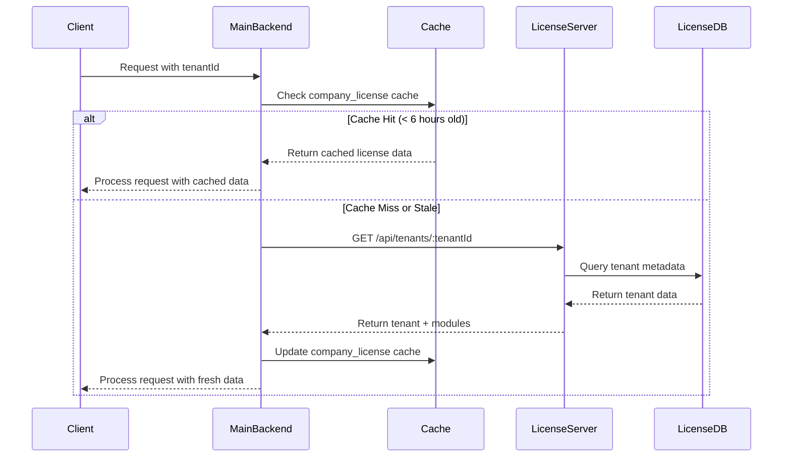
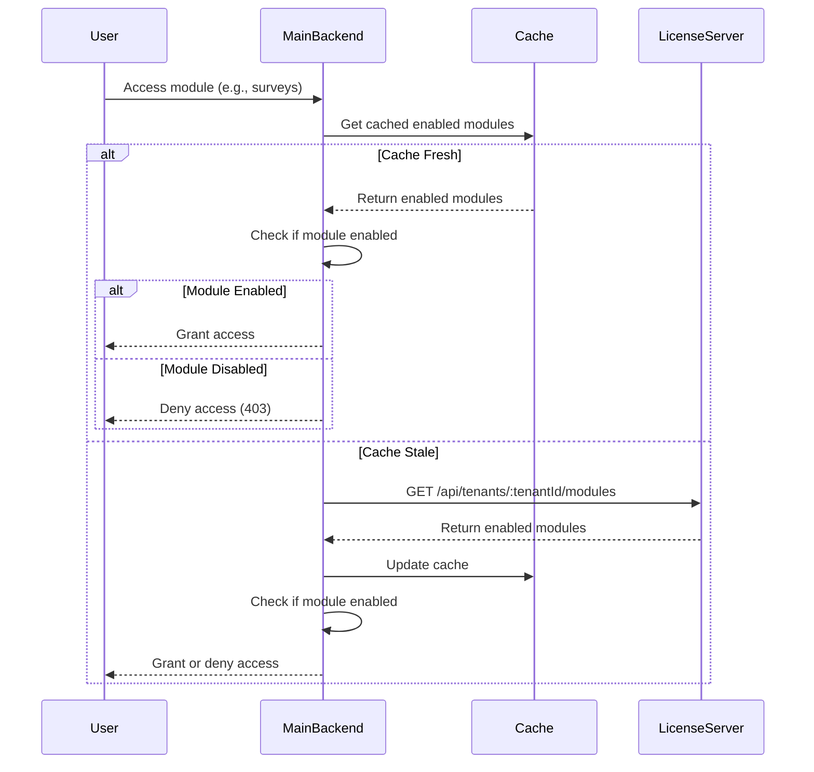
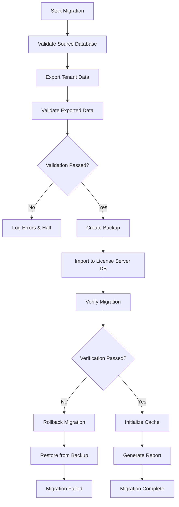
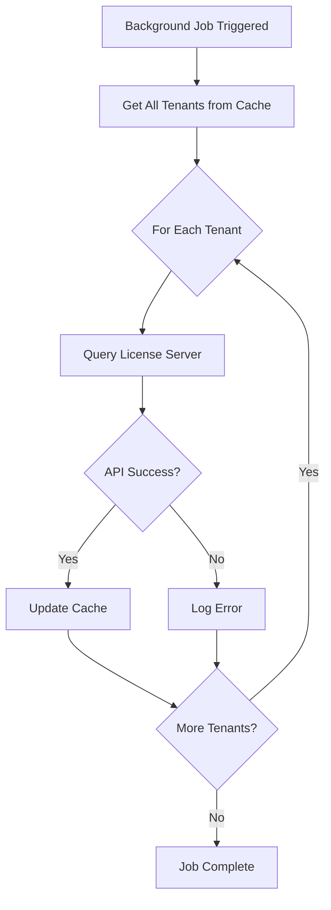

# Platform Data Migration Architecture

## Overview

This document describes the architecture of the platform data migration system, which separates platform control data (tenant metadata, subscriptions, modules) from business operations data. This separation establishes clear boundaries between the License Server and Main Backend applications.

---

## Architectural Principles

### Separation of Concerns

**Platform Control (License Server)**
- Tenant metadata and configuration
- Subscription and billing information
- Module enablement and feature flags
- License validation and enforcement

**Business Operations (Main Backend)**
- HR operational data (users, attendance, payroll)
- Tenant-scoped business logic
- Application features and workflows
- Cached license data for performance

### Single Source of Truth

The License Server is the authoritative source for all platform control data. The Main Backend queries the License Server via REST API and maintains a local cache for performance optimization.

### Backward Compatibility

During migration, the system supports reading from both databases, allowing for a phased transition with zero downtime.

---

## System Architecture

### High-Level Architecture

```
┌─────────────────────────────────────────────────────────────┐
│                     Client Applications                      │
│  (Web UI, Mobile Apps, Third-party Integrations)            │
└────────────────────────┬────────────────────────────────────┘
                         │
                         │ HTTPS
                         ▼
┌─────────────────────────────────────────────────────────────┐
│                    Main Backend (Port 5000)                  │
│  ┌──────────────────────────────────────────────────────┐  │
│  │  Business Logic Layer                                 │  │
│  │  - User Management                                    │  │
│  │  - Attendance Tracking                                │  │
│  │  - Payroll Processing                                 │  │
│  │  - Survey Management                                  │  │
│  └──────────────────────────────────────────────────────┘  │
│  ┌──────────────────────────────────────────────────────┐  │
│  │  License Integration Layer                            │  │
│  │  - License Server Client                              │  │
│  │  - Cache Management                                   │  │
│  │  - Fallback Logic                                     │  │
│  └──────────────────────────────────────────────────────┘  │
└────────────────────────┬────────────────────────────────────┘
                         │
                         │ REST API (HTTPS)
                         │ Authentication: API Keys
                         ▼
┌─────────────────────────────────────────────────────────────┐
│                 License Server (Port 4000)                   │
│  ┌──────────────────────────────────────────────────────┐  │
│  │  API Layer                                            │  │
│  │  - Tenant Management                                  │  │
│  │  - Module Management                                  │  │
│  │  - Subscription Management                            │  │
│  │  - License Validation                                 │  │
│  └──────────────────────────────────────────────────────┘  │
│  ┌──────────────────────────────────────────────────────┐  │
│  │  Authentication & Authorization                       │  │
│  │  - API Key Validation                                 │  │
│  │  - Permission Checking                                │  │
│  │  - Rate Limiting                                      │  │
│  └──────────────────────────────────────────────────────┘  │
└────────────────────────┬────────────────────────────────────┘
                         │
                         ▼
┌─────────────────────────────────────────────────────────────┐
│                    Database Layer                            │
│  ┌──────────────────────┐  ┌──────────────────────────┐    │
│  │  hrsm-licenses DB    │  │  hrsm_platform DB        │    │
│  │  (License Server)    │  │  (Main Backend)          │    │
│  ├──────────────────────┤  ├──────────────────────────┤    │
│  │ • tenants            │  │ • users                  │    │
│  │ • subscriptions      │  │ • attendances            │    │
│  │ • enabled_modules    │  │ • surveys                │    │
│  │ • licenses           │  │ • payroll                │    │
│  │ • license_validations│  │ • company_license (cache)│    │
│  └──────────────────────┘  └──────────────────────────┘    │
└─────────────────────────────────────────────────────────────┘
```

---

## Data Flow Diagrams

### 1. License Validation Flow



### 2. Module Access Check Flow



### 3. Migration Data Flow



### 4. Cache Refresh Flow



---

## Component Details

### License Server Components

#### 1. API Layer

**Responsibilities:**
- Handle HTTP requests
- Route to appropriate controllers
- Return formatted responses

**Technologies:**
- Express.js
- Node.js

**Key Files:**
- `hrsm-license-server/src/routes/tenants.js`
- `hrsm-license-server/src/routes/modules.js`
- `hrsm-license-server/src/routes/subscriptions.js`

#### 2. Authentication Middleware

**Responsibilities:**
- Validate API keys
- Check permissions
- Enforce rate limits

**Implementation:**
```javascript
// API Key Authentication
async function authenticateApiKey(req, res, next) {
  const apiKey = req.headers['x-api-key'];
  
  if (!apiKey) {
    return res.status(401).json({ 
      error: 'API key required' 
    });
  }
  
  const isValid = await validateApiKey(apiKey);
  
  if (!isValid) {
    return res.status(401).json({ 
      error: 'Invalid API key' 
    });
  }
  
  next();
}
```

#### 3. Data Access Layer

**Responsibilities:**
- Query MongoDB
- Manage transactions
- Handle database errors

**Key Collections:**
- `tenants` - Tenant metadata
- `subscriptions` - Billing information
- `enabled_modules` - Feature flags
- `licenses` - License records

### Main Backend Components

#### 1. License Server Client

**Responsibilities:**
- Make HTTP requests to License Server
- Handle authentication
- Manage timeouts and retries

**Implementation:**
```javascript
class LicenseServerClient {
  constructor(baseUrl, apiKey) {
    this.baseUrl = baseUrl;
    this.apiKey = apiKey;
    this.httpClient = axios.create({
      baseURL: baseUrl,
      headers: { 'X-API-Key': apiKey },
      timeout: 5000
    });
  }

  async getTenant(tenantId) {
    const response = await this.httpClient.get(
      `/api/tenants/${tenantId}`
    );
    return response.data.data;
  }

  async getEnabledModules(tenantId) {
    const response = await this.httpClient.get(
      `/api/tenants/${tenantId}/modules`
    );
    return response.data.data.modules;
  }
}
```

#### 2. Cache Management

**Responsibilities:**
- Store license data locally
- Check cache freshness
- Refresh stale cache
- Handle cache invalidation

**Cache Strategy:**
- TTL: 6 hours
- Storage: MongoDB collection `company_license`
- Refresh: Background job every 6 hours
- Fallback: Use stale cache if License Server unavailable

**Implementation:**
```javascript
// Cache TTL: 6 hours
const CACHE_TTL = 6 * 60 * 60 * 1000;

async function getCachedLicense(tenantId) {
  const cached = await CompanyLicense.findOne({ 
    companyId: tenantId 
  });
  return cached;
}

function isCacheStale(cachedLicense) {
  if (!cachedLicense.quickAccess?.lastSyncedAt) {
    return true;
  }
  
  const age = Date.now() - 
    new Date(cachedLicense.quickAccess.lastSyncedAt).getTime();
  return age > CACHE_TTL;
}

async function updateLicenseCache(tenantId, licenseData) {
  await CompanyLicense.updateOne(
    { companyId: tenantId },
    {
      $set: {
        'quickAccess.enabledModules': licenseData.enabledModules,
        'quickAccess.subscriptionStatus': licenseData.subscription.status,
        'quickAccess.lastSyncedAt': new Date(),
        'quickAccess.licenseValid': true
      }
    },
    { upsert: true }
  );
}
```

#### 3. Fallback Logic

**Responsibilities:**
- Handle License Server unavailability
- Use stale cache when necessary
- Log fallback events

**Implementation:**
```javascript
async function getTenantWithFallback(tenantId) {
  try {
    // Try License Server first
    return await licenseServerClient.getTenant(tenantId);
  } catch (error) {
    // Fallback to cache
    logger.warn('License Server unavailable, using cache', { 
      tenantId 
    });
    
    const cached = await getCachedLicense(tenantId);
    
    if (!cached) {
      throw new Error(
        'License Server unavailable and no cache available'
      );
    }
    
    return cached;
  }
}
```

---

## Database Schemas

### License Server Database (hrsm-licenses)

#### Tenants Collection

```javascript
{
  _id: ObjectId,
  tenantId: String,           // Unique identifier
  name: String,               // Company name
  domain: String,             // Primary domain
  contactEmail: String,       // Admin contact
  contactPhone: String,       // Admin phone
  
  subscription: {
    status: String,           // "active", "suspended", "expired"
    plan: String,             // "basic", "professional", "enterprise"
    startDate: Date,
    expiresAt: Date,
    billingCycle: String,     // "monthly", "annual"
    autoRenew: Boolean
  },
  
  enabledModules: [String],   // ["surveys", "payroll", ...]
  
  usageLimits: {
    maxUsers: Number,
    maxStorage: Number,       // in GB
    maxApiCalls: Number       // per day
  },
  
  billing: {
    currency: String,
    amount: Number,
    lastPaymentDate: Date,
    nextBillingDate: Date
  },
  
  metadata: {
    industry: String,
    companySize: String,
    country: String,
    timezone: String
  },
  
  status: String,             // "active", "suspended", "deleted"
  createdAt: Date,
  updatedAt: Date,
  deletedAt: Date
}

// Indexes
db.tenants.createIndex({ tenantId: 1 }, { unique: true });
db.tenants.createIndex({ domain: 1 });
db.tenants.createIndex({ "subscription.status": 1 });
db.tenants.createIndex({ status: 1 });
```

#### Subscriptions Collection

```javascript
{
  _id: ObjectId,
  tenantId: String,
  subscriptionId: String,
  
  plan: {
    name: String,
    features: [String],
    limits: {
      users: Number,
      storage: Number,
      apiCalls: Number
    }
  },
  
  billing: {
    status: String,
    amount: Number,
    currency: String,
    cycle: String,
    startDate: Date,
    currentPeriodStart: Date,
    currentPeriodEnd: Date,
    cancelAtPeriodEnd: Boolean
  },
  
  paymentHistory: [{
    date: Date,
    amount: Number,
    status: String,
    invoiceId: String,
    paymentMethod: String
  }],
  
  usage: {
    currentUsers: Number,
    currentStorage: Number,
    currentApiCalls: Number,
    lastUpdated: Date
  },
  
  createdAt: Date,
  updatedAt: Date
}

// Indexes
db.subscriptions.createIndex({ tenantId: 1 }, { unique: true });
db.subscriptions.createIndex({ subscriptionId: 1 }, { unique: true });
```

#### Enabled Modules Collection

```javascript
{
  _id: ObjectId,
  tenantId: String,
  moduleId: String,
  
  enabled: Boolean,
  enabledAt: Date,
  enabledBy: String,
  
  configuration: {
    // Module-specific settings
  },
  
  usage: {
    lastUsed: Date,
    usageCount: Number
  },
  
  createdAt: Date,
  updatedAt: Date
}

// Indexes
db.enabled_modules.createIndex({ tenantId: 1, moduleId: 1 }, { unique: true });
db.enabled_modules.createIndex({ tenantId: 1, enabled: 1 });
```

### Main Backend Database (hrsm_platform)

#### Company License Cache Collection

```javascript
{
  _id: ObjectId,
  companyId: String,          // Same as tenantId
  
  quickAccess: {
    enabledModules: [String], // Cached from License Server
    subscriptionStatus: String, // Cached from License Server
    licenseValid: Boolean,
    lastSyncedAt: Date,       // When cache was last updated
    cacheVersion: Number
  },
  
  // Original license fields (kept for backward compatibility)
  licenseKey: String,
  expiresAt: Date,
  
  updatedAt: Date
}

// Indexes
db.company_license.createIndex({ companyId: 1 }, { unique: true });
db.company_license.createIndex({ "quickAccess.lastSyncedAt": 1 });
```

---

## Security Architecture

### Authentication

**API Key Authentication:**
- All License Server API requests require API keys
- API keys stored securely in environment variables
- Keys have specific permissions (read, write, delete)

**Key Generation:**
```bash
node hrsm-license-server/src/scripts/generateApiKey.js \
  --name "Main Backend" \
  --permissions "tenants:read,tenants:write"
```

### Authorization

**Permission Model:**
- `tenants:read` - Read tenant information
- `tenants:write` - Create/update tenants
- `tenants:delete` - Delete tenants
- `modules:read` - Read module information
- `modules:write` - Enable/disable modules
- `licenses:validate` - Validate licenses

**Enforcement:**
```javascript
function requirePermission(permission) {
  return (req, res, next) => {
    if (!req.apiKey.permissions.includes(permission)) {
      return res.status(403).json({ 
        error: 'Insufficient permissions' 
      });
    }
    next();
  };
}
```

### Transport Security

**HTTPS Enforcement:**
- All production traffic uses HTTPS
- TLS 1.2 or higher required
- Certificate validation enforced

**Configuration:**
```javascript
// Redirect HTTP to HTTPS in production
if (process.env.NODE_ENV === 'production') {
  app.use((req, res, next) => {
    if (!req.secure) {
      return res.redirect(`https://${req.headers.host}${req.url}`);
    }
    next();
  });
}
```

---

## Performance Optimization

### Caching Strategy

**Cache Levels:**
1. **Application Cache** - In-memory cache for frequently accessed data
2. **Database Cache** - MongoDB collection for persistent cache
3. **CDN Cache** - For static assets (not applicable to API)

**Cache Invalidation:**
- Time-based: 6-hour TTL
- Event-based: Invalidate on module changes
- Manual: Admin can force refresh

### Database Optimization

**Indexes:**
- All frequently queried fields indexed
- Compound indexes for complex queries
- Unique indexes for identifiers

**Query Optimization:**
- Use projection to limit returned fields
- Batch queries where possible
- Use aggregation pipeline for complex operations

### API Optimization

**Response Compression:**
```javascript
const compression = require('compression');
app.use(compression());
```

**Connection Pooling:**
```javascript
mongoose.connect(mongoUri, {
  maxPoolSize: 10,
  minPoolSize: 2
});
```

---

## Monitoring and Observability

### Logging

**Log Levels:**
- `error` - Critical errors requiring immediate attention
- `warn` - Warning conditions
- `info` - Informational messages
- `debug` - Detailed debugging information

**Log Structure:**
```javascript
{
  timestamp: "2026-01-27T12:00:00Z",
  level: "info",
  message: "Tenant retrieved successfully",
  context: {
    tenantId: "techcorp_solutions",
    source: "license-server",
    requestId: "req-123"
  }
}
```

### Metrics

**Key Metrics:**
- API request rate
- API response time
- Cache hit rate
- Database query time
- Error rate

**Monitoring Tools:**
- Prometheus for metrics collection
- Grafana for visualization
- AlertManager for alerting

### Health Checks

**License Server Health:**
```bash
GET /health

Response:
{
  "status": "healthy",
  "timestamp": "2026-01-27T12:00:00Z",
  "database": "connected",
  "uptime": 86400
}
```

**Main Backend Health:**
```bash
GET /health

Response:
{
  "status": "healthy",
  "timestamp": "2026-01-27T12:00:00Z",
  "database": "connected",
  "licenseServer": "connected",
  "cache": "operational"
}
```

---

## Disaster Recovery

### Backup Strategy

**Automated Backups:**
- Daily full backups of both databases
- Hourly incremental backups
- 30-day retention period

**Backup Locations:**
- Primary: Local storage
- Secondary: Cloud storage (S3/Azure Blob)

### Recovery Procedures

**Database Recovery:**
```bash
# Restore License Server database
mongorestore --db=hrsm-licenses ./backups/hrsm-licenses-[timestamp]

# Restore Main Backend database
mongorestore --db=hrsm_platform ./backups/hrsm_platform-[timestamp]
```

**Application Recovery:**
1. Restore database from backup
2. Restart services
3. Verify health checks
4. Test critical functionality
5. Monitor for errors

### Recovery Time Objectives

- **RTO (Recovery Time Objective):** 1 hour
- **RPO (Recovery Point Objective):** 1 hour

---

## Scalability Considerations

### Horizontal Scaling

**License Server:**
- Stateless design allows multiple instances
- Load balancer distributes requests
- Shared database for consistency

**Main Backend:**
- Already designed for horizontal scaling
- Session management via Redis
- Tenant isolation ensures data safety

### Vertical Scaling

**Database:**
- Increase MongoDB instance size
- Add read replicas for read-heavy workloads
- Use sharding for very large datasets

### Caching at Scale

**Distributed Cache:**
- Use Redis for shared cache across instances
- Implement cache warming on startup
- Use cache aside pattern

---

## Migration Strategy

### Phase 1: Preparation (Week 1)

- Set up License Server infrastructure
- Create API endpoints
- Implement authentication
- Write migration scripts

### Phase 2: Testing (Week 2)

- Test migration in development
- Validate data integrity
- Performance testing
- Security testing

### Phase 3: Staging Migration (Week 3)

- Migrate staging environment
- Enable backward compatibility
- Monitor for issues
- User acceptance testing

### Phase 4: Production Migration (Week 4)

- Schedule maintenance window
- Execute migration
- Verify success
- Monitor closely

### Phase 5: Cleanup (Week 5)

- Remove backward compatibility code
- Archive old data
- Update documentation
- Post-migration review

---

## Future Enhancements

### Planned Improvements

1. **GraphQL API** - Add GraphQL endpoint for flexible queries
2. **Real-time Updates** - WebSocket support for live updates
3. **Advanced Analytics** - Usage analytics and reporting
4. **Multi-region Support** - Deploy across multiple regions
5. **Enhanced Caching** - Redis-based distributed cache

### Extensibility

The architecture is designed to be extensible:
- Plugin system for custom modules
- Webhook support for integrations
- Event-driven architecture for decoupling
- API versioning for backward compatibility

---

## Conclusion

This architecture establishes a clear separation between platform control and business operations, improving maintainability, security, and scalability. The License Server serves as the single source of truth for tenant metadata, while the Main Backend focuses on business logic and operations.

The caching strategy ensures high performance, and the fallback mechanisms provide resilience against service disruptions. The phased migration approach minimizes risk and allows for rollback if issues arise.

---

**Document Version:** 1.0  
**Last Updated:** 2026-01-27  
**Authors:** Platform Architecture Team  
**Next Review:** Quarterly
