# End-to-End Testing Framework Guide - HR-SM Modernization

## 📋 Table of Contents

1. [Overview](#overview)
2. [Framework Architecture](#framework-architecture)
3. [Test Structure](#test-structure)
4. [Writing Tests](#writing-tests)
5. [Custom Commands](#custom-commands)
6. [Test Data Management](#test-data-management)
7. [Multi-Tenant Testing](#multi-tenant-testing)
8. [Error Handling Tests](#error-handling-tests)
9. [Performance Testing](#performance-testing)
10. [CI/CD Integration](#cicd-integration)
11. [Best Practices](#best-practices)
12. [Troubleshooting](#troubleshooting)

## Overview

The HR-SM platform implements a comprehensive E2E testing framework using Cypress 15.8.1 to validate critical user workflows, multi-tenant data isolation, and platform administration functionality. The framework provides robust testing capabilities with intelligent mocking and graceful error handling.

### Key Features Achieved

- **Comprehensive Coverage**: 295+ tests covering all critical workflows
- **Multi-Tenant Isolation**: Complete validation of tenant data separation
- **Intelligent Mocking**: Tests work with or without backend services
- **Performance Monitoring**: Built-in performance tracking and optimization
- **Accessibility Testing**: Automated accessibility compliance validation
- **Error Resilience**: Graceful handling of service unavailability

### Implementation Status

✅ **Framework Infrastructure**: Complete and functional  
✅ **Multi-Tenant Tests**: 85+ tests for data isolation validation  
✅ **Platform Admin Tests**: 140+ tests for administration workflows  
✅ **Error Handling Tests**: 70+ tests for edge cases and failures  
✅ **Custom Commands**: 25+ reusable Cypress commands  
✅ **Documentation**: Complete patterns and maintenance guides  

## Framework Architecture

### Test Framework Structure

```
e2e/
├── fixtures/                    # Test data files
│   ├── users.json              # User test data with roles
│   ├── tenants.json            # Tenant configuration data
│   ├── modules.json            # Module configuration
│   └── test-data.json          # General test data
├── specs/                      # Test specifications
│   ├── auth/                   # Authentication flow tests
│   ├── hr-workflows/           # Core HR functionality tests
│   ├── platform-admin/         # Platform administration tests
│   ├── multi-tenant/           # Data isolation tests
│   └── error-handling/         # Edge cases and error tests
├── support/                    # Support files and utilities
│   ├── e2e.js                  # Main support configuration
│   ├── commands.js             # Custom Cypress commands
│   ├── helpers.js              # Test utility functions
│   ├── database.js             # Database operations (mocked)
│   └── mocking-utils.js        # API mocking utilities
├── screenshots/                # Test failure screenshots
├── videos/                     # Test execution videos
└── cypress.config.js           # Cypress configuration
```

### Architecture Flow

```mermaid
graph TB
    subgraph "🧪 Test Execution Layer"
        CYPRESS[Cypress Test Runner<br/>Test Orchestration<br/>Browser Automation]
        SPECS[Test Specifications<br/>Test Cases<br/>Assertions]
    end
    
    subgraph "🛠️ Support Layer"
        COMMANDS[Custom Commands<br/>Reusable Actions<br/>Complex Workflows]
        HELPERS[Helper Functions<br/>Utilities<br/>Data Generators]
        MOCKING[Mocking Utils<br/>API Interception<br/>Service Simulation]
    end
    
    subgraph "📊 Data Layer"
        FIXTURES[Test Fixtures<br/>Static Test Data<br/>Configuration]
        DATABASE[Database Utils<br/>Data Seeding<br/>Cleanup Operations]
    end
    
    subgraph "🌐 Application Layer"
        FRONTEND[Frontend Apps<br/>HR App + Platform Admin<br/>User Interfaces]
        BACKEND[Backend APIs<br/>Business Logic<br/>Data Services]
        LICENSE[License Server<br/>Validation Service<br/>Feature Control]
    end
    
    CYPRESS --> SPECS
    SPECS --> COMMANDS
    COMMANDS --> HELPERS
    HELPERS --> MOCKING
    MOCKING --> FIXTURES
    FIXTURES --> DATABASE
    
    CYPRESS --> FRONTEND
    FRONTEND --> BACKEND
    BACKEND --> LICENSE
    
    classDef testClass fill:#e3f2fd,stroke:#0d47a1,stroke-width:2px
    classDef supportClass fill:#f3e5f5,stroke:#4a148c,stroke-width:2px
    classDef dataClass fill:#e8f5e8,stroke:#1b5e20,stroke-width:2px
    classDef appClass fill:#fff3e0,stroke:#e65100,stroke-width:2px
    
    class CYPRESS,SPECS testClass
    class COMMANDS,HELPERS,MOCKING supportClass
    class FIXTURES,DATABASE dataClass
    class FRONTEND,BACKEND,LICENSE appClass
```



## Test Structure

### Test Organization Pattern

```javascript
// Standard test file structure
describe('Feature Name', () => {
  beforeEach(() => {
    // Setup common to all tests
    cy.cleanupTestData();
    cy.seedTestData('tenant', { domain: 'testcompany' });
  });

  afterEach(() => {
    // Cleanup after each test
    cy.cleanupTestData();
  });

  context('Specific Scenario Group', () => {
    it('should perform expected behavior', () => {
      // Arrange
      cy.fixture('testData').then((data) => {
        // Act
        cy.loginAsTenantUser('employee', 'testcompany');
        cy.visit('/feature-page');
        
        // Assert
        cy.get('[data-cy="feature-content"]').should('be.visible');
        cy.get('[data-cy="user-name"]').should('contain', data.user.name);
      });
    });

    it('should handle error conditions', () => {
      // Test error scenarios
      cy.intercept('GET', '/api/feature-data', { statusCode: 500 }).as('serverError');
      
      cy.loginAsTenantUser('employee', 'testcompany');
      cy.visit('/feature-page');
      
      cy.wait('@serverError');
      cy.get('[data-cy="error-message"]').should('be.visible');
    });
  });
});
```

### Multi-Tenant Test Pattern

```javascript
// Multi-tenant isolation test structure
describe('Multi-Tenant Data Isolation', () => {
  beforeEach(() => {
    cy.cleanupTestData();
    cy.seedTestData('multiTenant', {
      tenantA: { domain: 'company-a', name: 'Company A' },
      tenantB: { domain: 'company-b', name: 'Company B' }
    });
  });

  it('should maintain tenant data isolation', () => {
    cy.fixture('tenants').then((tenants) => {
      const tenantA = tenants.tenantA;
      const tenantB = tenants.tenantB;

      // Create data for Tenant A
      cy.loginAsTenantUser('manager', tenantA.domain);
      cy.createTestData('employee', { name: 'Tenant A Employee' });

      // Create data for Tenant B
      cy.loginAsTenantUser('manager', tenantB.domain);
      cy.createTestData('employee', { name: 'Tenant B Employee' });

      // Verify Tenant A can only see their data
      cy.loginAsTenantUser('employee', tenantA.domain);
      cy.visit('/employees');
      cy.get('[data-cy="employee-list"]').should('contain', 'Tenant A Employee');
      cy.get('[data-cy="employee-list"]').should('not.contain', 'Tenant B Employee');

      // Verify Tenant B can only see their data
      cy.loginAsTenantUser('employee', tenantB.domain);
      cy.visit('/employees');
      cy.get('[data-cy="employee-list"]').should('contain', 'Tenant B Employee');
      cy.get('[data-cy="employee-list"]').should('not.contain', 'Tenant A Employee');
    });
  });
});
```

## Writing Tests

### Authentication Flow Tests

```javascript
// e2e/specs/auth/login-flow.cy.js
describe('Authentication Flows', () => {
  beforeEach(() => {
    cy.cleanupTestData();
    cy.seedTestData('tenant', { domain: 'testcompany' });
  });

  context('Tenant User Login', () => {
    it('should login successfully with valid credentials', () => {
      cy.fixture('users').then((users) => {
        const employee = users.employee;
        
        cy.visit('/login');
        cy.get('[data-cy="email-input"]').type(employee.email);
        cy.get('[data-cy="password-input"]').type(employee.password);
        cy.get('[data-cy="login-button"]').click();
        
        // Verify successful login
        cy.url().should('include', '/dashboard');
        cy.get('[data-cy="user-menu"]').should('contain', employee.firstName);
        cy.get('[data-cy="tenant-name"]').should('contain', 'Test Company');
      });
    });

    it('should show error for invalid credentials', () => {
      cy.visit('/login');
      cy.get('[data-cy="email-input"]').type('invalid@example.com');
      cy.get('[data-cy="password-input"]').type('wrongpassword');
      cy.get('[data-cy="login-button"]').click();
      
      cy.get('[data-cy="error-message"]')
        .should('be.visible')
        .and('contain', 'Invalid credentials');
      cy.url().should('include', '/login');
    });

    it('should handle session timeout', () => {
      cy.loginAsTenantUser('employee', 'testcompany');
      
      // Simulate session expiry
      cy.window().then((win) => {
        win.localStorage.removeItem('authToken');
      });
      
      cy.visit('/dashboard');
      cy.url().should('include', '/login');
      cy.get('[data-cy="session-expired-message"]').should('be.visible');
    });
  });

  context('Platform Admin Login', () => {
    it('should login to platform admin successfully', () => {
      cy.fixture('users').then((users) => {
        const platformAdmin = users.platformAdmin;
        
        cy.visit('/platform-admin/login');
        cy.get('[data-cy="email-input"]').type(platformAdmin.email);
        cy.get('[data-cy="password-input"]').type(platformAdmin.password);
        cy.get('[data-cy="login-button"]').click();
        
        cy.url().should('include', '/platform-admin/dashboard');
        cy.get('[data-cy="admin-menu"]').should('be.visible');
        cy.get('[data-cy="platform-title"]').should('contain', 'Platform Administration');
      });
    });
  });

  context('Password Reset', () => {
    it('should initiate password reset flow', () => {
      cy.visit('/login');
      cy.get('[data-cy="forgot-password-link"]').click();
      
      cy.url().should('include', '/forgot-password');
      cy.get('[data-cy="email-input"]').type('test@example.com');
      cy.get('[data-cy="reset-button"]').click();
      
      cy.get('[data-cy="success-message"]')
        .should('be.visible')
        .and('contain', 'Password reset email sent');
    });
  });
});
```

### HR Workflow Tests

```javascript
// e2e/specs/hr-workflows/employee-management.cy.js
describe('Employee Management Workflows', () => {
  beforeEach(() => {
    cy.cleanupTestData();
    cy.seedTestData('tenant', { domain: 'testcompany' });
    cy.loginAsTenantUser('hrManager', 'testcompany');
  });

  context('Employee Profile Management', () => {
    it('should create new employee profile', () => {
      cy.visit('/employees');
      cy.get('[data-cy="add-employee-button"]').click();
      
      // Fill employee form
      cy.get('[data-cy="first-name-input"]').type('John');
      cy.get('[data-cy="last-name-input"]').type('Doe');
      cy.get('[data-cy="email-input"]').type('john.doe@testcompany.com');
      cy.get('[data-cy="employee-id-input"]').type('EMP001');
      cy.get('[data-cy="department-select"]').select('Engineering');
      cy.get('[data-cy="role-select"]').select('Employee');
      
      cy.get('[data-cy="save-button"]').click();
      
      // Verify employee created
      cy.get('[data-cy="success-message"]').should('contain', 'Employee created successfully');
      cy.get('[data-cy="employee-list"]').should('contain', 'John Doe');
      cy.get('[data-cy="employee-list"]').should('contain', 'EMP001');
    });

    it('should update employee profile', () => {
      // Create employee first
      cy.createTestEmployee({
        firstName: 'Jane',
        lastName: 'Smith',
        email: 'jane.smith@testcompany.com',
        employeeId: 'EMP002'
      });
      
      cy.visit('/employees');
      cy.get('[data-cy="employee-row"]').contains('Jane Smith').click();
      cy.get('[data-cy="edit-button"]').click();
      
      // Update employee details
      cy.get('[data-cy="department-select"]').select('Human Resources');
      cy.get('[data-cy="role-select"]').select('Manager');
      cy.get('[data-cy="save-button"]').click();
      
      // Verify update
      cy.get('[data-cy="success-message"]').should('contain', 'Employee updated successfully');
      cy.get('[data-cy="employee-department"]').should('contain', 'Human Resources');
      cy.get('[data-cy="employee-role"]').should('contain', 'Manager');
    });

    it('should validate required fields', () => {
      cy.visit('/employees');
      cy.get('[data-cy="add-employee-button"]').click();
      cy.get('[data-cy="save-button"]').click();
      
      // Verify validation errors
      cy.get('[data-cy="first-name-error"]').should('contain', 'First name is required');
      cy.get('[data-cy="last-name-error"]').should('contain', 'Last name is required');
      cy.get('[data-cy="email-error"]').should('contain', 'Email is required');
    });
  });

  context('Leave Request Workflow', () => {
    it('should submit and approve leave request', () => {
      // Employee submits leave request
      cy.loginAsTenantUser('employee', 'testcompany');
      cy.visit('/leave-requests');
      cy.get('[data-cy="new-request-button"]').click();
      
      cy.get('[data-cy="leave-type-select"]').select('Annual Leave');
      cy.get('[data-cy="start-date-input"]').type('2025-02-01');
      cy.get('[data-cy="end-date-input"]').type('2025-02-05');
      cy.get('[data-cy="reason-textarea"]').type('Family vacation');
      cy.get('[data-cy="submit-button"]').click();
      
      cy.get('[data-cy="success-message"]').should('contain', 'Leave request submitted');
      
      // Manager approves request
      cy.loginAsTenantUser('manager', 'testcompany');
      cy.visit('/leave-requests/pending');
      cy.get('[data-cy="request-row"]').first().click();
      cy.get('[data-cy="approve-button"]').click();
      cy.get('[data-cy="approval-comment"]').type('Approved for family vacation');
      cy.get('[data-cy="confirm-approve-button"]').click();
      
      cy.get('[data-cy="success-message"]').should('contain', 'Leave request approved');
      
      // Verify employee sees approved status
      cy.loginAsTenantUser('employee', 'testcompany');
      cy.visit('/leave-requests');
      cy.get('[data-cy="request-status"]').should('contain', 'Approved');
    });

    it('should reject leave request with reason', () => {
      // Create pending leave request
      cy.createTestLeaveRequest({
        employeeId: 'employee-123',
        type: 'sick-leave',
        startDate: '2025-02-10',
        endDate: '2025-02-12'
      });
      
      cy.loginAsTenantUser('manager', 'testcompany');
      cy.visit('/leave-requests/pending');
      cy.get('[data-cy="request-row"]').first().click();
      cy.get('[data-cy="reject-button"]').click();
      cy.get('[data-cy="rejection-reason"]').type('Insufficient documentation provided');
      cy.get('[data-cy="confirm-reject-button"]').click();
      
      cy.get('[data-cy="success-message"]').should('contain', 'Leave request rejected');
    });
  });
});
```
## Custom Commands

### Authentication Commands

```javascript
// e2e/support/commands.js

// Login as tenant user with specific role
Cypress.Commands.add('loginAsTenantUser', (userType, tenantDomain) => {
  cy.fixture('users').then((users) => {
    const user = users[userType];
    if (!user) {
      throw new Error(`User type '${userType}' not found in fixtures`);
    }

    cy.session([userType, tenantDomain], () => {
      cy.visit(`/login?tenant=${tenantDomain}`);
      cy.get('[data-cy="email-input"]').type(user.email);
      cy.get('[data-cy="password-input"]').type(user.password);
      cy.get('[data-cy="login-button"]').click();
      
      // Wait for successful login
      cy.url().should('include', '/dashboard');
      cy.get('[data-cy="user-menu"]').should('be.visible');
    });
  });
});

// Login as platform admin
Cypress.Commands.add('loginAsPlatformAdmin', () => {
  cy.fixture('users').then((users) => {
    const admin = users.platformAdmin;
    
    cy.session('platformAdmin', () => {
      cy.visit('/platform-admin/login');
      cy.get('[data-cy="email-input"]').type(admin.email);
      cy.get('[data-cy="password-input"]').type(admin.password);
      cy.get('[data-cy="login-button"]').click();
      
      cy.url().should('include', '/platform-admin/dashboard');
      cy.get('[data-cy="admin-menu"]').should('be.visible');
    });
  });
});

// Logout current user
Cypress.Commands.add('logout', () => {
  cy.get('[data-cy="user-menu"]').click();
  cy.get('[data-cy="logout-button"]').click();
  cy.url().should('include', '/login');
});
```

### Data Management Commands

```javascript
// Test data seeding and cleanup
Cypress.Commands.add('seedTestData', (dataType, config = {}) => {
  cy.task('seedTestData', { dataType, config });
});

Cypress.Commands.add('cleanupTestData', () => {
  cy.task('cleanupTestData');
});

// Create specific test entities
Cypress.Commands.add('createTestEmployee', (employeeData) => {
  cy.task('createTestEmployee', employeeData);
});

Cypress.Commands.add('createTestDepartment', (departmentData) => {
  cy.task('createTestDepartment', departmentData);
});

Cypress.Commands.add('createTestLeaveRequest', (requestData) => {
  cy.task('createTestLeaveRequest', requestData);
});

Cypress.Commands.add('createTestTenant', (tenantData) => {
  cy.task('createTestTenant', tenantData);
});
```

### UI Interaction Commands

```javascript
// Form filling helpers
Cypress.Commands.add('fillEmployeeForm', (employeeData) => {
  if (employeeData.firstName) {
    cy.get('[data-cy="first-name-input"]').clear().type(employeeData.firstName);
  }
  if (employeeData.lastName) {
    cy.get('[data-cy="last-name-input"]').clear().type(employeeData.lastName);
  }
  if (employeeData.email) {
    cy.get('[data-cy="email-input"]').clear().type(employeeData.email);
  }
  if (employeeData.employeeId) {
    cy.get('[data-cy="employee-id-input"]').clear().type(employeeData.employeeId);
  }
  if (employeeData.department) {
    cy.get('[data-cy="department-select"]').select(employeeData.department);
  }
  if (employeeData.role) {
    cy.get('[data-cy="role-select"]').select(employeeData.role);
  }
});

// Navigation helpers
Cypress.Commands.add('navigateToModule', (moduleName) => {
  cy.get('[data-cy="sidebar-menu"]').within(() => {
    cy.get(`[data-cy="menu-${moduleName}"]`).click();
  });
  cy.url().should('include', `/${moduleName}`);
});

// Table interaction helpers
Cypress.Commands.add('searchInTable', (searchTerm) => {
  cy.get('[data-cy="table-search"]').clear().type(searchTerm);
  cy.get('[data-cy="search-button"]').click();
});

Cypress.Commands.add('sortTableBy', (columnName, direction = 'asc') => {
  cy.get(`[data-cy="column-header-${columnName}"]`).click();
  if (direction === 'desc') {
    cy.get(`[data-cy="column-header-${columnName}"]`).click();
  }
});

// Modal and dialog helpers
Cypress.Commands.add('openModal', (modalTrigger) => {
  cy.get(`[data-cy="${modalTrigger}"]`).click();
  cy.get('[data-cy="modal"]').should('be.visible');
});

Cypress.Commands.add('closeModal', () => {
  cy.get('[data-cy="modal-close"]').click();
  cy.get('[data-cy="modal"]').should('not.exist');
});

Cypress.Commands.add('confirmDialog', (action = 'confirm') => {
  cy.get('[data-cy="confirmation-dialog"]').should('be.visible');
  cy.get(`[data-cy="${action}-button"]`).click();
  cy.get('[data-cy="confirmation-dialog"]').should('not.exist');
});
```

### API Mocking Commands

```javascript
// API interception and mocking
Cypress.Commands.add('mockApiCall', (method, url, response, statusCode = 200) => {
  cy.intercept(method, url, {
    statusCode,
    body: response
  }).as(`mock${method}${url.replace(/[^a-zA-Z0-9]/g, '')}`);
});

Cypress.Commands.add('mockApiError', (method, url, statusCode = 500, message = 'Server Error') => {
  cy.intercept(method, url, {
    statusCode,
    body: { error: message }
  }).as(`mockError${method}${url.replace(/[^a-zA-Z0-9]/g, '')}`);
});

// Mock common API endpoints
Cypress.Commands.add('mockEmployeeApi', (employees = []) => {
  cy.intercept('GET', '/api/v1/hr-core/users*', {
    statusCode: 200,
    body: { success: true, data: employees }
  }).as('getEmployees');
  
  cy.intercept('POST', '/api/v1/hr-core/users', {
    statusCode: 201,
    body: { success: true, data: { id: 'new-employee-id' } }
  }).as('createEmployee');
});

Cypress.Commands.add('mockTenantApi', (tenants = []) => {
  cy.intercept('GET', '/platform/tenants*', {
    statusCode: 200,
    body: { success: true, data: tenants }
  }).as('getTenants');
  
  cy.intercept('POST', '/platform/tenants', {
    statusCode: 201,
    body: { success: true, data: { id: 'new-tenant-id' } }
  }).as('createTenant');
});
```

### Accessibility Commands

```javascript
// Accessibility testing helpers
Cypress.Commands.add('checkA11y', (context = null, options = {}) => {
  cy.injectAxe();
  cy.checkA11y(context, {
    includedImpacts: ['critical', 'serious'],
    ...options
  });
});

Cypress.Commands.add('testKeyboardNavigation', (selector) => {
  cy.get(selector).focus();
  cy.focused().should('have.attr', 'data-cy', selector.replace('[data-cy="', '').replace('"]', ''));
  
  // Test Tab navigation
  cy.focused().tab();
  cy.focused().should('not.have.attr', 'data-cy', selector.replace('[data-cy="', '').replace('"]', ''));
});

// Screen reader testing
Cypress.Commands.add('checkAriaLabels', (selector) => {
  cy.get(selector).should('have.attr', 'aria-label').or('have.attr', 'aria-labelledby');
});
```

## Test Data Management

### Fixture Structure

```javascript
// e2e/fixtures/users.json
{
  "employee": {
    "firstName": "John",
    "lastName": "Employee",
    "email": "john.employee@testcompany.com",
    "password": "password123",
    "role": "employee",
    "employeeId": "EMP001"
  },
  "manager": {
    "firstName": "Jane",
    "lastName": "Manager",
    "email": "jane.manager@testcompany.com",
    "password": "password123",
    "role": "manager",
    "employeeId": "MGR001"
  },
  "hrManager": {
    "firstName": "Bob",
    "lastName": "HR",
    "email": "bob.hr@testcompany.com",
    "password": "password123",
    "role": "hr",
    "employeeId": "HR001"
  },
  "tenantAdmin": {
    "firstName": "Alice",
    "lastName": "Admin",
    "email": "alice.admin@testcompany.com",
    "password": "password123",
    "role": "admin",
    "employeeId": "ADM001"
  },
  "platformAdmin": {
    "firstName": "Platform",
    "lastName": "Administrator",
    "email": "platform.admin@hrsm.com",
    "password": "platformpass123",
    "role": "platformAdmin"
  }
}
```

```javascript
// e2e/fixtures/tenants.json
{
  "tenantA": {
    "name": "Test Company A",
    "domain": "company-a",
    "subdomain": "company-a",
    "status": "active",
    "subscription": {
      "plan": "professional",
      "expiresAt": "2025-12-31T23:59:59.000Z"
    },
    "modules": ["hr-core", "tasks", "payroll", "reports"]
  },
  "tenantB": {
    "name": "Test Company B",
    "domain": "company-b",
    "subdomain": "company-b",
    "status": "active",
    "subscription": {
      "plan": "basic",
      "expiresAt": "2025-12-31T23:59:59.000Z"
    },
    "modules": ["hr-core", "tasks"]
  },
  "testcompany": {
    "name": "Test Company",
    "domain": "testcompany",
    "subdomain": "testcompany",
    "status": "active",
    "subscription": {
      "plan": "enterprise",
      "expiresAt": "2025-12-31T23:59:59.000Z"
    },
    "modules": ["hr-core", "tasks", "payroll", "reports", "clinic", "documents"]
  }
}
```

### Dynamic Test Data Generation

```javascript
// e2e/support/helpers.js

// Generate random test data
export const generateTestEmployee = (overrides = {}) => {
  const randomId = Math.floor(Math.random() * 10000);
  return {
    firstName: `TestEmployee${randomId}`,
    lastName: 'Generated',
    email: `test.employee.${randomId}@testcompany.com`,
    employeeId: `EMP${randomId}`,
    role: 'employee',
    department: 'Engineering',
    status: 'active',
    ...overrides
  };
};

export const generateTestTenant = (overrides = {}) => {
  const randomId = Math.floor(Math.random() * 10000);
  return {
    name: `Test Tenant ${randomId}`,
    domain: `tenant-${randomId}`,
    subdomain: `tenant-${randomId}`,
    status: 'active',
    subscription: {
      plan: 'professional',
      expiresAt: '2025-12-31T23:59:59.000Z'
    },
    modules: ['hr-core', 'tasks'],
    ...overrides
  };
};

export const generateTestLeaveRequest = (overrides = {}) => {
  const startDate = new Date();
  startDate.setDate(startDate.getDate() + 7); // Next week
  const endDate = new Date(startDate);
  endDate.setDate(endDate.getDate() + 2); // 3 days

  return {
    type: 'annual-leave',
    startDate: startDate.toISOString().split('T')[0],
    endDate: endDate.toISOString().split('T')[0],
    reason: 'Test leave request',
    status: 'pending',
    ...overrides
  };
};

// Test data factories
export class TestDataFactory {
  static createEmployeeBatch(count, tenantId, overrides = {}) {
    return Array.from({ length: count }, (_, index) => 
      generateTestEmployee({
        ...overrides,
        tenantId,
        employeeId: `BATCH${Date.now()}${index}`,
        email: `batch.employee.${Date.now()}.${index}@testcompany.com`
      })
    );
  }

  static createDepartmentHierarchy(tenantId) {
    return {
      engineering: {
        name: 'Engineering',
        code: 'ENG',
        tenantId,
        employees: this.createEmployeeBatch(5, tenantId, { department: 'engineering' })
      },
      hr: {
        name: 'Human Resources',
        code: 'HR',
        tenantId,
        employees: this.createEmployeeBatch(2, tenantId, { department: 'hr', role: 'hr' })
      },
      finance: {
        name: 'Finance',
        code: 'FIN',
        tenantId,
        employees: this.createEmployeeBatch(3, tenantId, { department: 'finance' })
      }
    };
  }
}
```

### Database Mocking

```javascript
// e2e/support/database.js

// Mock database operations for tests that don't require real backend
export const mockDatabaseOperations = () => {
  let mockData = {
    users: [],
    tenants: [],
    departments: [],
    leaveRequests: []
  };

  return {
    // Seed operations
    seedUsers: (users) => {
      mockData.users = [...mockData.users, ...users];
    },

    seedTenants: (tenants) => {
      mockData.tenants = [...mockData.tenants, ...tenants];
    },

    // Query operations
    findUsersByTenant: (tenantId) => {
      return mockData.users.filter(user => user.tenantId === tenantId);
    },

    findUserByEmail: (email, tenantId) => {
      return mockData.users.find(user => 
        user.email === email && user.tenantId === tenantId
      );
    },

    // CRUD operations
    createUser: (userData) => {
      const user = { ...userData, id: `user-${Date.now()}` };
      mockData.users.push(user);
      return user;
    },

    updateUser: (userId, updateData) => {
      const userIndex = mockData.users.findIndex(user => user.id === userId);
      if (userIndex !== -1) {
        mockData.users[userIndex] = { ...mockData.users[userIndex], ...updateData };
        return mockData.users[userIndex];
      }
      return null;
    },

    deleteUser: (userId) => {
      const userIndex = mockData.users.findIndex(user => user.id === userId);
      if (userIndex !== -1) {
        return mockData.users.splice(userIndex, 1)[0];
      }
      return null;
    },

    // Cleanup
    cleanup: () => {
      mockData = {
        users: [],
        tenants: [],
        departments: [],
        leaveRequests: []
      };
    },

    // Get all data (for debugging)
    getAllData: () => mockData
  };
};

// Cypress task integration
export const setupDatabaseTasks = (on) => {
  const db = mockDatabaseOperations();

  on('task', {
    seedTestData: ({ dataType, config }) => {
      switch (dataType) {
        case 'tenant':
          db.seedTenants([config]);
          break;
        case 'multiTenant':
          db.seedTenants([config.tenantA, config.tenantB]);
          break;
        default:
          console.log(`Unknown data type: ${dataType}`);
      }
      return null;
    },

    cleanupTestData: () => {
      db.cleanup();
      return null;
    },

    createTestEmployee: (employeeData) => {
      return db.createUser(employeeData);
    },

    createTestTenant: (tenantData) => {
      const tenant = { ...tenantData, id: `tenant-${Date.now()}` };
      db.seedTenants([tenant]);
      return tenant;
    },

    getTestData: () => {
      return db.getAllData();
    }
  });
};
```

## Multi-Tenant Testing

### Tenant Isolation Validation

```javascript
// e2e/specs/multi-tenant/data-isolation.cy.js
describe('Multi-Tenant Data Isolation', () => {
  beforeEach(() => {
    cy.cleanupTestData();
    cy.fixture('tenants').then((tenants) => {
      cy.seedTestData('multiTenant', {
        tenantA: tenants.tenantA,
        tenantB: tenants.tenantB
      });
    });
  });

  context('Employee Data Isolation', () => {
    it('should prevent cross-tenant employee access', () => {
      cy.fixture('tenants').then((tenants) => {
        const tenantA = tenants.tenantA;
        const tenantB = tenants.tenantB;

        // Create employees for both tenants
        cy.loginAsTenantUser('hrManager', tenantA.domain);
        cy.createTestEmployee({
          firstName: 'Alice',
          lastName: 'TenantA',
          email: 'alice@company-a.com',
          tenantId: tenantA.id
        });

        cy.loginAsTenantUser('hrManager', tenantB.domain);
        cy.createTestEmployee({
          firstName: 'Bob',
          lastName: 'TenantB',
          email: 'bob@company-b.com',
          tenantId: tenantB.id
        });

        // Verify Tenant A cannot see Tenant B's employees
        cy.loginAsTenantUser('hrManager', tenantA.domain);
        cy.visit('/employees');
        cy.get('[data-cy="employee-list"]').should('contain', 'Alice TenantA');
        cy.get('[data-cy="employee-list"]').should('not.contain', 'Bob TenantB');

        // Verify Tenant B cannot see Tenant A's employees
        cy.loginAsTenantUser('hrManager', tenantB.domain);
        cy.visit('/employees');
        cy.get('[data-cy="employee-list"]').should('contain', 'Bob TenantB');
        cy.get('[data-cy="employee-list"]').should('not.contain', 'Alice TenantA');
      });
    });

    it('should prevent API-level cross-tenant access', () => {
      cy.fixture('tenants').then((tenants) => {
        const tenantA = tenants.tenantA;
        const tenantB = tenants.tenantB;

        // Login as Tenant A user
        cy.loginAsTenantUser('employee', tenantA.domain);

        // Attempt to access Tenant B's data via API
        cy.request({
          method: 'GET',
          url: '/api/v1/hr-core/users',
          headers: {
            'X-Tenant-ID': tenantB.id
          },
          failOnStatusCode: false
        }).then((response) => {
          // Should be forbidden or return empty results
          expect([403, 200]).to.include(response.status);
          if (response.status === 200) {
            expect(response.body.data).to.be.empty;
          }
        });
      });
    });
  });

  context('Leave Request Isolation', () => {
    it('should isolate leave requests between tenants', () => {
      cy.fixture('tenants').then((tenants) => {
        const tenantA = tenants.tenantA;
        const tenantB = tenants.tenantB;

        // Create leave requests for both tenants
        cy.loginAsTenantUser('employee', tenantA.domain);
        cy.visit('/leave-requests');
        cy.get('[data-cy="new-request-button"]').click();
        cy.fillLeaveRequestForm({
          type: 'annual-leave',
          startDate: '2025-03-01',
          endDate: '2025-03-05',
          reason: 'Tenant A vacation'
        });
        cy.get('[data-cy="submit-button"]').click();

        cy.loginAsTenantUser('employee', tenantB.domain);
        cy.visit('/leave-requests');
        cy.get('[data-cy="new-request-button"]').click();
        cy.fillLeaveRequestForm({
          type: 'sick-leave',
          startDate: '2025-03-10',
          endDate: '2025-03-12',
          reason: 'Tenant B sick leave'
        });
        cy.get('[data-cy="submit-button"]').click();

        // Verify managers can only see their tenant's requests
        cy.loginAsTenantUser('manager', tenantA.domain);
        cy.visit('/leave-requests/pending');
        cy.get('[data-cy="request-list"]').should('contain', 'Tenant A vacation');
        cy.get('[data-cy="request-list"]').should('not.contain', 'Tenant B sick leave');

        cy.loginAsTenantUser('manager', tenantB.domain);
        cy.visit('/leave-requests/pending');
        cy.get('[data-cy="request-list"]').should('contain', 'Tenant B sick leave');
        cy.get('[data-cy="request-list"]').should('not.contain', 'Tenant A vacation');
      });
    });
  });

  context('Module Access Control', () => {
    it('should enforce module-based access restrictions', () => {
      cy.fixture('tenants').then((tenants) => {
        // Tenant A has payroll module, Tenant B doesn't
        const tenantA = tenants.tenantA; // Has payroll module
        const tenantB = tenants.tenantB; // No payroll module

        // Tenant A should have access to payroll
        cy.loginAsTenantUser('hrManager', tenantA.domain);
        cy.visit('/payroll');
        cy.get('[data-cy="payroll-dashboard"]').should('be.visible');

        // Tenant B should not have access to payroll
        cy.loginAsTenantUser('hrManager', tenantB.domain);
        cy.visit('/payroll');
        cy.get('[data-cy="access-denied"]').should('be.visible');
        cy.get('[data-cy="error-message"]').should('contain', 'Module not available');
      });
    });
  });
});
```

### Tenant Switching Tests

```javascript
// e2e/specs/multi-tenant/tenant-switching.cy.js
describe('Tenant Context Management', () => {
  beforeEach(() => {
    cy.cleanupTestData();
    cy.seedTestData('multiTenant', {
      tenantA: { domain: 'company-a', name: 'Company A' },
      tenantB: { domain: 'company-b', name: 'Company B' }
    });
  });

  context('Platform Admin Tenant Switching', () => {
    it('should switch between tenant contexts', () => {
      cy.loginAsPlatformAdmin();
      cy.visit('/platform-admin/tenants');

      // Switch to Tenant A context
      cy.get('[data-cy="tenant-row"]').contains('Company A').within(() => {
        cy.get('[data-cy="switch-context-button"]').click();
      });

      cy.get('[data-cy="current-tenant-context"]').should('contain', 'Company A');
      cy.get('[data-cy="tenant-data-panel"]').should('be.visible');

      // Switch to Tenant B context
      cy.get('[data-cy="tenant-selector"]').click();
      cy.get('[data-cy="tenant-option"]').contains('Company B').click();

      cy.get('[data-cy="current-tenant-context"]').should('contain', 'Company B');
      cy.get('[data-cy="tenant-data-panel"]').should('be.visible');
    });

    it('should maintain data isolation during context switching', () => {
      // Create different data for each tenant
      cy.createTestEmployee({ 
        firstName: 'Alice', 
        tenantId: 'tenant-a-id',
        email: 'alice@company-a.com'
      });
      cy.createTestEmployee({ 
        firstName: 'Bob', 
        tenantId: 'tenant-b-id',
        email: 'bob@company-b.com'
      });

      cy.loginAsPlatformAdmin();
      cy.visit('/platform-admin/tenants');

      // View Tenant A data
      cy.switchToTenantContext('Company A');
      cy.get('[data-cy="tenant-employees"]').should('contain', 'Alice');
      cy.get('[data-cy="tenant-employees"]').should('not.contain', 'Bob');

      // View Tenant B data
      cy.switchToTenantContext('Company B');
      cy.get('[data-cy="tenant-employees"]').should('contain', 'Bob');
      cy.get('[data-cy="tenant-employees"]').should('not.contain', 'Alice');
    });
  });

  context('Session Isolation', () => {
    it('should maintain separate sessions for different tenants', () => {
      // Login to Tenant A in one session
      cy.loginAsTenantUser('employee', 'company-a');
      cy.visit('/dashboard');
      cy.get('[data-cy="tenant-name"]').should('contain', 'Company A');

      // Open new session for Tenant B (simulate new browser tab)
      cy.clearCookies();
      cy.clearLocalStorage();
      
      cy.loginAsTenantUser('employee', 'company-b');
      cy.visit('/dashboard');
      cy.get('[data-cy="tenant-name"]').should('contain', 'Company B');

      // Verify sessions don't interfere with each other
      cy.window().then((win) => {
        const tenantId = win.localStorage.getItem('tenantId');
        expect(tenantId).to.not.equal('company-a-id');
      });
    });
  });
});
```
## Error Handling Tests

### Network Failure Recovery

```javascript
// e2e/specs/error-handling/network-failure-recovery.cy.js
describe('Network Failure Recovery', () => {
  beforeEach(() => {
    cy.cleanupTestData();
    cy.seedTestData('tenant', { domain: 'testcompany' });
    cy.loginAsTenantUser('employee', 'testcompany');
  });

  context('API Failure Scenarios', () => {
    it('should handle server errors gracefully', () => {
      // Mock server error
      cy.intercept('GET', '/api/v1/hr-core/users*', {
        statusCode: 500,
        body: { error: 'Internal Server Error' }
      }).as('serverError');

      cy.visit('/employees');
      cy.wait('@serverError');

      // Verify error handling
      cy.get('[data-cy="error-message"]')
        .should('be.visible')
        .and('contain', 'Unable to load employees');
      cy.get('[data-cy="retry-button"]').should('be.visible');
    });

    it('should retry failed requests', () => {
      let requestCount = 0;
      
      cy.intercept('GET', '/api/v1/hr-core/users*', (req) => {
        requestCount++;
        if (requestCount < 3) {
          req.reply({ statusCode: 500, body: { error: 'Server Error' } });
        } else {
          req.reply({ statusCode: 200, body: { success: true, data: [] } });
        }
      }).as('retryableRequest');

      cy.visit('/employees');
      cy.get('[data-cy="retry-button"]').click();
      cy.get('[data-cy="retry-button"]').click();

      // Should eventually succeed
      cy.get('[data-cy="employee-list"]').should('be.visible');
      cy.get('[data-cy="error-message"]').should('not.exist');
    });

    it('should handle network timeouts', () => {
      cy.intercept('GET', '/api/v1/hr-core/users*', (req) => {
        // Simulate timeout by delaying response
        req.reply((res) => {
          setTimeout(() => {
            res.send({ statusCode: 408, body: { error: 'Request Timeout' } });
          }, 30000);
        });
      }).as('timeoutRequest');

      cy.visit('/employees');
      
      // Should show timeout error
      cy.get('[data-cy="timeout-error"]', { timeout: 35000 })
        .should('be.visible')
        .and('contain', 'Request timed out');
    });

    it('should work offline with cached data', () => {
      // First, load data successfully
      cy.intercept('GET', '/api/v1/hr-core/users*', {
        statusCode: 200,
        body: { 
          success: true, 
          data: [{ id: '1', firstName: 'John', lastName: 'Doe' }] 
        }
      }).as('initialLoad');

      cy.visit('/employees');
      cy.wait('@initialLoad');
      cy.get('[data-cy="employee-list"]').should('contain', 'John Doe');

      // Then simulate offline
      cy.intercept('GET', '/api/v1/hr-core/users*', { forceNetworkError: true }).as('offline');

      cy.reload();
      
      // Should show cached data with offline indicator
      cy.get('[data-cy="offline-indicator"]').should('be.visible');
      cy.get('[data-cy="employee-list"]').should('contain', 'John Doe');
    });
  });

  context('Form Submission Failures', () => {
    it('should handle form submission errors', () => {
      cy.intercept('POST', '/api/v1/hr-core/users', {
        statusCode: 400,
        body: { 
          error: 'Validation failed',
          details: { email: 'Email already exists' }
        }
      }).as('validationError');

      cy.visit('/employees');
      cy.get('[data-cy="add-employee-button"]').click();
      
      cy.fillEmployeeForm({
        firstName: 'John',
        lastName: 'Doe',
        email: 'existing@example.com'
      });
      
      cy.get('[data-cy="save-button"]').click();
      cy.wait('@validationError');

      // Should show field-specific error
      cy.get('[data-cy="email-error"]').should('contain', 'Email already exists');
      cy.get('[data-cy="form-error"]').should('contain', 'Validation failed');
    });

    it('should preserve form data on submission failure', () => {
      cy.intercept('POST', '/api/v1/hr-core/users', {
        statusCode: 500,
        body: { error: 'Server Error' }
      }).as('serverError');

      cy.visit('/employees');
      cy.get('[data-cy="add-employee-button"]').click();
      
      const formData = {
        firstName: 'Jane',
        lastName: 'Smith',
        email: 'jane.smith@example.com',
        employeeId: 'EMP123'
      };
      
      cy.fillEmployeeForm(formData);
      cy.get('[data-cy="save-button"]').click();
      cy.wait('@serverError');

      // Form data should be preserved
      cy.get('[data-cy="first-name-input"]').should('have.value', formData.firstName);
      cy.get('[data-cy="last-name-input"]').should('have.value', formData.lastName);
      cy.get('[data-cy="email-input"]').should('have.value', formData.email);
      cy.get('[data-cy="employee-id-input"]').should('have.value', formData.employeeId);
    });
  });
});
```

### License Server Failures

```javascript
// e2e/specs/error-handling/license-server-failures.cy.js
describe('License Server Failure Handling', () => {
  beforeEach(() => {
    cy.cleanupTestData();
    cy.seedTestData('tenant', { domain: 'testcompany' });
  });

  context('License Validation Failures', () => {
    it('should handle license server unavailability', () => {
      // Mock license server down
      cy.intercept('POST', 'http://localhost:4000/licenses/validate', {
        forceNetworkError: true
      }).as('licenseServerDown');

      cy.loginAsTenantUser('employee', 'testcompany');
      cy.visit('/dashboard');

      // Should show warning but allow access with cached license
      cy.get('[data-cy="license-warning"]')
        .should('be.visible')
        .and('contain', 'License validation temporarily unavailable');
      
      // Core functionality should still work
      cy.get('[data-cy="dashboard-content"]').should('be.visible');
      cy.navigateToModule('employees');
      cy.get('[data-cy="employee-list"]').should('be.visible');
    });

    it('should handle expired license gracefully', () => {
      cy.intercept('POST', 'http://localhost:4000/licenses/validate', {
        statusCode: 403,
        body: { 
          error: 'License expired',
          expiredAt: '2024-12-31T23:59:59.000Z'
        }
      }).as('expiredLicense');

      cy.loginAsTenantUser('employee', 'testcompany');
      cy.visit('/dashboard');

      // Should show license expired message
      cy.get('[data-cy="license-expired-modal"]').should('be.visible');
      cy.get('[data-cy="license-expired-message"]')
        .should('contain', 'Your license has expired');
      
      // Should restrict access to premium features
      cy.get('[data-cy="premium-feature-disabled"]').should('be.visible');
    });

    it('should handle module access restrictions', () => {
      cy.intercept('POST', 'http://localhost:4000/licenses/validate', {
        statusCode: 200,
        body: { 
          valid: true,
          modules: ['hr-core', 'tasks'], // No payroll module
          restrictions: {
            maxUsers: 50,
            features: ['basic-reporting']
          }
        }
      }).as('restrictedLicense');

      cy.loginAsTenantUser('hrManager', 'testcompany');
      cy.visit('/payroll');

      // Should show module not available
      cy.get('[data-cy="module-unavailable"]')
        .should('be.visible')
        .and('contain', 'Payroll module not available in your license');
      
      cy.get('[data-cy="upgrade-license-button"]').should('be.visible');
    });
  });

  context('License Renewal Process', () => {
    it('should handle license renewal workflow', () => {
      // Mock license near expiry
      cy.intercept('POST', 'http://localhost:4000/licenses/validate', {
        statusCode: 200,
        body: { 
          valid: true,
          expiresAt: new Date(Date.now() + 7 * 24 * 60 * 60 * 1000).toISOString(), // 7 days
          renewalRequired: true
        }
      }).as('nearExpiryLicense');

      cy.loginAsTenantUser('tenantAdmin', 'testcompany');
      cy.visit('/dashboard');

      // Should show renewal notification
      cy.get('[data-cy="license-renewal-banner"]')
        .should('be.visible')
        .and('contain', 'License expires in 7 days');
      
      cy.get('[data-cy="renew-license-button"]').click();
      
      // Should navigate to renewal process
      cy.url().should('include', '/license/renewal');
      cy.get('[data-cy="renewal-form"]').should('be.visible');
    });
  });
});
```

## Performance Testing

### Load Time Monitoring

```javascript
// e2e/specs/performance/load-time-monitoring.cy.js
describe('Performance Monitoring', () => {
  beforeEach(() => {
    cy.cleanupTestData();
    cy.seedTestData('tenant', { domain: 'testcompany' });
  });

  context('Page Load Performance', () => {
    it('should load dashboard within acceptable time', () => {
      cy.loginAsTenantUser('employee', 'testcompany');
      
      const startTime = Date.now();
      cy.visit('/dashboard');
      
      cy.get('[data-cy="dashboard-content"]').should('be.visible').then(() => {
        const loadTime = Date.now() - startTime;
        expect(loadTime).to.be.lessThan(3000); // 3 seconds max
        
        // Log performance metric
        cy.task('logPerformanceMetric', {
          page: 'dashboard',
          loadTime,
          timestamp: new Date().toISOString()
        });
      });
    });

    it('should load employee list efficiently', () => {
      // Create large dataset
      cy.task('createLargeEmployeeDataset', { count: 1000 });
      
      cy.loginAsTenantUser('hrManager', 'testcompany');
      
      const startTime = Date.now();
      cy.visit('/employees');
      
      cy.get('[data-cy="employee-table"]').should('be.visible').then(() => {
        const loadTime = Date.now() - startTime;
        expect(loadTime).to.be.lessThan(5000); // 5 seconds max for large dataset
        
        // Verify pagination is working
        cy.get('[data-cy="pagination"]').should('be.visible');
        cy.get('[data-cy="employee-row"]').should('have.length.at.most', 50); // Page size limit
      });
    });
  });

  context('API Response Times', () => {
    it('should have fast API response times', () => {
      cy.intercept('GET', '/api/v1/hr-core/users*', (req) => {
        const startTime = Date.now();
        req.continue((res) => {
          const responseTime = Date.now() - startTime;
          expect(responseTime).to.be.lessThan(1000); // 1 second max
          
          cy.task('logApiPerformance', {
            endpoint: req.url,
            method: req.method,
            responseTime,
            statusCode: res.statusCode
          });
        });
      }).as('getUsersAPI');

      cy.loginAsTenantUser('hrManager', 'testcompany');
      cy.visit('/employees');
      cy.wait('@getUsersAPI');
    });
  });

  context('Memory Usage Monitoring', () => {
    it('should not have memory leaks during navigation', () => {
      cy.loginAsTenantUser('employee', 'testcompany');
      
      // Navigate through multiple pages
      const pages = ['/dashboard', '/employees', '/leave-requests', '/tasks', '/profile'];
      
      pages.forEach((page, index) => {
        cy.visit(page);
        cy.get('[data-cy="page-content"]').should('be.visible');
        
        // Check memory usage
        cy.window().then((win) => {
          if (win.performance && win.performance.memory) {
            const memoryUsage = win.performance.memory.usedJSHeapSize;
            
            cy.task('logMemoryUsage', {
              page,
              memoryUsage,
              navigationStep: index + 1
            });
            
            // Memory shouldn't grow excessively
            if (index > 0) {
              expect(memoryUsage).to.be.lessThan(100 * 1024 * 1024); // 100MB max
            }
          }
        });
      });
    });
  });
});
```

### Accessibility Performance

```javascript
// e2e/specs/performance/accessibility-performance.cy.js
describe('Accessibility Performance', () => {
  beforeEach(() => {
    cy.cleanupTestData();
    cy.seedTestData('tenant', { domain: 'testcompany' });
    cy.loginAsTenantUser('employee', 'testcompany');
  });

  context('Keyboard Navigation Performance', () => {
    it('should have fast keyboard navigation', () => {
      cy.visit('/employees');
      
      const startTime = Date.now();
      
      // Test tab navigation through form
      cy.get('[data-cy="add-employee-button"]').click();
      cy.get('[data-cy="first-name-input"]').focus();
      
      // Navigate through all form fields
      for (let i = 0; i < 10; i++) {
        cy.focused().tab();
      }
      
      const navigationTime = Date.now() - startTime;
      expect(navigationTime).to.be.lessThan(2000); // 2 seconds max
    });

    it('should have accessible focus indicators', () => {
      cy.visit('/dashboard');
      
      // Check focus indicators are visible and performant
      cy.get('[data-cy="navigation-menu"] a').each(($link) => {
        cy.wrap($link).focus();
        cy.wrap($link).should('have.css', 'outline-width').and('not.equal', '0px');
      });
    });
  });

  context('Screen Reader Performance', () => {
    it('should have proper ARIA labels for performance', () => {
      cy.visit('/employees');
      
      // Check that ARIA labels don't impact performance
      const startTime = Date.now();
      
      cy.get('[data-cy="employee-table"]').within(() => {
        cy.get('[role="columnheader"]').should('have.length.greaterThan', 0);
        cy.get('[role="row"]').should('have.length.greaterThan', 0);
      });
      
      const ariaCheckTime = Date.now() - startTime;
      expect(ariaCheckTime).to.be.lessThan(1000); // 1 second max
    });
  });
});
```

## CI/CD Integration

### GitHub Actions Configuration

```yaml
# .github/workflows/e2e-tests.yml
name: E2E Tests

on:
  push:
    branches: [main, develop]
  pull_request:
    branches: [main]

jobs:
  e2e-tests:
    runs-on: ubuntu-latest
    
    strategy:
      matrix:
        browser: [chrome, firefox, edge]
        test-suite: [auth, hr-workflows, platform-admin, multi-tenant, error-handling]
    
    services:
      mongodb:
        image: mongo:6.0
        ports:
          - 27017:27017
        options: >-
          --health-cmd "mongosh --eval 'db.adminCommand(\"ismaster\")'"
          --health-interval 10s
          --health-timeout 5s
          --health-retries 5

      redis:
        image: redis:7
        ports:
          - 6379:6379
        options: >-
          --health-cmd "redis-cli ping"
          --health-interval 10s
          --health-timeout 5s
          --health-retries 5

    steps:
      - name: Checkout code
        uses: actions/checkout@v4

      - name: Setup Node.js
        uses: actions/setup-node@v4
        with:
          node-version: '18'
          cache: 'npm'

      - name: Install dependencies
        run: |
          npm ci
          cd client && npm ci
          cd ../hrsm-license-server && npm ci

      - name: Build applications
        run: |
          npm run build:all
        env:
          NODE_ENV: production

      - name: Start services
        run: |
          npm run start:backend &
          npm run start:license-server &
          npm run start:frontend &
          npm run start:platform &
        env:
          NODE_ENV: test
          MONGODB_URI: mongodb://localhost:27017/hr-sm-e2e-test
          REDIS_URL: redis://localhost:6379

      - name: Wait for services
        run: |
          npx wait-on http://localhost:5000/api/health
          npx wait-on http://localhost:4000/health
          npx wait-on http://localhost:3000
          npx wait-on http://localhost:3001

      - name: Run E2E tests
        run: |
          npx cypress run \
            --browser ${{ matrix.browser }} \
            --spec "e2e/specs/${{ matrix.test-suite }}/**/*.cy.js" \
            --config video=true,screenshotOnRunFailure=true
        env:
          CYPRESS_baseUrl: http://localhost:3000
          CYPRESS_platformAdminUrl: http://localhost:3001
          CYPRESS_apiUrl: http://localhost:5000
          CYPRESS_licenseServerUrl: http://localhost:4000

      - name: Upload test artifacts
        uses: actions/upload-artifact@v4
        if: failure()
        with:
          name: cypress-artifacts-${{ matrix.browser }}-${{ matrix.test-suite }}
          path: |
            e2e/screenshots
            e2e/videos
          retention-days: 7

      - name: Upload test results
        uses: actions/upload-artifact@v4
        if: always()
        with:
          name: test-results-${{ matrix.browser }}-${{ matrix.test-suite }}
          path: |
            e2e/reports
            cypress/reports
          retention-days: 30

      - name: Generate test report
        if: always()
        run: |
          npx mochawesome-merge e2e/reports/*.json > e2e/reports/merged-report.json
          npx marge e2e/reports/merged-report.json --reportDir e2e/reports --inline

      - name: Comment PR with test results
        if: github.event_name == 'pull_request'
        uses: actions/github-script@v7
        with:
          script: |
            const fs = require('fs');
            const path = 'e2e/reports/merged-report.json';
            
            if (fs.existsSync(path)) {
              const report = JSON.parse(fs.readFileSync(path, 'utf8'));
              const { stats } = report;
              
              const comment = `
              ## E2E Test Results - ${{ matrix.browser }} - ${{ matrix.test-suite }}
              
              - ✅ **Passed**: ${stats.passes}
              - ❌ **Failed**: ${stats.failures}
              - ⏭️ **Skipped**: ${stats.skipped}
              - ⏱️ **Duration**: ${stats.duration}ms
              
              ${stats.failures > 0 ? '❌ Some tests failed. Check the artifacts for details.' : '✅ All tests passed!'}
              `;
              
              github.rest.issues.createComment({
                issue_number: context.issue.number,
                owner: context.repo.owner,
                repo: context.repo.repo,
                body: comment
              });
            }
```

### Parallel Test Execution

```javascript
// cypress.config.js - Parallel configuration
import { defineConfig } from 'cypress';

export default defineConfig({
  e2e: {
    baseUrl: 'http://localhost:3000',
    supportFile: 'e2e/support/e2e.js',
    specPattern: 'e2e/specs/**/*.cy.{js,jsx,ts,tsx}',
    
    // Parallel execution settings
    numTestsKeptInMemory: 5,
    experimentalMemoryManagement: true,
    
    // Test isolation
    testIsolation: true,
    
    // Timeouts
    defaultCommandTimeout: 10000,
    pageLoadTimeout: 30000,
    requestTimeout: 10000,
    
    // Retry configuration
    retries: {
      runMode: 2,
      openMode: 0
    },
    
    // Video and screenshot settings
    video: true,
    screenshotOnRunFailure: true,
    
    // Environment variables
    env: {
      platformAdminUrl: 'http://localhost:3001',
      apiUrl: 'http://localhost:5000',
      licenseServerUrl: 'http://localhost:4000'
    },
    
    setupNodeEvents(on, config) {
      // Parallel execution plugin
      require('cypress-parallel/plugin')(on, config);
      
      // Custom tasks
      on('task', {
        logPerformanceMetric: (metric) => {
          console.log('Performance Metric:', metric);
          return null;
        },
        
        logApiPerformance: (data) => {
          console.log('API Performance:', data);
          return null;
        },
        
        logMemoryUsage: (data) => {
          console.log('Memory Usage:', data);
          return null;
        }
      });
      
      return config;
    }
  }
});
```

## Best Practices

### Test Organization

1. **Descriptive Test Names**: Use clear, descriptive test names that explain the expected behavior
2. **Logical Grouping**: Group related tests using `context()` blocks
3. **Setup and Teardown**: Use `beforeEach()` and `afterEach()` for consistent test setup
4. **Data Isolation**: Ensure each test starts with clean data
5. **Independent Tests**: Tests should not depend on each other

### Element Selection

1. **Data Attributes**: Use `data-cy` attributes for reliable element selection
2. **Avoid CSS Classes**: Don't rely on CSS classes or IDs that may change
3. **Semantic Selectors**: Use semantic HTML elements when possible
4. **Stable Selectors**: Choose selectors that won't break with UI changes

### Error Handling

1. **Graceful Failures**: Handle expected failures gracefully
2. **Meaningful Assertions**: Use descriptive assertion messages
3. **Retry Logic**: Implement retry logic for flaky operations
4. **Fallback Strategies**: Provide fallback strategies for service unavailability

### Performance Considerations

1. **Minimize Wait Times**: Use smart waits instead of arbitrary delays
2. **Efficient Selectors**: Use efficient CSS selectors
3. **Parallel Execution**: Run tests in parallel when possible
4. **Resource Cleanup**: Clean up resources after tests

## Troubleshooting

### Common Issues

#### 1. Element Not Found Errors

**Problem**: `cy.get()` fails to find elements

**Solutions**:
```javascript
// Use proper waits
cy.get('[data-cy="element"]', { timeout: 10000 }).should('be.visible');

// Wait for specific conditions
cy.get('[data-cy="loading"]').should('not.exist');
cy.get('[data-cy="content"]').should('be.visible');

// Use data-cy attributes consistently
cy.get('[data-cy="submit-button"]').click(); // ✅ Good
cy.get('#submit').click(); // ❌ Fragile
```

#### 2. Test Flakiness

**Problem**: Tests pass sometimes and fail other times

**Solutions**:
```javascript
// Wait for network requests
cy.intercept('GET', '/api/data').as('getData');
cy.wait('@getData');

// Use proper assertions
cy.get('[data-cy="list"]').should('have.length.greaterThan', 0);

// Handle async operations
cy.get('[data-cy="button"]').click();
cy.get('[data-cy="success-message"]').should('be.visible');
```

#### 3. Service Connection Issues

**Problem**: Tests fail when backend services are unavailable

**Solutions**:
```javascript
// Use intelligent mocking
cy.intercept('GET', '/api/users', { fixture: 'users.json' }).as('getUsers');

// Graceful degradation
cy.visit('/users', { failOnStatusCode: false });
cy.get('body').then(($body) => {
  if ($body.find('[data-cy="error-message"]').length > 0) {
    cy.log('Service unavailable, using mock data');
    cy.mockUserApi();
  }
});
```

#### 4. Performance Issues

**Problem**: Tests run slowly or timeout

**Solutions**:
```javascript
// Optimize selectors
cy.get('[data-cy="specific-element"]'); // ✅ Fast
cy.get('div > span.class > p'); // ❌ Slow

// Use efficient waits
cy.get('[data-cy="element"]').should('be.visible'); // ✅ Good
cy.wait(5000); // ❌ Arbitrary wait

// Minimize network requests
cy.intercept('GET', '/api/heavy-data', { fixture: 'light-data.json' });
```

### Debug Techniques

1. **Console Logging**: Add strategic `cy.log()` statements
2. **Screenshots**: Take screenshots at key points for debugging
3. **Network Inspection**: Monitor network requests in DevTools
4. **Element Inspection**: Use browser DevTools to inspect elements
5. **Test Isolation**: Run individual tests to isolate issues

### Performance Optimization

1. **Parallel Execution**: Use cypress-parallel for faster test runs
2. **Smart Mocking**: Mock heavy API calls and external services
3. **Efficient Selectors**: Use specific, fast CSS selectors
4. **Resource Management**: Clean up resources and data between tests
5. **Test Prioritization**: Run critical tests first in CI/CD pipelines

---

**Last Updated**: December 30, 2025  
**Version**: 1.0  
**Maintainer**: HR-SM Development Team

This guide provides comprehensive documentation for the E2E testing framework in the HR-SM platform. For additional support, refer to the [Test Maintenance Guide](../e2e/test-maintenance-guide.md) or contact the development team.