# License Server Microservice Guide - HR-SM Modernization

## 📋 Table of Contents

1. [Overview](#overview)
2. [Architecture](#architecture)
3. [Installation & Setup](#installation--setup)
4. [API Documentation](#api-documentation)
5. [Security Implementation](#security-implementation)
6. [Integration Guide](#integration-guide)
7. [Deployment](#deployment)
8. [Monitoring & Logging](#monitoring--logging)
9. [Testing](#testing)
10. [Troubleshooting](#troubleshooting)
11. [Best Practices](#best-practices)
12. [Performance Optimization](#performance-optimization)

## Overview

The HR-SM License Server is an independent microservice responsible for license generation, validation, and management using RSA-signed JWT tokens. This extraction from the main backend improves security, scalability, and maintainability of license operations.

### Key Features Achieved

- **Independent Microservice**: Runs on port 4000, separate from main backend
- **JWT-Based Licensing**: RSA 4096-bit signed tokens for security
- **Machine Binding**: License activation tied to specific machine IDs
- **Feature Control**: Granular module and feature access control
- **Usage Tracking**: Real-time monitoring of license usage and limits
- **Audit Logging**: Complete audit trail for all license operations
- **Graceful Degradation**: Main system continues with cached validation when offline

### Implementation Status

✅ **Microservice Architecture**: Independent service on port 4000  
✅ **JWT Security**: RSA 4096-bit key pair for token signing  
✅ **API Endpoints**: Complete REST API for license management  
✅ **Integration**: Seamless integration with main HR-SM backend  
✅ **Platform Admin UI**: License management interface  
✅ **Testing**: Comprehensive test coverage (35+ tests)  
✅ **Documentation**: Complete API and deployment guides  

## Architecture

### Microservice Architecture

```mermaid
graph TB
    subgraph "🏢 HR-SM Platform"
        FRONTEND[Frontend Applications<br/>HR App + Platform Admin<br/>Port 3000/3001]
        BACKEND[Main Backend<br/>Business Logic<br/>Port 5000]
    end
    
    subgraph "🔐 License Server Microservice"
        LICENSE_API[License Server<br/>JWT Management<br/>Port 4000]
        LICENSE_DB[(License Database<br/>MongoDB<br/>hrsm-licenses)]
        RSA_KEYS[RSA Key Pair<br/>4096-bit<br/>JWT Signing]
    end
    
    subgraph "🛡️ Security Layer"
        API_KEY[API Key Auth<br/>Admin Operations<br/>Rate Limiting]
        JWT_VALIDATION[JWT Validation<br/>Token Verification<br/>Machine Binding]
    end
    
    subgraph "📊 Monitoring"
        HEALTH[Health Checks<br/>Service Status<br/>Database Connectivity]
        AUDIT[Audit Logging<br/>Operation Tracking<br/>Compliance]
        METRICS[Usage Metrics<br/>Performance Data<br/>Analytics]
    end
    
    FRONTEND --> BACKEND
    BACKEND --> LICENSE_API
    LICENSE_API --> LICENSE_DB
    LICENSE_API --> RSA_KEYS
    LICENSE_API --> API_KEY
    API_KEY --> JWT_VALIDATION
    LICENSE_API --> HEALTH
    LICENSE_API --> AUDIT
    LICENSE_API --> METRICS
    
    classDef platformClass fill:#e3f2fd,stroke:#0d47a1,stroke-width:2px
    classDef licenseClass fill:#f3e5f5,stroke:#4a148c,stroke-width:2px
    classDef securityClass fill:#ffebee,stroke:#c62828,stroke-width:2px
    classDef monitoringClass fill:#e8f5e8,stroke:#1b5e20,stroke-width:2px
    
    class FRONTEND,BACKEND platformClass
    class LICENSE_API,LICENSE_DB,RSA_KEYS licenseClass
    class API_KEY,JWT_VALIDATION securityClass
    class HEALTH,AUDIT,METRICS monitoringClass
```



### Service Components

```
hrsm-license-server/
├── src/
│   ├── controllers/
│   │   └── LicenseController.js    # REST API endpoints
│   ├── services/
│   │   ├── LicenseGenerator.js     # JWT license creation
│   │   ├── ValidationService.js    # JWT license validation
│   │   └── AuditService.js         # License operation logging
│   ├── models/
│   │   ├── License.js              # License data model
│   │   └── LicenseUsage.js         # Usage tracking model
│   ├── middleware/
│   │   ├── authentication.js       # API key validation
│   │   ├── validation.js           # Request validation
│   │   └── rateLimiting.js         # Rate limiting
│   ├── routes/
│   │   └── licenseRoutes.js        # API route definitions
│   ├── config/
│   │   ├── database.js             # MongoDB configuration
│   │   └── security.js             # Security settings
│   └── utils/
│       ├── logger.js               # Winston logging
│       └── errors.js               # Error handling
├── keys/
│   ├── private.pem                 # RSA private key (generated)
│   └── public.pem                  # RSA public key (generated)
├── logs/                           # Application logs
├── __tests__/                      # Test files
└── package.json                    # Dependencies and scripts
```

## Installation & Setup

### Prerequisites

- Node.js 18 or higher
- MongoDB 6.0 or higher
- Git for version control
- OpenSSL for key generation (optional)

### Step-by-Step Installation

#### 1. Navigate to License Server Directory

```bash
cd hrsm-license-server
```

#### 2. Install Dependencies

```bash
npm install
```

#### 3. Generate RSA Key Pair

```bash
# Using npm script (recommended)
npm run generate-keys

# Or manually using OpenSSL
openssl genrsa -out keys/private.pem 4096
openssl rsa -in keys/private.pem -pubout -out keys/public.pem
```

#### 4. Environment Configuration

```bash
# Copy example environment file
cp .env.example .env

# Edit environment variables
nano .env
```

**Environment Variables:**

```env
# Server Configuration
PORT=4000
NODE_ENV=development

# Database Configuration
MONGODB_URI=mongodb://localhost:27017/hrsm-licenses

# Security Configuration
ADMIN_API_KEY=your-secure-api-key-here
JWT_PRIVATE_KEY_PATH=./keys/private.pem
JWT_PUBLIC_KEY_PATH=./keys/public.pem

# CORS Configuration
ALLOWED_ORIGINS=http://localhost:3000,http://localhost:3001,http://localhost:5000

# Rate Limiting
RATE_LIMIT_WINDOW=900000
RATE_LIMIT_MAX_REQUESTS=100

# Logging
LOG_LEVEL=info
LOG_FILE=./logs/license-server.log
```

#### 5. Start the Service

```bash
# Development mode with auto-reload
npm run dev

# Production mode
npm start

# Using PM2 (recommended for production)
npm run start:pm2
```

#### 6. Verify Installation

```bash
# Check health endpoint
curl http://localhost:4000/health

# Expected response:
{
  "status": "healthy",
  "timestamp": "2025-12-30T10:00:00.000Z",
  "uptime": 123.456,
  "database": "connected"
}
```

### Database Setup

The license server uses a separate MongoDB database for isolation:

```javascript
// Database initialization
const mongoose = require('mongoose');

const connectDatabase = async () => {
  try {
    await mongoose.connect(process.env.MONGODB_URI, {
      useNewUrlParser: true,
      useUnifiedTopology: true,
      maxPoolSize: 10,
      serverSelectionTimeoutMS: 5000,
    });
    
    console.log('License server database connected successfully');
  } catch (error) {
    console.error('Database connection failed:', error);
    process.exit(1);
  }
};
```

## API Documentation

### Authentication

All admin endpoints require API key authentication:

```bash
# Include API key in headers
curl -H "X-API-Key: your-api-key" http://localhost:4000/licenses
```

### License Management Endpoints

#### Create License

**POST** `/licenses/create`

Creates a new license with specified features and limits.

```bash
curl -X POST http://localhost:4000/licenses/create \
  -H "X-API-Key: your-api-key" \
  -H "Content-Type: application/json" \
  -d '{
    "tenantId": "company-123",
    "tenantName": "Acme Corporation",
    "type": "professional",
    "expiresAt": "2025-12-31T23:59:59.000Z",
    "modules": ["hr-core", "tasks", "payroll", "reports"],
    "limits": {
      "maxUsers": 200,
      "maxStorage": 50,
      "apiCallsPerMonth": 100000
    },
    "features": ["advanced-reporting", "api-access", "sso"]
  }'
```

**Response:**
```json
{
  "success": true,
  "data": {
    "licenseNumber": "LIC-20251230-ABC123",
    "token": "eyJhbGciOiJSUzI1NiIsInR5cCI6IkpXVCJ9...",
    "tenantId": "company-123",
    "type": "professional",
    "status": "active",
    "expiresAt": "2025-12-31T23:59:59.000Z",
    "createdAt": "2025-12-30T10:00:00.000Z"
  }
}
```

#### Validate License

**POST** `/licenses/validate`

Validates a license token and returns current status.

```bash
curl -X POST http://localhost:4000/licenses/validate \
  -H "Content-Type: application/json" \
  -d '{
    "token": "eyJhbGciOiJSUzI1NiIsInR5cCI6IkpXVCJ9...",
    "machineId": "machine-abc-123",
    "requestedModules": ["hr-core", "tasks"]
  }'
```

**Response:**
```json
{
  "valid": true,
  "licenseNumber": "LIC-20251230-ABC123",
  "tenantId": "company-123",
  "status": "active",
  "expiresAt": "2025-12-31T23:59:59.000Z",
  "modules": ["hr-core", "tasks", "payroll", "reports"],
  "limits": {
    "maxUsers": 200,
    "maxStorage": 50,
    "apiCallsPerMonth": 100000
  },
  "usage": {
    "currentUsers": 45,
    "currentStorage": 12.5,
    "apiCallsThisMonth": 15000
  },
  "machineBinding": {
    "bound": true,
    "machineId": "machine-abc-123",
    "activatedAt": "2025-12-30T10:00:00.000Z"
  }
}
```

#### Get License Details

**GET** `/licenses/:licenseNumber`

Retrieves detailed information about a specific license.

```bash
curl -H "X-API-Key: your-api-key" \
  http://localhost:4000/licenses/LIC-20251230-ABC123
```

#### Renew License

**PATCH** `/licenses/:licenseNumber/renew`

Extends the expiration date of an existing license.

```bash
curl -X PATCH http://localhost:4000/licenses/LIC-20251230-ABC123/renew \
  -H "X-API-Key: your-api-key" \
  -H "Content-Type: application/json" \
  -d '{
    "newExpiryDate": "2026-12-31T23:59:59.000Z",
    "reason": "Annual renewal"
  }'
```

#### Revoke License

**DELETE** `/licenses/:licenseNumber`

Revokes a license, making it invalid for future use.

```bash
curl -X DELETE http://localhost:4000/licenses/LIC-20251230-ABC123 \
  -H "X-API-Key: your-api-key" \
  -H "Content-Type: application/json" \
  -d '{
    "reason": "Contract terminated"
  }'
```

#### Update License Usage

**PATCH** `/licenses/:licenseNumber/usage`

Updates current usage statistics for a license.

```bash
curl -X PATCH http://localhost:4000/licenses/LIC-20251230-ABC123/usage \
  -H "Content-Type: application/json" \
  -d '{
    "currentUsers": 47,
    "currentStorage": 13.2,
    "apiCallsIncrement": 150
  }'
```

### Query Endpoints

#### Get Tenant Licenses

**GET** `/licenses/tenant/:tenantId`

Retrieves all licenses for a specific tenant.

```bash
curl -H "X-API-Key: your-api-key" \
  http://localhost:4000/licenses/tenant/company-123
```

#### License Statistics

**GET** `/licenses/stats`

Retrieves system-wide license statistics (admin only).

```bash
curl -H "X-API-Key: your-api-key" \
  http://localhost:4000/licenses/stats
```

**Response:**
```json
{
  "totalLicenses": 150,
  "activeLicenses": 142,
  "expiredLicenses": 5,
  "revokedLicenses": 3,
  "licensesByType": {
    "trial": 25,
    "basic": 45,
    "professional": 60,
    "enterprise": 20
  },
  "expiringWithin30Days": 12,
  "totalRevenue": 125000,
  "averageUsage": {
    "users": 65.5,
    "storage": 22.3,
    "apiCalls": 45000
  }
}
```

### Health Check Endpoints

#### Basic Health Check

**GET** `/health`

```bash
curl http://localhost:4000/health
```

#### Detailed Health Check

**GET** `/health/detailed`

```bash
curl http://localhost:4000/health/detailed
```

**Response:**
```json
{
  "status": "healthy",
  "timestamp": "2025-12-30T10:00:00.000Z",
  "uptime": 3600.123,
  "version": "1.0.0",
  "database": {
    "status": "connected",
    "responseTime": 15
  },
  "memory": {
    "used": "45.2 MB",
    "total": "128 MB",
    "percentage": 35.3
  },
  "licenses": {
    "total": 150,
    "active": 142
  }
}
```

## Security Implementation

### RSA Key Management

The license server uses RSA 4096-bit keys for JWT signing and verification:

```javascript
// Key generation utility
const crypto = require('crypto');
const fs = require('fs');
const path = require('path');

const generateKeyPair = () => {
  const { publicKey, privateKey } = crypto.generateKeyPairSync('rsa', {
    modulusLength: 4096,
    publicKeyEncoding: {
      type: 'spki',
      format: 'pem'
    },
    privateKeyEncoding: {
      type: 'pkcs8',
      format: 'pem'
    }
  });

  // Save keys securely
  fs.writeFileSync(path.join(__dirname, '../keys/private.pem'), privateKey, { mode: 0o600 });
  fs.writeFileSync(path.join(__dirname, '../keys/public.pem'), publicKey, { mode: 0o644 });
  
  console.log('RSA key pair generated successfully');
};
```

### JWT Token Structure

License tokens contain comprehensive information:

```javascript
// JWT payload structure
const licensePayload = {
  // Standard JWT claims
  iss: 'hrsm-license-server',
  sub: licenseNumber,
  aud: 'hrsm-platform',
  exp: Math.floor(expiresAt.getTime() / 1000),
  iat: Math.floor(Date.now() / 1000),
  jti: crypto.randomUUID(),
  
  // License-specific claims
  tenantId: 'company-123',
  tenantName: 'Acme Corporation',
  licenseType: 'professional',
  status: 'active',
  
  // Feature permissions
  modules: ['hr-core', 'tasks', 'payroll', 'reports'],
  features: ['advanced-reporting', 'api-access', 'sso'],
  
  // Usage limits
  limits: {
    maxUsers: 200,
    maxStorage: 50,
    apiCallsPerMonth: 100000
  },
  
  // Machine binding
  machineBinding: {
    required: true,
    machineId: null // Set during activation
  }
};
```

### API Key Authentication

Admin endpoints require API key authentication:

```javascript
// API key middleware
const authenticateApiKey = (req, res, next) => {
  const apiKey = req.headers['x-api-key'];
  
  if (!apiKey) {
    return res.status(401).json({
      error: 'API key required',
      code: 'MISSING_API_KEY'
    });
  }
  
  if (apiKey !== process.env.ADMIN_API_KEY) {
    return res.status(403).json({
      error: 'Invalid API key',
      code: 'INVALID_API_KEY'
    });
  }
  
  next();
};
```

### Rate Limiting

Protect against abuse with configurable rate limiting:

```javascript
const rateLimit = require('express-rate-limit');

const createRateLimiter = (windowMs, max, message) => {
  return rateLimit({
    windowMs,
    max,
    message: {
      error: message,
      code: 'RATE_LIMIT_EXCEEDED'
    },
    standardHeaders: true,
    legacyHeaders: false,
  });
};

// Different limits for different endpoints
const adminLimiter = createRateLimiter(15 * 60 * 1000, 100, 'Too many admin requests');
const validationLimiter = createRateLimiter(60 * 1000, 1000, 'Too many validation requests');
```

## Integration Guide

### Main Backend Integration

The main HR-SM backend integrates with the license server through middleware:

```javascript
// server/middleware/licenseValidation.middleware.js
const axios = require('axios');
const NodeCache = require('node-cache');

class LicenseValidationMiddleware {
  constructor() {
    this.cache = new NodeCache({ stdTTL: 300 }); // 5-minute cache
    this.licenseServerUrl = process.env.LICENSE_SERVER_URL || 'http://localhost:4000';
  }

  async validateLicense(req, res, next) {
    try {
      const token = req.headers['x-license-token'];
      const machineId = req.headers['x-machine-id'];
      
      if (!token) {
        return res.status(401).json({ error: 'License token required' });
      }

      // Check cache first
      const cacheKey = `license:${token}:${machineId}`;
      const cachedResult = this.cache.get(cacheKey);
      
      if (cachedResult) {
        req.license = cachedResult;
        return next();
      }

      // Validate with license server
      const response = await axios.post(`${this.licenseServerUrl}/licenses/validate`, {
        token,
        machineId,
        requestedModules: req.body.modules || []
      }, {
        timeout: 5000
      });

      if (response.data.valid) {
        // Cache valid license
        this.cache.set(cacheKey, response.data);
        req.license = response.data;
        next();
      } else {
        res.status(403).json({ error: 'Invalid license' });
      }
    } catch (error) {
      // Graceful degradation - allow with cached data
      console.error('License validation failed:', error.message);
      
      const fallbackData = this.cache.get(`fallback:${req.headers['x-license-token']}`);
      if (fallbackData) {
        req.license = fallbackData;
        next();
      } else {
        res.status(503).json({ error: 'License validation service unavailable' });
      }
    }
  }
}

module.exports = new LicenseValidationMiddleware();
```

### Frontend Integration

Platform Admin interface for license management:

```javascript
// client/platform-admin/src/services/licenseService.js
import axios from 'axios';

class LicenseService {
  constructor() {
    this.baseURL = process.env.REACT_APP_LICENSE_SERVER_URL || 'http://localhost:4000';
    this.apiKey = process.env.REACT_APP_LICENSE_API_KEY;
  }

  async createLicense(licenseData) {
    const response = await axios.post(`${this.baseURL}/licenses/create`, licenseData, {
      headers: {
        'X-API-Key': this.apiKey,
        'Content-Type': 'application/json'
      }
    });
    return response.data;
  }

  async getLicenses(tenantId) {
    const response = await axios.get(`${this.baseURL}/licenses/tenant/${tenantId}`, {
      headers: { 'X-API-Key': this.apiKey }
    });
    return response.data;
  }

  async renewLicense(licenseNumber, newExpiryDate) {
    const response = await axios.patch(
      `${this.baseURL}/licenses/${licenseNumber}/renew`,
      { newExpiryDate },
      { headers: { 'X-API-Key': this.apiKey } }
    );
    return response.data;
  }

  async revokeLicense(licenseNumber, reason) {
    const response = await axios.delete(`${this.baseURL}/licenses/${licenseNumber}`, {
      headers: { 'X-API-Key': this.apiKey },
      data: { reason }
    });
    return response.data;
  }
}

export default new LicenseService();
```

## Deployment

### Development Deployment

```bash
# Start in development mode
cd hrsm-license-server
npm run dev

# The service will be available at http://localhost:4000
```

### Production Deployment

#### Using PM2 (Recommended)

```bash
# Install PM2 globally
npm install -g pm2

# Start with PM2
cd hrsm-license-server
npm run start:pm2

# Monitor processes
pm2 status
pm2 logs hrsm-license-server
pm2 monit
```

#### Using Docker

```dockerfile
# Dockerfile
FROM node:18-alpine

WORKDIR /app

# Copy package files
COPY package*.json ./
RUN npm ci --only=production

# Copy application code
COPY . .

# Create keys directory
RUN mkdir -p keys logs

# Set permissions
RUN chown -R node:node /app
USER node

EXPOSE 4000

CMD ["npm", "start"]
```

```bash
# Build and run Docker container
docker build -t hrsm-license-server .
docker run -d \
  --name license-server \
  -p 4000:4000 \
  -v $(pwd)/keys:/app/keys \
  -v $(pwd)/logs:/app/logs \
  --env-file .env \
  hrsm-license-server
```

#### Using Docker Compose

```yaml
# docker-compose.yml
version: '3.8'

services:
  license-server:
    build: .
    ports:
      - "4000:4000"
    environment:
      - NODE_ENV=production
      - MONGODB_URI=mongodb://mongo:27017/hrsm-licenses
    volumes:
      - ./keys:/app/keys
      - ./logs:/app/logs
    depends_on:
      - mongo
    restart: unless-stopped

  mongo:
    image: mongo:6.0
    ports:
      - "27017:27017"
    volumes:
      - license_db_data:/data/db
    restart: unless-stopped

volumes:
  license_db_data:
```

### Environment-Specific Configuration

#### Production Environment Variables

```env
# Production .env
NODE_ENV=production
PORT=4000

# Database
MONGODB_URI=mongodb://prod-mongo-cluster:27017/hrsm-licenses

# Security
ADMIN_API_KEY=your-super-secure-production-api-key
JWT_PRIVATE_KEY_PATH=/secure/keys/private.pem
JWT_PUBLIC_KEY_PATH=/secure/keys/public.pem

# CORS
ALLOWED_ORIGINS=https://hr.yourcompany.com,https://admin.yourcompany.com

# Rate Limiting
RATE_LIMIT_WINDOW=900000
RATE_LIMIT_MAX_REQUESTS=1000

# Logging
LOG_LEVEL=warn
LOG_FILE=/var/log/hrsm/license-server.log
```

### Load Balancing

For high availability, deploy multiple instances behind a load balancer:

```nginx
# nginx.conf
upstream license_servers {
    server license-server-1:4000;
    server license-server-2:4000;
    server license-server-3:4000;
}

server {
    listen 80;
    server_name license.yourcompany.com;

    location / {
        proxy_pass http://license_servers;
        proxy_set_header Host $host;
        proxy_set_header X-Real-IP $remote_addr;
        proxy_set_header X-Forwarded-For $proxy_add_x_forwarded_for;
        proxy_set_header X-Forwarded-Proto $scheme;
        
        # Health check
        proxy_next_upstream error timeout invalid_header http_500 http_502 http_503;
        proxy_connect_timeout 5s;
        proxy_send_timeout 10s;
        proxy_read_timeout 10s;
    }
}
```

## Monitoring & Logging

### Health Monitoring

The license server provides comprehensive health endpoints:

```javascript
// Health check implementation
const healthController = {
  async basicHealth(req, res) {
    res.json({
      status: 'healthy',
      timestamp: new Date().toISOString(),
      uptime: process.uptime()
    });
  },

  async detailedHealth(req, res) {
    const dbStatus = await checkDatabaseConnection();
    const memoryUsage = process.memoryUsage();
    
    res.json({
      status: dbStatus.connected ? 'healthy' : 'degraded',
      timestamp: new Date().toISOString(),
      uptime: process.uptime(),
      version: process.env.npm_package_version,
      database: {
        status: dbStatus.connected ? 'connected' : 'disconnected',
        responseTime: dbStatus.responseTime
      },
      memory: {
        used: `${Math.round(memoryUsage.heapUsed / 1024 / 1024)} MB`,
        total: `${Math.round(memoryUsage.heapTotal / 1024 / 1024)} MB`,
        percentage: Math.round((memoryUsage.heapUsed / memoryUsage.heapTotal) * 100)
      }
    });
  }
};
```

### Logging Configuration

Winston-based structured logging:

```javascript
// utils/logger.js
const winston = require('winston');

const logger = winston.createLogger({
  level: process.env.LOG_LEVEL || 'info',
  format: winston.format.combine(
    winston.format.timestamp(),
    winston.format.errors({ stack: true }),
    winston.format.json()
  ),
  defaultMeta: { service: 'hrsm-license-server' },
  transports: [
    new winston.transports.File({ 
      filename: 'logs/error.log', 
      level: 'error' 
    }),
    new winston.transports.File({ 
      filename: 'logs/combined.log' 
    })
  ]
});

if (process.env.NODE_ENV !== 'production') {
  logger.add(new winston.transports.Console({
    format: winston.format.simple()
  }));
}

module.exports = logger;
```

### Audit Logging

Complete audit trail for all license operations:

```javascript
// services/auditService.js
class AuditService {
  async logLicenseOperation(operation, licenseNumber, details, userId = null) {
    const auditEntry = {
      timestamp: new Date(),
      operation,
      licenseNumber,
      userId,
      details,
      ipAddress: details.ipAddress,
      userAgent: details.userAgent
    };

    await AuditLog.create(auditEntry);
    
    logger.info('License operation logged', {
      operation,
      licenseNumber,
      userId
    });
  }

  async getLicenseAuditTrail(licenseNumber) {
    return await AuditLog.find({ licenseNumber })
      .sort({ timestamp: -1 })
      .limit(100);
  }
}
```

### Metrics Collection

Track key performance indicators:

```javascript
// Metrics middleware
const metricsMiddleware = (req, res, next) => {
  const startTime = Date.now();
  
  res.on('finish', () => {
    const duration = Date.now() - startTime;
    const route = req.route?.path || req.path;
    
    // Log request metrics
    logger.info('Request completed', {
      method: req.method,
      route,
      statusCode: res.statusCode,
      duration,
      userAgent: req.get('User-Agent')
    });
    
    // Update Prometheus metrics if configured
    if (global.prometheusMetrics) {
      global.prometheusMetrics.httpRequestDuration
        .labels(req.method, route, res.statusCode)
        .observe(duration / 1000);
    }
  });
  
  next();
};
```

## Testing

### Test Structure

The license server includes comprehensive test coverage:

```
__tests__/
├── unit/
│   ├── licenseGenerator.unit.test.js
│   ├── validationService.unit.test.js
│   ├── auditService.unit.test.js
│   └── licenseController.unit.test.js
├── integration/
│   ├── licenseController.integration.test.js
│   └── licenseWorkflows.integration.test.js
└── e2e/
    └── licenseWorkflows.e2e.test.js
```

### Running Tests

```bash
# Run all tests
npm test

# Run with coverage
npm run test:coverage

# Run specific test suites
npm run test:unit
npm run test:integration
npm run test:e2e

# Watch mode for development
npm run test:watch
```

### Test Examples

#### Unit Test Example

```javascript
// __tests__/unit/licenseGenerator.unit.test.js
describe('LicenseGenerator', () => {
  describe('generateLicense', () => {
    it('should create valid JWT license with correct payload', async () => {
      const licenseData = {
        tenantId: 'test-tenant',
        type: 'professional',
        expiresAt: new Date('2025-12-31'),
        modules: ['hr-core', 'tasks']
      };

      const result = await licenseGenerator.generateLicense(licenseData);

      expect(result).toHaveProperty('licenseNumber');
      expect(result).toHaveProperty('token');
      expect(result.licenseNumber).toMatch(/^LIC-\d{8}-[A-Z0-9]{6}$/);
      
      // Verify JWT structure
      const decoded = jwt.decode(result.token);
      expect(decoded.tenantId).toBe('test-tenant');
      expect(decoded.modules).toEqual(['hr-core', 'tasks']);
    });
  });
});
```

#### Integration Test Example

```javascript
// __tests__/integration/licenseController.integration.test.js
describe('License Controller Integration', () => {
  it('should create and validate license end-to-end', async () => {
    // Create license
    const createResponse = await request(app)
      .post('/licenses/create')
      .set('X-API-Key', process.env.ADMIN_API_KEY)
      .send({
        tenantId: 'integration-test',
        type: 'basic',
        expiresAt: '2025-12-31T23:59:59.000Z',
        modules: ['hr-core']
      });

    expect(createResponse.status).toBe(201);
    const { licenseNumber, token } = createResponse.body.data;

    // Validate license
    const validateResponse = await request(app)
      .post('/licenses/validate')
      .send({
        token,
        machineId: 'test-machine-123'
      });

    expect(validateResponse.status).toBe(200);
    expect(validateResponse.body.valid).toBe(true);
    expect(validateResponse.body.licenseNumber).toBe(licenseNumber);
  });
});
```

## Troubleshooting

### Common Issues

#### 1. License Server Won't Start

**Symptoms:**
- Server fails to start
- Port already in use error
- Database connection failures

**Solutions:**

```bash
# Check if port is in use
netstat -an | grep :4000
# or
lsof -i :4000

# Kill process using port
kill -9 $(lsof -t -i:4000)

# Check MongoDB connection
mongosh mongodb://localhost:27017/hrsm-licenses

# Verify environment variables
node -e "console.log(process.env.MONGODB_URI)"
```

#### 2. RSA Key Issues

**Symptoms:**
- JWT signing failures
- "Key not found" errors
- Invalid signature errors

**Solutions:**

```bash
# Regenerate keys
cd hrsm-license-server
npm run generate-keys

# Verify key format
openssl rsa -in keys/private.pem -text -noout
openssl rsa -pubin -in keys/public.pem -text -noout

# Check file permissions
ls -la keys/
# Should show: -rw------- private.pem, -rw-r--r-- public.pem
```

#### 3. License Validation Failures

**Symptoms:**
- Valid licenses showing as invalid
- Machine binding issues
- Token expiration problems

**Debugging Steps:**

```javascript
// Debug JWT token
const jwt = require('jsonwebtoken');
const fs = require('fs');

const token = 'your-license-token-here';
const publicKey = fs.readFileSync('keys/public.pem');

try {
  const decoded = jwt.verify(token, publicKey, { algorithms: ['RS256'] });
  console.log('Token is valid:', decoded);
} catch (error) {
  console.error('Token validation failed:', error.message);
}
```

#### 4. Database Connection Issues

**Symptoms:**
- MongoDB connection timeouts
- Authentication failures
- Collection access errors

**Solutions:**

```bash
# Test MongoDB connection
mongosh "mongodb://localhost:27017/hrsm-licenses"

# Check MongoDB logs
tail -f /var/log/mongodb/mongod.log

# Verify database permissions
use hrsm-licenses
db.runCommand({connectionStatus: 1})
```

#### 5. Performance Issues

**Symptoms:**
- Slow license validation
- High memory usage
- Request timeouts

**Optimization Steps:**

```javascript
// Enable MongoDB indexing
db.licenses.createIndex({ "licenseNumber": 1 });
db.licenses.createIndex({ "tenantId": 1 });
db.licenses.createIndex({ "status": 1, "expiresAt": 1 });

// Monitor memory usage
const memoryUsage = process.memoryUsage();
console.log('Memory usage:', {
  rss: Math.round(memoryUsage.rss / 1024 / 1024) + ' MB',
  heapUsed: Math.round(memoryUsage.heapUsed / 1024 / 1024) + ' MB',
  heapTotal: Math.round(memoryUsage.heapTotal / 1024 / 1024) + ' MB'
});
```

### Diagnostic Commands

```bash
# Check service status
curl http://localhost:4000/health/detailed

# Test license creation
curl -X POST http://localhost:4000/licenses/create \
  -H "X-API-Key: your-api-key" \
  -H "Content-Type: application/json" \
  -d '{"tenantId":"test","type":"trial","expiresAt":"2025-12-31T23:59:59.000Z","modules":["hr-core"]}'

# Validate license token
curl -X POST http://localhost:4000/licenses/validate \
  -H "Content-Type: application/json" \
  -d '{"token":"your-token","machineId":"test-machine"}'

# Check logs
tail -f logs/combined.log
tail -f logs/error.log
```

### Log Analysis

Common log patterns to watch for:

```bash
# License creation events
grep "License created" logs/combined.log

# Validation failures
grep "License validation failed" logs/error.log

# Database connection issues
grep "Database" logs/error.log

# Rate limiting events
grep "Rate limit exceeded" logs/combined.log
```

## Best Practices

### Security Best Practices

1. **Key Management**
   - Store RSA keys securely with proper file permissions
   - Rotate keys periodically (recommended: annually)
   - Use hardware security modules (HSM) in production
   - Never commit keys to version control

2. **API Security**
   - Use strong, unique API keys for admin operations
   - Implement rate limiting on all endpoints
   - Enable CORS only for trusted origins
   - Use HTTPS in production environments

3. **Token Security**
   - Set appropriate expiration times for licenses
   - Implement token revocation mechanisms
   - Use machine binding for license activation
   - Monitor for token abuse patterns

### Performance Best Practices

1. **Caching Strategy**
   - Cache valid license validations for 5 minutes
   - Implement Redis for distributed caching
   - Use fallback caching for offline scenarios
   - Clear cache on license updates

2. **Database Optimization**
   - Create indexes on frequently queried fields
   - Use MongoDB aggregation for complex queries
   - Implement connection pooling
   - Monitor query performance

3. **Resource Management**
   - Set memory limits for Node.js processes
   - Implement graceful shutdown handling
   - Use clustering for CPU-intensive operations
   - Monitor resource usage continuously

### Operational Best Practices

1. **Monitoring**
   - Set up health check endpoints
   - Implement comprehensive logging
   - Use metrics collection (Prometheus/Grafana)
   - Set up alerting for critical issues

2. **Deployment**
   - Use process managers (PM2) in production
   - Implement blue-green deployments
   - Automate deployment pipelines
   - Test deployments in staging environments

3. **Backup and Recovery**
   - Regular database backups
   - Test backup restoration procedures
   - Document recovery processes
   - Implement disaster recovery plans

## Performance Optimization

### Caching Implementation

```javascript
// Enhanced caching with Redis
const redis = require('redis');
const client = redis.createClient();

class CacheService {
  async get(key) {
    try {
      const value = await client.get(key);
      return value ? JSON.parse(value) : null;
    } catch (error) {
      console.error('Cache get error:', error);
      return null;
    }
  }

  async set(key, value, ttl = 300) {
    try {
      await client.setEx(key, ttl, JSON.stringify(value));
    } catch (error) {
      console.error('Cache set error:', error);
    }
  }

  async invalidate(pattern) {
    try {
      const keys = await client.keys(pattern);
      if (keys.length > 0) {
        await client.del(keys);
      }
    } catch (error) {
      console.error('Cache invalidation error:', error);
    }
  }
}
```

### Database Optimization

```javascript
// Optimized database queries
class LicenseRepository {
  async findActiveLicensesByTenant(tenantId) {
    return await License.find({
      tenantId,
      status: 'active',
      expiresAt: { $gt: new Date() }
    })
    .select('licenseNumber type expiresAt modules limits')
    .lean(); // Use lean() for read-only operations
  }

  async updateLicenseUsage(licenseNumber, usage) {
    return await License.findOneAndUpdate(
      { licenseNumber },
      { 
        $set: { 'usage.lastUpdated': new Date() },
        $inc: {
          'usage.currentUsers': usage.usersDelta || 0,
          'usage.apiCallsThisMonth': usage.apiCallsDelta || 0
        }
      },
      { new: true, lean: true }
    );
  }
}
```

### Connection Pooling

```javascript
// MongoDB connection optimization
const mongoose = require('mongoose');

const connectDatabase = async () => {
  const options = {
    useNewUrlParser: true,
    useUnifiedTopology: true,
    maxPoolSize: 10, // Maximum number of connections
    serverSelectionTimeoutMS: 5000,
    socketTimeoutMS: 45000,
    bufferCommands: false,
    bufferMaxEntries: 0
  };

  await mongoose.connect(process.env.MONGODB_URI, options);
};
```

---

## Summary

The HR-SM License Server provides a robust, secure, and scalable solution for license management. Key achievements include:

- **Independent microservice architecture** with complete separation from main backend
- **JWT-based licensing** with RSA 4096-bit security
- **Comprehensive API** for all license operations
- **Machine binding** for enhanced security
- **Graceful degradation** when offline
- **Complete test coverage** with 35+ tests
- **Production-ready deployment** options

The server successfully handles license creation, validation, renewal, and revocation while providing detailed audit trails and usage monitoring. Integration with the main HR-SM platform is seamless through middleware and caching strategies.
```