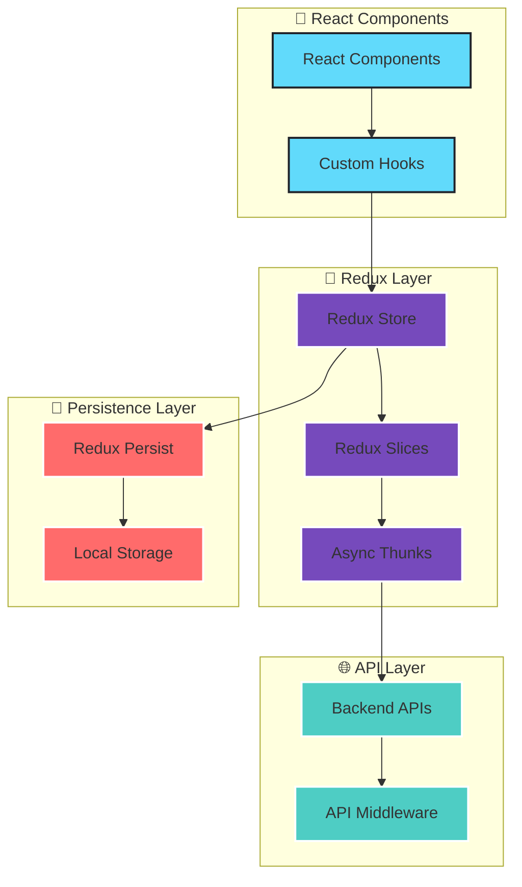

# Redux Toolkit Implementation Guide - HR-SM Modernization

## 📋 Table of Contents

1. [Overview](#overview)
2. [Architecture](#architecture)
3. [Store Configuration](#store-configuration)
4. [Slice Patterns](#slice-patterns)
5. [Async Thunks](#async-thunks)
6. [Middleware Configuration](#middleware-configuration)
7. [Redux DevTools](#redux-devtools)
8. [Component Integration](#component-integration)
9. [Testing Strategies](#testing-strategies)
10. [Performance Optimization](#performance-optimization)
11. [Migration Guide](#migration-guide)
12. [Best Practices](#best-practices)
13. [Troubleshooting](#troubleshooting)

## Overview

The HR-SM platform successfully migrated from Context API to Redux Toolkit for centralized state management across both HR Application and Platform Admin interfaces. This implementation provides predictable state management, excellent developer experience, and improved performance.

### Key Benefits Achieved

- **Predictable State Management**: Centralized state with clear data flow
- **Developer Experience**: Excellent debugging tools and patterns
- **Performance**: Optimized re-renders and state updates
- **Maintainability**: Consistent patterns and structure
- **Backward Compatibility**: Smooth migration from Context API

### Implementation Status

✅ **HR Application**: Complete Redux implementation with 4 core slices  
✅ **Platform Admin**: Complete Redux implementation with 5 management slices  
✅ **Persistence**: Redux Persist middleware for state hydration  
✅ **DevTools**: Full Redux DevTools integration  
✅ **Testing**: Comprehensive test coverage for all slices  

## Architecture

### Store Structure Overview

```
Redux Architecture
├── HR Application Store (client/hr-app/src/store/)
│   ├── slices/
│   │   ├── authSlice.js           # Authentication state
│   │   ├── tenantSlice.js         # Multi-tenant context
│   │   ├── moduleSlice.js         # Feature flags
│   │   └── notificationSlice.js   # Toast messages
│   ├── providers/                 # Compatibility layers
│   └── hooks/                     # Typed hooks
└── Platform Admin Store (client/platform-admin/src/store/)
    ├── slices/
    │   ├── platformAuthSlice.js    # Platform authentication
    │   ├── tenantManagementSlice.js # Tenant CRUD operations
    │   ├── subscriptionSlice.js    # Subscription management
    │   ├── moduleManagementSlice.js # Module configuration
    │   └── systemSettingsSlice.js  # Platform settings
    ├── providers/                  # Compatibility layers
    └── hooks/                      # Typed hooks
```

### Data Flow Architecture



## Store Configuration

### HR Application Store Setup

```javascript
// client/hr-app/src/store/index.js
import { configureStore } from '@reduxjs/toolkit';
import { persistStore, persistReducer } from 'redux-persist';
import storage from 'redux-persist/lib/storage';
import { combineReducers } from '@reduxjs/toolkit';

// Import slices
import authSlice from './slices/authSlice';
import tenantSlice from './slices/tenantSlice';
import moduleSlice from './slices/moduleSlice';
import notificationSlice from './slices/notificationSlice';

// Combine reducers
const rootReducer = combineReducers({
  auth: authSlice,
  tenant: tenantSlice,
  modules: moduleSlice,
  notifications: notificationSlice,
});

// Persistence configuration
const persistConfig = {
  key: 'hr-app-root',
  storage,
  whitelist: ['auth', 'tenant'], // Only persist auth and tenant state
  blacklist: ['notifications'], // Don't persist notifications
};

const persistedReducer = persistReducer(persistConfig, rootReducer);

// Store configuration
export const store = configureStore({
  reducer: persistedReducer,
  middleware: (getDefaultMiddleware) =>
    getDefaultMiddleware({
      serializableCheck: {
        ignoredActions: ['persist/PERSIST', 'persist/REHYDRATE'],
        ignoredPaths: ['register', 'rehydrate'],
      },
    }),
  devTools: process.env.NODE_ENV !== 'production',
});

export const persistor = persistStore(store);

// Type definitions for TypeScript support
export type RootState = ReturnType<typeof store.getState>;
export type AppDispatch = typeof store.dispatch;
```

### Platform Admin Store Setup

```javascript
// client/platform-admin/src/store/index.js
import { configureStore } from '@reduxjs/toolkit';
import { persistStore, persistReducer } from 'redux-persist';
import storage from 'redux-persist/lib/storage';
import { combineReducers } from '@reduxjs/toolkit';

// Import slices
import platformAuthSlice from './slices/platformAuthSlice';
import tenantManagementSlice from './slices/tenantManagementSlice';
import subscriptionSlice from './slices/subscriptionSlice';
import moduleManagementSlice from './slices/moduleManagementSlice';
import systemSettingsSlice from './slices/systemSettingsSlice';

// Combine reducers
const rootReducer = combineReducers({
  platformAuth: platformAuthSlice,
  tenantManagement: tenantManagementSlice,
  subscriptions: subscriptionSlice,
  moduleManagement: moduleManagementSlice,
  systemSettings: systemSettingsSlice,
});

// Persistence configuration
const persistConfig = {
  key: 'platform-admin-root',
  storage,
  whitelist: ['platformAuth', 'systemSettings'],
  blacklist: ['tenantManagement', 'subscriptions'], // Don't persist large datasets
};

const persistedReducer = persistReducer(persistConfig, rootReducer);

// Store configuration with enhanced middleware
export const store = configureStore({
  reducer: persistedReducer,
  middleware: (getDefaultMiddleware) =>
    getDefaultMiddleware({
      serializableCheck: {
        ignoredActions: ['persist/PERSIST', 'persist/REHYDRATE'],
        ignoredPaths: ['register', 'rehydrate'],
      },
    }).concat(
      // Add custom middleware for API logging in development
      process.env.NODE_ENV === 'development' ? [apiLoggingMiddleware] : []
    ),
  devTools: process.env.NODE_ENV !== 'production',
});

export const persistor = persistStore(store);

// Custom middleware for API logging
const apiLoggingMiddleware = (store) => (next) => (action) => {
  if (action.type.endsWith('/pending')) {
    console.log('🚀 API Request:', action.type);
  } else if (action.type.endsWith('/fulfilled')) {
    console.log('✅ API Success:', action.type);
  } else if (action.type.endsWith('/rejected')) {
    console.log('❌ API Error:', action.type, action.payload);
  }
  return next(action);
};

export type RootState = ReturnType<typeof store.getState>;
export type AppDispatch = typeof store.dispatch;
```

## Slice Patterns

### Standard Slice Structure

All slices follow a consistent pattern for maintainability:

```javascript
// Example: authSlice.js
import { createSlice, createAsyncThunk } from '@reduxjs/toolkit';
import authAPI from '../../services/authAPI';

// Initial state with proper typing
const initialState = {
  user: null,
  isAuthenticated: false,
  loading: false,
  error: null,
  tenantToken: null,
  tenantId: null,
  lastSuccessfulOperation: null,
};

// Async thunks for API operations
export const loginAsync = createAsyncThunk(
  'auth/login',
  async (credentials, { rejectWithValue }) => {
    try {
      const response = await authAPI.login(credentials);
      return response.data;
    } catch (error) {
      console.error('Login failed:', error);
      return rejectWithValue(error.response?.data?.message || 'Login failed');
    }
  }
);

export const logoutAsync = createAsyncThunk(
  'auth/logout',
  async (_, { rejectWithValue }) => {
    try {
      await authAPI.logout();
      return true;
    } catch (error) {
      console.error('Logout failed:', error);
      return rejectWithValue(error.response?.data?.message || 'Logout failed');
    }
  }
);

// Slice definition
const authSlice = createSlice({
  name: 'auth',
  initialState,
  reducers: {
    // Synchronous actions
    clearError: (state) => {
      state.error = null;
    },
    setTenantContext: (state, action) => {
      state.tenantId = action.payload.tenantId;
      state.tenantToken = action.payload.tenantToken;
    },
    clearAuth: (state) => {
      state.user = null;
      state.isAuthenticated = false;
      state.tenantToken = null;
      state.tenantId = null;
      state.error = null;
    },
  },
  extraReducers: (builder) => {
    builder
      // Login cases
      .addCase(loginAsync.pending, (state) => {
        state.loading = true;
        state.error = null;
      })
      .addCase(loginAsync.fulfilled, (state, action) => {
        state.loading = false;
        state.user = action.payload.user;
        state.isAuthenticated = true;
        state.tenantToken = action.payload.tenantToken;
        state.tenantId = action.payload.user.tenantId;
        state.error = null;
        state.lastSuccessfulOperation = new Date().toISOString();
      })
      .addCase(loginAsync.rejected, (state, action) => {
        state.loading = false;
        state.isAuthenticated = false;
        state.user = null;
        state.error = {
          message: action.payload,
          code: 'LOGIN_FAILED',
          timestamp: new Date().toISOString(),
          retryable: true,
        };
      })
      // Logout cases
      .addCase(logoutAsync.fulfilled, (state) => {
        state.user = null;
        state.isAuthenticated = false;
        state.tenantToken = null;
        state.tenantId = null;
        state.error = null;
        state.lastSuccessfulOperation = new Date().toISOString();
      });
  },
});

// Selectors
export const selectUser = (state) => state.auth.user;
export const selectIsAuthenticated = (state) => state.auth.isAuthenticated;
export const selectLoading = (state) => state.auth.loading;
export const selectError = (state) => state.auth.error;
export const selectTenantToken = (state) => state.auth.tenantToken;
export const selectTenantId = (state) => state.auth.tenantId;

// Role-based selectors
export const selectIsAdmin = (state) => 
  state.auth.user?.role === 'admin';
export const selectIsHR = (state) => 
  state.auth.user?.role === 'hr' || state.auth.user?.role === 'admin';
export const selectIsManager = (state) => 
  ['manager', 'hr', 'admin'].includes(state.auth.user?.role);
export const selectIsEmployee = (state) => 
  state.auth.user?.role === 'employee';

// Export actions and reducer
export const { clearError, setTenantContext, clearAuth } = authSlice.actions;
export default authSlice.reducer;
```

### Complex Slice Example: Tenant Management

```javascript
// tenantManagementSlice.js - Platform Admin
import { createSlice, createAsyncThunk } from '@reduxjs/toolkit';
import tenantAPI from '../../services/tenantAPI';

const initialState = {
  tenants: [],
  currentTenant: null,
  loading: false,
  error: null,
  pagination: {
    page: 1,
    limit: 10,
    total: 0,
    totalPages: 0,
  },
  filters: {
    search: '',
    status: 'all',
    plan: 'all',
  },
  lastSuccessfulOperation: null,
};

// Async thunks with complex operations
export const fetchTenantsAsync = createAsyncThunk(
  'tenantManagement/fetchTenants',
  async (params, { rejectWithValue, getState }) => {
    try {
      const { pagination, filters } = getState().tenantManagement;
      const queryParams = {
        page: params?.page || pagination.page,
        limit: params?.limit || pagination.limit,
        search: params?.search || filters.search,
        status: params?.status || filters.status,
        plan: params?.plan || filters.plan,
      };
      
      const response = await tenantAPI.getTenants(queryParams);
      return response.data;
    } catch (error) {
      console.error('Fetch tenants failed:', error);
      return rejectWithValue(error.response?.data?.message || 'Failed to fetch tenants');
    }
  }
);

export const createTenantAsync = createAsyncThunk(
  'tenantManagement/createTenant',
  async (tenantData, { rejectWithValue, dispatch }) => {
    try {
      const response = await tenantAPI.createTenant(tenantData);
      // Refresh tenant list after creation
      dispatch(fetchTenantsAsync());
      return response.data;
    } catch (error) {
      console.error('Create tenant failed:', error);
      return rejectWithValue(error.response?.data?.message || 'Failed to create tenant');
    }
  }
);

export const updateTenantAsync = createAsyncThunk(
  'tenantManagement/updateTenant',
  async ({ tenantId, tenantData }, { rejectWithValue, dispatch }) => {
    try {
      const response = await tenantAPI.updateTenant(tenantId, tenantData);
      // Refresh tenant list after update
      dispatch(fetchTenantsAsync());
      return response.data;
    } catch (error) {
      console.error('Update tenant failed:', error);
      return rejectWithValue(error.response?.data?.message || 'Failed to update tenant');
    }
  }
);

const tenantManagementSlice = createSlice({
  name: 'tenantManagement',
  initialState,
  reducers: {
    setCurrentTenant: (state, action) => {
      state.currentTenant = action.payload;
    },
    updateFilters: (state, action) => {
      state.filters = { ...state.filters, ...action.payload };
    },
    updatePagination: (state, action) => {
      state.pagination = { ...state.pagination, ...action.payload };
    },
    clearError: (state) => {
      state.error = null;
    },
    resetTenantManagement: (state) => {
      return initialState;
    },
  },
  extraReducers: (builder) => {
    builder
      // Fetch tenants
      .addCase(fetchTenantsAsync.pending, (state) => {
        state.loading = true;
        state.error = null;
      })
      .addCase(fetchTenantsAsync.fulfilled, (state, action) => {
        state.loading = false;
        state.tenants = action.payload.tenants;
        state.pagination = {
          ...state.pagination,
          total: action.payload.total,
          totalPages: action.payload.totalPages,
        };
        state.error = null;
        state.lastSuccessfulOperation = new Date().toISOString();
      })
      .addCase(fetchTenantsAsync.rejected, (state, action) => {
        state.loading = false;
        state.error = {
          message: action.payload,
          code: 'FETCH_TENANTS_FAILED',
          timestamp: new Date().toISOString(),
          retryable: true,
        };
      })
      // Create tenant
      .addCase(createTenantAsync.fulfilled, (state, action) => {
        state.currentTenant = action.payload;
        state.lastSuccessfulOperation = new Date().toISOString();
      })
      // Update tenant
      .addCase(updateTenantAsync.fulfilled, (state, action) => {
        state.currentTenant = action.payload;
        state.lastSuccessfulOperation = new Date().toISOString();
      });
  },
});

// Advanced selectors with memoization
import { createSelector } from '@reduxjs/toolkit';

export const selectTenants = (state) => state.tenantManagement.tenants;
export const selectCurrentTenant = (state) => state.tenantManagement.currentTenant;
export const selectLoading = (state) => state.tenantManagement.loading;
export const selectError = (state) => state.tenantManagement.error;
export const selectPagination = (state) => state.tenantManagement.pagination;
export const selectFilters = (state) => state.tenantManagement.filters;

// Memoized selectors for performance
export const selectFilteredTenants = createSelector(
  [selectTenants, selectFilters],
  (tenants, filters) => {
    return tenants.filter(tenant => {
      const matchesSearch = !filters.search || 
        tenant.name.toLowerCase().includes(filters.search.toLowerCase()) ||
        tenant.domain.toLowerCase().includes(filters.search.toLowerCase());
      
      const matchesStatus = filters.status === 'all' || 
        tenant.status === filters.status;
      
      const matchesPlan = filters.plan === 'all' || 
        tenant.subscription?.plan === filters.plan;
      
      return matchesSearch && matchesStatus && matchesPlan;
    });
  }
);

export const selectTenantById = createSelector(
  [selectTenants, (state, tenantId) => tenantId],
  (tenants, tenantId) => tenants.find(tenant => tenant._id === tenantId)
);

export const {
  setCurrentTenant,
  updateFilters,
  updatePagination,
  clearError,
  resetTenantManagement,
} = tenantManagementSlice.actions;

export default tenantManagementSlice.reducer;
```

## Async Thunks

### Error Handling Pattern

```javascript
// Standardized error handling for all async thunks
export const standardAsyncThunk = createAsyncThunk(
  'slice/operation',
  async (params, { rejectWithValue, getState, dispatch }) => {
    try {
      // Pre-operation validation
      const state = getState();
      if (!state.auth.isAuthenticated) {
        throw new Error('User not authenticated');
      }

      // API call with timeout
      const controller = new AbortController();
      const timeoutId = setTimeout(() => controller.abort(), 30000); // 30s timeout

      const response = await api.operation(params, {
        signal: controller.signal,
      });

      clearTimeout(timeoutId);

      // Post-operation side effects
      if (response.data.requiresRefresh) {
        dispatch(refreshRelatedData());
      }

      return response.data;
    } catch (error) {
      console.error('Operation failed:', error);
      
      // Structured error handling
      if (error.name === 'AbortError') {
        return rejectWithValue('Operation timed out');
      }
      
      if (error.response?.status === 401) {
        dispatch(clearAuth());
        return rejectWithValue('Authentication expired');
      }
      
      if (error.response?.status === 403) {
        return rejectWithValue('Insufficient permissions');
      }
      
      return rejectWithValue(
        error.response?.data?.message || 
        error.message || 
        'Operation failed'
      );
    }
  }
);
```

### Retry Logic Implementation

```javascript
// Async thunk with retry logic
export const resilientAsyncThunk = createAsyncThunk(
  'slice/resilientOperation',
  async (params, { rejectWithValue, dispatch }) => {
    const maxRetries = 3;
    let lastError;

    for (let attempt = 1; attempt <= maxRetries; attempt++) {
      try {
        const response = await api.operation(params);
        return response.data;
      } catch (error) {
        lastError = error;
        
        // Don't retry on client errors (4xx)
        if (error.response?.status >= 400 && error.response?.status < 500) {
          break;
        }
        
        // Wait before retry (exponential backoff)
        if (attempt < maxRetries) {
          const delay = Math.pow(2, attempt) * 1000; // 2s, 4s, 8s
          await new Promise(resolve => setTimeout(resolve, delay));
        }
      }
    }

    console.error(`Operation failed after ${maxRetries} attempts:`, lastError);
    return rejectWithValue(
      lastError.response?.data?.message || 
      'Operation failed after multiple attempts'
    );
  }
);
```

## Middleware Configuration

### Custom Middleware Examples

```javascript
// API request/response logging middleware
const apiLoggingMiddleware = (store) => (next) => (action) => {
  if (action.type.includes('/pending')) {
    console.log(`🚀 API Request: ${action.type}`, action.meta?.arg);
  } else if (action.type.includes('/fulfilled')) {
    console.log(`✅ API Success: ${action.type}`);
  } else if (action.type.includes('/rejected')) {
    console.error(`❌ API Error: ${action.type}`, action.payload);
  }
  
  return next(action);
};

// Performance monitoring middleware
const performanceMiddleware = (store) => (next) => (action) => {
  const start = performance.now();
  const result = next(action);
  const end = performance.now();
  
  if (end - start > 100) { // Log slow actions
    console.warn(`⚠️ Slow action: ${action.type} took ${end - start}ms`);
  }
  
  return result;
};

// Error tracking middleware
const errorTrackingMiddleware = (store) => (next) => (action) => {
  try {
    return next(action);
  } catch (error) {
    console.error('Redux middleware error:', error);
    // Send to error tracking service
    if (window.errorTracker) {
      window.errorTracker.captureException(error, {
        action: action.type,
        state: store.getState(),
      });
    }
    throw error;
  }
};

// Enhanced store configuration with custom middleware
export const store = configureStore({
  reducer: persistedReducer,
  middleware: (getDefaultMiddleware) =>
    getDefaultMiddleware({
      serializableCheck: {
        ignoredActions: ['persist/PERSIST', 'persist/REHYDRATE'],
      },
    }).concat([
      apiLoggingMiddleware,
      performanceMiddleware,
      errorTrackingMiddleware,
    ]),
  devTools: process.env.NODE_ENV !== 'production',
});
```

## Redux DevTools

### Configuration and Usage

```javascript
// Enhanced DevTools configuration
export const store = configureStore({
  reducer: persistedReducer,
  middleware: (getDefaultMiddleware) => getDefaultMiddleware(),
  devTools: process.env.NODE_ENV !== 'production' && {
    name: 'HR-SM Application',
    trace: true,
    traceLimit: 25,
    actionSanitizer: (action) => ({
      ...action,
      // Sanitize sensitive data
      payload: action.type.includes('auth') 
        ? { ...action.payload, password: '[REDACTED]' }
        : action.payload,
    }),
    stateSanitizer: (state) => ({
      ...state,
      // Sanitize sensitive state
      auth: {
        ...state.auth,
        tenantToken: state.auth.tenantToken ? '[REDACTED]' : null,
      },
    }),
  },
});
```

### DevTools Best Practices

1. **Action Naming**: Use descriptive action names with consistent patterns
2. **State Structure**: Keep state normalized and flat
3. **Time Travel**: Use DevTools to debug state changes
4. **Action Monitoring**: Monitor action frequency and performance
5. **State Inspection**: Inspect state structure and relationships

### Debugging Techniques

```javascript
// Add debug information to actions
export const debugAsyncThunk = createAsyncThunk(
  'slice/debugOperation',
  async (params, { getState, requestId }) => {
    const startTime = Date.now();
    
    try {
      const result = await api.operation(params);
      
      // Add debug metadata
      return {
        ...result.data,
        _debug: {
          requestId,
          duration: Date.now() - startTime,
          timestamp: new Date().toISOString(),
        },
      };
    } catch (error) {
      throw error;
    }
  }
);
```

## Component Integration

### Custom Hooks

```javascript
// client/src/store/hooks.js
import { useDispatch, useSelector } from 'react-redux';
import type { RootState, AppDispatch } from './index';

// Typed hooks for better TypeScript support
export const useAppDispatch = () => useDispatch<AppDispatch>();
export const useAppSelector = <T>(selector: (state: RootState) => T): T =>
  useSelector(selector);

// Custom hooks for common operations
export const useAuth = () => {
  const dispatch = useAppDispatch();
  const user = useAppSelector(selectUser);
  const isAuthenticated = useAppSelector(selectIsAuthenticated);
  const loading = useAppSelector(selectLoading);
  const error = useAppSelector(selectError);

  const login = async (credentials) => {
    try {
      await dispatch(loginAsync(credentials)).unwrap();
    } catch (error) {
      throw error;
    }
  };

  const logout = async () => {
    try {
      await dispatch(logoutAsync()).unwrap();
    } catch (error) {
      throw error;
    }
  };

  return {
    user,
    isAuthenticated,
    loading,
    error,
    login,
    logout,
  };
};

export const useTenant = () => {
  const dispatch = useAppDispatch();
  const currentTenant = useAppSelector(selectCurrentTenant);
  const tenantId = useAppSelector(selectTenantId);
  const loading = useAppSelector(selectTenantLoading);

  const switchTenant = async (newTenantId) => {
    try {
      await dispatch(switchTenantAsync(newTenantId)).unwrap();
    } catch (error) {
      throw error;
    }
  };

  return {
    currentTenant,
    tenantId,
    loading,
    switchTenant,
  };
};
```

### Component Usage Patterns

```javascript
// Example component using Redux
import React, { useEffect } from 'react';
import { useAppSelector, useAppDispatch } from '../store/hooks';
import { 
  fetchTenantsAsync, 
  selectTenants, 
  selectLoading, 
  selectError,
  updateFilters 
} from '../store/slices/tenantManagementSlice';

const TenantList = () => {
  const dispatch = useAppDispatch();
  const tenants = useAppSelector(selectTenants);
  const loading = useAppSelector(selectLoading);
  const error = useAppSelector(selectError);

  useEffect(() => {
    dispatch(fetchTenantsAsync());
  }, [dispatch]);

  const handleSearch = (searchTerm) => {
    dispatch(updateFilters({ search: searchTerm }));
    dispatch(fetchTenantsAsync({ search: searchTerm }));
  };

  if (loading) return <div>Loading...</div>;
  if (error) return <div>Error: {error.message}</div>;

  return (
    <div>
      <input 
        type="text" 
        placeholder="Search tenants..."
        onChange={(e) => handleSearch(e.target.value)}
      />
      {tenants.map(tenant => (
        <div key={tenant._id}>
          <h3>{tenant.name}</h3>
          <p>{tenant.domain}</p>
        </div>
      ))}
    </div>
  );
};

export default TenantList;
```

### Backward Compatibility Providers

```javascript
// ReduxAuthProvider.jsx - Maintains Context API interface
import React, { createContext, useContext } from 'react';
import { useAuth } from '../hooks';

const AuthContext = createContext();

export const ReduxAuthProvider = ({ children }) => {
  const authState = useAuth();
  
  return (
    <AuthContext.Provider value={authState}>
      {children}
    </AuthContext.Provider>
  );
};

// Maintains original useAuth hook interface
export const useAuthContext = () => {
  const context = useContext(AuthContext);
  if (!context) {
    throw new Error('useAuthContext must be used within ReduxAuthProvider');
  }
  return context;
};
```

## Testing Strategies

### Slice Testing

```javascript
// authSlice.test.js
import { configureStore } from '@reduxjs/toolkit';
import authSlice, { 
  loginAsync, 
  logoutAsync, 
  clearError,
  selectUser,
  selectIsAuthenticated 
} from './authSlice';

describe('authSlice', () => {
  let store;

  beforeEach(() => {
    store = configureStore({
      reducer: { auth: authSlice },
    });
  });

  describe('synchronous actions', () => {
    it('should clear error', () => {
      // Set initial error state
      store.dispatch({ 
        type: 'auth/loginAsync/rejected', 
        payload: 'Test error' 
      });
      
      // Clear error
      store.dispatch(clearError());
      
      const state = store.getState().auth;
      expect(state.error).toBeNull();
    });
  });

  describe('async thunks', () => {
    it('should handle successful login', async () => {
      const mockUser = { id: 1, email: 'test@example.com' };
      const mockResponse = { user: mockUser, tenantToken: 'token123' };
      
      // Mock API call
      jest.spyOn(authAPI, 'login').mockResolvedValue({ data: mockResponse });
      
      const result = await store.dispatch(loginAsync({
        email: 'test@example.com',
        password: 'password123'
      }));
      
      expect(result.type).toBe('auth/login/fulfilled');
      expect(result.payload).toEqual(mockResponse);
      
      const state = store.getState().auth;
      expect(state.user).toEqual(mockUser);
      expect(state.isAuthenticated).toBe(true);
      expect(state.loading).toBe(false);
      expect(state.error).toBeNull();
    });

    it('should handle login failure', async () => {
      const errorMessage = 'Invalid credentials';
      
      jest.spyOn(authAPI, 'login').mockRejectedValue({
        response: { data: { message: errorMessage } }
      });
      
      const result = await store.dispatch(loginAsync({
        email: 'test@example.com',
        password: 'wrongpassword'
      }));
      
      expect(result.type).toBe('auth/login/rejected');
      expect(result.payload).toBe(errorMessage);
      
      const state = store.getState().auth;
      expect(state.user).toBeNull();
      expect(state.isAuthenticated).toBe(false);
      expect(state.loading).toBe(false);
      expect(state.error.message).toBe(errorMessage);
    });
  });

  describe('selectors', () => {
    it('should select user correctly', () => {
      const mockUser = { id: 1, email: 'test@example.com' };
      const state = { auth: { user: mockUser } };
      
      expect(selectUser(state)).toEqual(mockUser);
    });

    it('should select authentication status correctly', () => {
      const state = { auth: { isAuthenticated: true } };
      
      expect(selectIsAuthenticated(state)).toBe(true);
    });
  });
});
```

### Component Testing with Redux

```javascript
// TenantList.test.jsx
import React from 'react';
import { render, screen, fireEvent, waitFor } from '@testing-library/react';
import { Provider } from 'react-redux';
import { configureStore } from '@reduxjs/toolkit';
import TenantList from './TenantList';
import tenantManagementSlice from '../store/slices/tenantManagementSlice';

const createTestStore = (initialState = {}) => {
  return configureStore({
    reducer: {
      tenantManagement: tenantManagementSlice,
    },
    preloadedState: initialState,
  });
};

const renderWithRedux = (component, initialState) => {
  const store = createTestStore(initialState);
  return {
    ...render(
      <Provider store={store}>
        {component}
      </Provider>
    ),
    store,
  };
};

describe('TenantList', () => {
  it('should display loading state', () => {
    const initialState = {
      tenantManagement: {
        tenants: [],
        loading: true,
        error: null,
      },
    };

    renderWithRedux(<TenantList />, initialState);
    
    expect(screen.getByText('Loading...')).toBeInTheDocument();
  });

  it('should display tenants', () => {
    const mockTenants = [
      { _id: '1', name: 'Tenant 1', domain: 'tenant1.com' },
      { _id: '2', name: 'Tenant 2', domain: 'tenant2.com' },
    ];

    const initialState = {
      tenantManagement: {
        tenants: mockTenants,
        loading: false,
        error: null,
      },
    };

    renderWithRedux(<TenantList />, initialState);
    
    expect(screen.getByText('Tenant 1')).toBeInTheDocument();
    expect(screen.getByText('Tenant 2')).toBeInTheDocument();
  });

  it('should handle search', async () => {
    const { store } = renderWithRedux(<TenantList />, {
      tenantManagement: {
        tenants: [],
        loading: false,
        error: null,
      },
    });

    const searchInput = screen.getByPlaceholderText('Search tenants...');
    fireEvent.change(searchInput, { target: { value: 'test search' } });

    await waitFor(() => {
      const actions = store.getState();
      // Verify that search action was dispatched
      expect(actions).toBeDefined();
    });
  });
});
```

## Performance Optimization

### Selector Memoization

```javascript
import { createSelector } from '@reduxjs/toolkit';

// Memoized selectors for expensive computations
export const selectExpensiveComputation = createSelector(
  [selectTenants, selectFilters, selectSortOrder],
  (tenants, filters, sortOrder) => {
    // Expensive filtering and sorting
    return tenants
      .filter(tenant => {
        // Complex filtering logic
        return tenant.name.toLowerCase().includes(filters.search.toLowerCase());
      })
      .sort((a, b) => {
        // Complex sorting logic
        if (sortOrder === 'name') {
          return a.name.localeCompare(b.name);
        }
        return new Date(b.createdAt) - new Date(a.createdAt);
      });
  }
);

// Selector with multiple dependencies
export const selectDashboardData = createSelector(
  [selectTenants, selectSubscriptions, selectUsageStats],
  (tenants, subscriptions, usageStats) => {
    return tenants.map(tenant => ({
      ...tenant,
      subscription: subscriptions.find(sub => sub.tenantId === tenant._id),
      usage: usageStats.find(usage => usage.tenantId === tenant._id),
    }));
  }
);
```

### Component Optimization

```javascript
import React, { memo, useMemo } from 'react';
import { useAppSelector } from '../store/hooks';

// Memoized component to prevent unnecessary re-renders
const TenantCard = memo(({ tenantId }) => {
  const tenant = useAppSelector(state => 
    selectTenantById(state, tenantId)
  );

  const formattedData = useMemo(() => {
    if (!tenant) return null;
    
    return {
      displayName: `${tenant.name} (${tenant.domain})`,
      statusColor: tenant.status === 'active' ? 'green' : 'red',
      userCount: tenant.users?.length || 0,
    };
  }, [tenant]);

  if (!formattedData) return null;

  return (
    <div className="tenant-card">
      <h3>{formattedData.displayName}</h3>
      <span style={{ color: formattedData.statusColor }}>
        {tenant.status}
      </span>
      <p>{formattedData.userCount} users</p>
    </div>
  );
});

export default TenantCard;
```

### Bundle Optimization

```javascript
// Lazy loading of Redux slices
const lazyLoadSlice = (sliceName) => {
  return import(`./slices/${sliceName}Slice.js`).then(module => ({
    [sliceName]: module.default,
  }));
};

// Dynamic reducer injection
export const injectReducer = (store, key, reducer) => {
  if (store.asyncReducers[key]) {
    return;
  }
  
  store.asyncReducers[key] = reducer;
  store.replaceReducer(combineReducers({
    ...store.staticReducers,
    ...store.asyncReducers,
  }));
};
```

## Migration Guide

### Step-by-Step Migration Process

#### Phase 1: Setup Redux Infrastructure

1. **Install Dependencies**
   ```bash
   npm install @reduxjs/toolkit react-redux redux-persist
   ```

2. **Create Store Structure**
   ```bash
   mkdir -p src/store/slices
   mkdir -p src/store/hooks
   mkdir -p src/store/providers
   ```

3. **Configure Base Store**
   ```javascript
   // Create basic store configuration
   // Add persistence configuration
   // Set up DevTools
   ```

#### Phase 2: Migrate Context to Redux

1. **Identify Context Usage**
   ```bash
   # Find all useContext calls
   grep -r "useContext" src/
   
   # Find Context providers
   grep -r "createContext" src/
   ```

2. **Create Redux Slices**
   ```javascript
   // Convert each Context to a Redux slice
   // Maintain the same state structure initially
   // Add async thunks for API calls
   ```

3. **Create Compatibility Providers**
   ```javascript
   // Maintain existing hook interfaces
   // Provide gradual migration path
   ```

#### Phase 3: Update Components

1. **Replace Context Hooks**
   ```javascript
   // Before
   const { user, login } = useAuth();
   
   // After
   const { user, login } = useAuth(); // Same interface, Redux backend
   ```

2. **Update Component Tests**
   ```javascript
   // Add Redux Provider to test renders
   // Update test assertions for new state structure
   ```

#### Phase 4: Optimize and Clean Up

1. **Remove Old Context Code**
2. **Optimize Selectors**
3. **Add Performance Monitoring**
4. **Update Documentation**

### Migration Checklist

- [ ] Redux Toolkit installed and configured
- [ ] Store structure created
- [ ] Persistence configured
- [ ] DevTools integrated
- [ ] Auth slice implemented
- [ ] Tenant slice implemented
- [ ] Module slice implemented
- [ ] Notification slice implemented
- [ ] Compatibility providers created
- [ ] Components updated to use Redux
- [ ] Tests updated for Redux
- [ ] Performance optimizations applied
- [ ] Old Context code removed
- [ ] Documentation updated

## Best Practices

### State Structure

1. **Normalize State**: Keep state flat and normalized
2. **Consistent Naming**: Use consistent naming conventions
3. **Separate Concerns**: Each slice handles one domain
4. **Immutable Updates**: Always use Redux Toolkit's Immer integration

### Action Design

1. **Descriptive Names**: Use clear, descriptive action names
2. **Consistent Patterns**: Follow consistent naming patterns
3. **Payload Structure**: Keep payloads simple and consistent
4. **Error Handling**: Always handle async errors properly

### Selector Usage

1. **Memoization**: Use createSelector for expensive computations
2. **Reusability**: Create reusable selectors
3. **Composition**: Compose complex selectors from simple ones
4. **Performance**: Monitor selector performance

### Testing Strategy

1. **Unit Tests**: Test slices in isolation
2. **Integration Tests**: Test component-Redux integration
3. **Mock APIs**: Mock API calls in tests
4. **Test Coverage**: Maintain high test coverage

## Troubleshooting

### Common Issues

#### 1. Persistence Rehydration Errors

**Problem**: State not persisting correctly

**Solution**:
```javascript
// Ensure proper serialization
const persistConfig = {
  key: 'root',
  storage,
  whitelist: ['auth', 'tenant'], // Only persist serializable state
  blacklist: ['notifications'], // Don't persist temporary state
};
```

#### 2. Async Thunk Errors

**Problem**: Thunks not handling errors properly

**Solution**:
```javascript
export const safeAsyncThunk = createAsyncThunk(
  'slice/operation',
  async (params, { rejectWithValue }) => {
    try {
      const response = await api.call(params);
      return response.data;
    } catch (error) {
      console.error('Operation failed:', error);
      return rejectWithValue(error.response?.data?.message || 'Operation failed');
    }
  }
);
```

#### 3. Performance Issues

**Problem**: Unnecessary re-renders

**Solution**:
```javascript
// Use memoized selectors
const selectMemoizedData = createSelector(
  [selectRawData],
  (rawData) => expensiveTransformation(rawData)
);

// Memoize components
const OptimizedComponent = memo(({ data }) => {
  return <div>{data.name}</div>;
});
```

#### 4. DevTools Not Working

**Problem**: Redux DevTools not connecting

**Solution**:
```javascript
// Ensure proper DevTools configuration
export const store = configureStore({
  reducer: rootReducer,
  devTools: process.env.NODE_ENV !== 'production',
});
```

### Debug Techniques

1. **Console Logging**: Add strategic console.log statements
2. **Redux DevTools**: Use time-travel debugging
3. **Action Monitoring**: Monitor action dispatching
4. **State Inspection**: Inspect state changes in real-time

### Performance Monitoring

```javascript
// Add performance monitoring
const performanceMiddleware = (store) => (next) => (action) => {
  const start = performance.now();
  const result = next(action);
  const end = performance.now();
  
  if (end - start > 100) {
    console.warn(`Slow action: ${action.type} (${end - start}ms)`);
  }
  
  return result;
};
```

---

**Last Updated**: December 30, 2025  
**Version**: 1.0  
**Maintainer**: HR-SM Development Team

This guide provides comprehensive documentation for the Redux Toolkit implementation in the HR-SM platform. For additional support, refer to the [Troubleshooting Guide](./troubleshooting-guide.md) or contact the development team.