# Repository Pattern Implementation Guide - HR-SM Modernization

## 📋 Table of Contents

1. [Overview](#overview)
2. [Architecture](#architecture)
3. [Base Repository](#base-repository)
4. [Repository Implementation](#repository-implementation)
5. [Service Integration](#service-integration)
6. [Transaction Support](#transaction-support)
7. [Query Builder](#query-builder)
8. [Testing Strategies](#testing-strategies)
9. [Performance Optimization](#performance-optimization)
10. [Migration Guide](#migration-guide)
11. [Best Practices](#best-practices)
12. [Troubleshooting](#troubleshooting)

## Overview

The HR-SM platform successfully implemented the Repository Pattern to abstract data access operations, improving code maintainability, testability, and separation of concerns. This implementation provides a clean abstraction layer between business logic and data persistence.

### Key Benefits Achieved

- **Improved Maintainability**: Clear separation of data access logic
- **Enhanced Testability**: Easy to mock and test data operations
- **Better Performance**: Optimized queries and connection management
- **Consistent API**: Standardized interface across all data operations
- **Future Flexibility**: Easy to switch database implementations or add caching

### Implementation Status

✅ **Base Repository**: Complete abstract base class with CRUD operations  
✅ **Core Repositories**: 4 repositories for HR core models  
✅ **Module Repositories**: 7 repositories for business modules  
✅ **Platform Repositories**: 4 repositories for platform management  
✅ **Service Integration**: All services use repositories instead of direct model access  
✅ **Testing**: Comprehensive test coverage with 335+ tests  

## Architecture

### Repository Layer Structure

```
server/repositories/
├── BaseRepository.js           # Abstract base class
├── GenericRepository.js        # Generic implementation
├── QueryBuilder.js            # Query building utilities
├── index.js                   # Repository exports
├── interfaces/
│   └── IRepository.js         # Repository interface contract
├── core/                      # Core HR model repositories
│   ├── UserRepository.js
│   ├── DepartmentRepository.js
│   ├── PositionRepository.js
│   └── TenantConfigRepository.js
├── modules/                   # Module-specific repositories
│   ├── AttendanceRepository.js
│   ├── PayrollRepository.js
│   ├── VacationRepository.js
│   ├── TaskRepository.js
│   ├── DocumentRepository.js
│   ├── MissionRepository.js
│   └── OvertimeRepository.js
└── platform/                 # Platform management repositories
    ├── CompanyRepository.js
    ├── PlatformUserRepository.js
    ├── SubscriptionRepository.js
    └── LicenseRepository.js
```
### Data Flow Architecture

```mermaid
graph TB
    subgraph "🎯 Controller Layer"
        CTRL[Controllers<br/>HTTP Handlers<br/>Request Validation]
    end
    
    subgraph "🧠 Service Layer"
        SVC[Services<br/>Business Logic<br/>Data Processing]
    end
    
    subgraph "📊 Repository Layer"
        REPO[Repositories<br/>Data Access<br/>Query Operations]
        BASE[BaseRepository<br/>Common CRUD<br/>Transaction Support]
    end
    
    subgraph "💾 Data Layer"
        MODEL[Mongoose Models<br/>Schema Definition<br/>Validation]
        DB[MongoDB<br/>Document Storage<br/>Indexing]
    end
    
    CTRL --> SVC
    SVC --> REPO
    REPO --> BASE
    BASE --> MODEL
    MODEL --> DB
    
    classDef controllerClass fill:#e3f2fd,stroke:#0d47a1,stroke-width:2px
    classDef serviceClass fill:#f3e5f5,stroke:#4a148c,stroke-width:2px
    classDef repoClass fill:#e8f5e8,stroke:#1b5e20,stroke-width:2px
    classDef dataClass fill:#fff3e0,stroke:#e65100,stroke-width:2px
    
    class CTRL controllerClass
    class SVC serviceClass
    class REPO,BASE repoClass
    class MODEL,DB dataClass
```



## Base Repository

### Abstract Base Class

```javascript
// server/repositories/BaseRepository.js
import mongoose from 'mongoose';
import QueryBuilder from './QueryBuilder.js';

class BaseRepository {
  constructor(model) {
    if (new.target === BaseRepository) {
      throw new Error('BaseRepository is abstract and cannot be instantiated directly');
    }
    this.model = model;
    this.modelName = model.modelName;
  }

  // Standard CRUD Operations
  async create(data, options = {}) {
    try {
      const document = new this.model(data);
      return await document.save(options);
    } catch (error) {
      throw this.handleError(error, 'create');
    }
  }

  async findById(id, options = {}) {
    try {
      return await this.model.findById(id, null, options);
    } catch (error) {
      throw this.handleError(error, 'findById');
    }
  }

  async findOne(filter, options = {}) {
    try {
      return await this.model.findOne(filter, null, options);
    } catch (error) {
      throw this.handleError(error, 'findOne');
    }
  }

  async find(filter = {}, options = {}) {
    try {
      return await this.model.find(filter, null, options);
    } catch (error) {
      throw this.handleError(error, 'find');
    }
  }

  async update(id, data, options = {}) {
    try {
      const defaultOptions = { new: true, runValidators: true };
      return await this.model.findByIdAndUpdate(
        id, 
        data, 
        { ...defaultOptions, ...options }
      );
    } catch (error) {
      throw this.handleError(error, 'update');
    }
  }

  async delete(id, options = {}) {
    try {
      return await this.model.findByIdAndDelete(id, options);
    } catch (error) {
      throw this.handleError(error, 'delete');
    }
  }

  async count(filter = {}) {
    try {
      return await this.model.countDocuments(filter);
    } catch (error) {
      throw this.handleError(error, 'count');
    }
  }

  // Advanced Operations
  async aggregate(pipeline) {
    try {
      return await this.model.aggregate(pipeline);
    } catch (error) {
      throw this.handleError(error, 'aggregate');
    }
  }

  async bulkWrite(operations, options = {}) {
    try {
      return await this.model.bulkWrite(operations, options);
    } catch (error) {
      throw this.handleError(error, 'bulkWrite');
    }
  }

  // Transaction Support
  async withTransaction(operations) {
    const session = await mongoose.startSession();
    
    try {
      return await session.withTransaction(async () => {
        return await operations(session);
      });
    } catch (error) {
      throw this.handleError(error, 'transaction');
    } finally {
      await session.endSession();
    }
  }

  // Query Builder Integration
  query() {
    return new QueryBuilder(this.model);
  }

  // Pagination Helper
  async paginate(filter = {}, options = {}) {
    const { page = 1, limit = 10, sort = { createdAt: -1 } } = options;
    const skip = (page - 1) * limit;

    try {
      const [documents, total] = await Promise.all([
        this.model.find(filter)
          .sort(sort)
          .skip(skip)
          .limit(limit)
          .exec(),
        this.model.countDocuments(filter)
      ]);

      return {
        documents,
        pagination: {
          page,
          limit,
          total,
          totalPages: Math.ceil(total / limit),
          hasNext: page < Math.ceil(total / limit),
          hasPrev: page > 1,
        },
      };
    } catch (error) {
      throw this.handleError(error, 'paginate');
    }
  }

  // Error Handling
  handleError(error, operation) {
    console.error(`${this.modelName} Repository ${operation} error:`, error);
    
    // Handle specific MongoDB errors
    if (error.code === 11000) {
      const field = Object.keys(error.keyPattern)[0];
      throw new Error(`Duplicate ${field}: ${error.keyValue[field]}`);
    }
    
    if (error.name === 'ValidationError') {
      const messages = Object.values(error.errors).map(err => err.message);
      throw new Error(`Validation failed: ${messages.join(', ')}`);
    }
    
    if (error.name === 'CastError') {
      throw new Error(`Invalid ${error.path}: ${error.value}`);
    }
    
    throw error;
  }

  // Soft Delete Support (optional)
  async softDelete(id, deletedBy) {
    return await this.update(id, {
      isDeleted: true,
      deletedAt: new Date(),
      deletedBy,
    });
  }

  async restore(id) {
    return await this.update(id, {
      isDeleted: false,
      deletedAt: null,
      deletedBy: null,
    });
  }

  // Audit Trail Support
  async createWithAudit(data, createdBy) {
    return await this.create({
      ...data,
      createdBy,
      createdAt: new Date(),
    });
  }

  async updateWithAudit(id, data, updatedBy) {
    return await this.update(id, {
      ...data,
      updatedBy,
      updatedAt: new Date(),
    });
  }
}

export default BaseRepository;
```

### Repository Interface Contract

```javascript
// server/repositories/interfaces/IRepository.js
/**
 * Repository Interface Contract
 * All repositories must implement these methods
 */
export default class IRepository {
  // Basic CRUD operations
  async create(data, options = {}) {
    throw new Error('Method create() must be implemented');
  }

  async findById(id, options = {}) {
    throw new Error('Method findById() must be implemented');
  }

  async findOne(filter, options = {}) {
    throw new Error('Method findOne() must be implemented');
  }

  async find(filter = {}, options = {}) {
    throw new Error('Method find() must be implemented');
  }

  async update(id, data, options = {}) {
    throw new Error('Method update() must be implemented');
  }

  async delete(id, options = {}) {
    throw new Error('Method delete() must be implemented');
  }

  async count(filter = {}) {
    throw new Error('Method count() must be implemented');
  }

  // Advanced operations
  async aggregate(pipeline) {
    throw new Error('Method aggregate() must be implemented');
  }

  async withTransaction(operations) {
    throw new Error('Method withTransaction() must be implemented');
  }

  // Query builder
  query() {
    throw new Error('Method query() must be implemented');
  }

  // Pagination
  async paginate(filter = {}, options = {}) {
    throw new Error('Method paginate() must be implemented');
  }
}
```

## Repository Implementation

### Core Repository Example: UserRepository

```javascript
// server/repositories/core/UserRepository.js
import BaseRepository from '../BaseRepository.js';
import User from '../../modules/hr-core/users/models/user.model.js';

class UserRepository extends BaseRepository {
  constructor() {
    super(User);
  }

  // Domain-specific query methods
  async findByEmail(email, tenantId) {
    return await this.findOne({ email, tenantId });
  }

  async findByRole(role, tenantId, options = {}) {
    return await this.find({ role, tenantId }, options);
  }

  async findByDepartment(departmentId, tenantId, options = {}) {
    return await this.find({ 
      department: departmentId, 
      tenantId 
    }, options);
  }

  async findActiveUsers(tenantId, options = {}) {
    return await this.find({ 
      status: 'active', 
      tenantId 
    }, options);
  }

  // Complex queries with aggregation
  async getUserStatsByDepartment(tenantId) {
    const pipeline = [
      { $match: { tenantId } },
      {
        $group: {
          _id: '$department',
          totalUsers: { $sum: 1 },
          activeUsers: {
            $sum: { $cond: [{ $eq: ['$status', 'active'] }, 1, 0] }
          },
          roles: { $addToSet: '$role' }
        }
      },
      {
        $lookup: {
          from: 'departments',
          localField: '_id',
          foreignField: '_id',
          as: 'departmentInfo'
        }
      },
      { $unwind: '$departmentInfo' },
      {
        $project: {
          departmentName: '$departmentInfo.name',
          totalUsers: 1,
          activeUsers: 1,
          roles: 1
        }
      }
    ];

    return await this.aggregate(pipeline);
  }

  // Bulk operations
  async createMultipleUsers(usersData, tenantId, createdBy) {
    const operations = usersData.map(userData => ({
      insertOne: {
        document: {
          ...userData,
          tenantId,
          createdBy,
          createdAt: new Date(),
        }
      }
    }));

    return await this.bulkWrite(operations);
  }

  async updateUserRoles(userIds, newRole, tenantId, updatedBy) {
    const operations = userIds.map(userId => ({
      updateOne: {
        filter: { _id: userId, tenantId },
        update: {
          $set: {
            role: newRole,
            updatedBy,
            updatedAt: new Date(),
          }
        }
      }
    }));

    return await this.bulkWrite(operations);
  }

  // Advanced search with text indexing
  async searchUsers(searchTerm, tenantId, options = {}) {
    const searchFilter = {
      tenantId,
      $or: [
        { firstName: { $regex: searchTerm, $options: 'i' } },
        { lastName: { $regex: searchTerm, $options: 'i' } },
        { email: { $regex: searchTerm, $options: 'i' } },
        { employeeId: { $regex: searchTerm, $options: 'i' } },
      ]
    };

    return await this.find(searchFilter, options);
  }

  // Performance-optimized queries
  async findUsersWithDepartmentInfo(tenantId, options = {}) {
    return await this.find({ tenantId }, {
      ...options,
      populate: {
        path: 'department',
        select: 'name code description'
      }
    });
  }

  // Validation helpers
  async isEmailUnique(email, tenantId, excludeUserId = null) {
    const filter = { email, tenantId };
    if (excludeUserId) {
      filter._id = { $ne: excludeUserId };
    }
    
    const existingUser = await this.findOne(filter);
    return !existingUser;
  }

  async isEmployeeIdUnique(employeeId, tenantId, excludeUserId = null) {
    const filter = { employeeId, tenantId };
    if (excludeUserId) {
      filter._id = { $ne: excludeUserId };
    }
    
    const existingUser = await this.findOne(filter);
    return !existingUser;
  }
}

export default UserRepository;
```

### Module Repository Example: AttendanceRepository

```javascript
// server/repositories/modules/AttendanceRepository.js
import BaseRepository from '../BaseRepository.js';
import Attendance from '../../modules/hr-core/attendance/models/attendance.model.js';

class AttendanceRepository extends BaseRepository {
  constructor() {
    super(Attendance);
  }

  // Date range queries
  async findByDateRange(startDate, endDate, tenantId, options = {}) {
    const filter = {
      tenantId,
      date: { 
        $gte: new Date(startDate), 
        $lte: new Date(endDate) 
      }
    };
    return await this.find(filter, options);
  }

  async findByEmployeeAndDateRange(employeeId, startDate, endDate, tenantId) {
    const filter = {
      employee: employeeId,
      tenantId,
      date: { 
        $gte: new Date(startDate), 
        $lte: new Date(endDate) 
      }
    };
    return await this.find(filter, { sort: { date: 1 } });
  }

  // Attendance analytics
  async getAttendanceStats(tenantId, startDate, endDate) {
    const pipeline = [
      {
        $match: {
          tenantId,
          date: { 
            $gte: new Date(startDate), 
            $lte: new Date(endDate) 
          }
        }
      },
      {
        $group: {
          _id: '$employee',
          totalDays: { $sum: 1 },
          presentDays: {
            $sum: { $cond: [{ $eq: ['$status', 'present'] }, 1, 0] }
          },
          lateDays: {
            $sum: { $cond: [{ $eq: ['$status', 'late'] }, 1, 0] }
          },
          absentDays: {
            $sum: { $cond: [{ $eq: ['$status', 'absent'] }, 1, 0] }
          },
          totalHours: { $sum: '$hoursWorked' },
          avgHours: { $avg: '$hoursWorked' }
        }
      },
      {
        $lookup: {
          from: 'users',
          localField: '_id',
          foreignField: '_id',
          as: 'employee'
        }
      },
      { $unwind: '$employee' },
      {
        $project: {
          employeeName: {
            $concat: ['$employee.firstName', ' ', '$employee.lastName']
          },
          employeeId: '$employee.employeeId',
          totalDays: 1,
          presentDays: 1,
          lateDays: 1,
          absentDays: 1,
          attendanceRate: {
            $multiply: [
              { $divide: ['$presentDays', '$totalDays'] },
              100
            ]
          },
          totalHours: 1,
          avgHours: { $round: ['$avgHours', 2] }
        }
      },
      { $sort: { attendanceRate: -1 } }
    ];

    return await this.aggregate(pipeline);
  }

  // Clock in/out operations
  async clockIn(employeeId, tenantId, clockInData) {
    const today = new Date();
    today.setHours(0, 0, 0, 0);

    // Check if already clocked in today
    const existingAttendance = await this.findOne({
      employee: employeeId,
      tenantId,
      date: today
    });

    if (existingAttendance) {
      throw new Error('Already clocked in today');
    }

    return await this.create({
      employee: employeeId,
      tenantId,
      date: today,
      clockIn: new Date(),
      status: 'present',
      ...clockInData
    });
  }

  async clockOut(employeeId, tenantId, clockOutData) {
    const today = new Date();
    today.setHours(0, 0, 0, 0);

    const attendance = await this.findOne({
      employee: employeeId,
      tenantId,
      date: today
    });

    if (!attendance) {
      throw new Error('No clock-in record found for today');
    }

    if (attendance.clockOut) {
      throw new Error('Already clocked out today');
    }

    const clockOutTime = new Date();
    const hoursWorked = (clockOutTime - attendance.clockIn) / (1000 * 60 * 60);

    return await this.update(attendance._id, {
      clockOut: clockOutTime,
      hoursWorked: Math.round(hoursWorked * 100) / 100,
      ...clockOutData
    });
  }

  // Monthly reports
  async getMonthlyReport(tenantId, year, month) {
    const startDate = new Date(year, month - 1, 1);
    const endDate = new Date(year, month, 0);

    const pipeline = [
      {
        $match: {
          tenantId,
          date: { $gte: startDate, $lte: endDate }
        }
      },
      {
        $group: {
          _id: {
            employee: '$employee',
            week: { $week: '$date' }
          },
          weeklyHours: { $sum: '$hoursWorked' },
          daysPresent: { $sum: 1 }
        }
      },
      {
        $group: {
          _id: '$_id.employee',
          totalHours: { $sum: '$weeklyHours' },
          totalDays: { $sum: '$daysPresent' },
          weeks: {
            $push: {
              week: '$_id.week',
              hours: '$weeklyHours',
              days: '$daysPresent'
            }
          }
        }
      },
      {
        $lookup: {
          from: 'users',
          localField: '_id',
          foreignField: '_id',
          as: 'employee'
        }
      },
      { $unwind: '$employee' }
    ];

    return await this.aggregate(pipeline);
  }
}

export default AttendanceRepository;
```
## Service Integration

### Service Layer Refactoring

```javascript
// server/modules/hr-core/services/UserService.js
import UserRepository from '../../../repositories/core/UserRepository.js';
import DepartmentRepository from '../../../repositories/core/DepartmentRepository.js';
import bcrypt from 'bcrypt';

class UserService {
  constructor() {
    this.userRepository = new UserRepository();
    this.departmentRepository = new DepartmentRepository();
  }

  async createUser(userData, tenantId, createdBy) {
    // Validation
    await this.validateUserData(userData, tenantId);

    // Hash password
    if (userData.password) {
      userData.password = await bcrypt.hash(userData.password, 10);
    }

    // Create user through repository
    return await this.userRepository.createWithAudit({
      ...userData,
      tenantId,
      status: 'active'
    }, createdBy);
  }

  async getUserById(userId, tenantId) {
    const user = await this.userRepository.findById(userId);
    
    if (!user || user.tenantId !== tenantId) {
      throw new Error('User not found');
    }
    
    return user;
  }

  async getUsers(filters = {}, options = {}, tenantId) {
    const filter = { ...filters, tenantId };
    
    // Use repository pagination
    return await this.userRepository.paginate(filter, options);
  }

  async updateUser(userId, updateData, tenantId, updatedBy) {
    // Validate user exists and belongs to tenant
    const existingUser = await this.getUserById(userId, tenantId);
    
    // Validate update data
    await this.validateUserData(updateData, tenantId, userId);
    
    // Hash password if provided
    if (updateData.password) {
      updateData.password = await bcrypt.hash(updateData.password, 10);
    }

    return await this.userRepository.updateWithAudit(
      userId, 
      updateData, 
      updatedBy
    );
  }

  async deleteUser(userId, tenantId, deletedBy) {
    const user = await this.getUserById(userId, tenantId);
    
    // Soft delete instead of hard delete
    return await this.userRepository.softDelete(userId, deletedBy);
  }

  async searchUsers(searchTerm, tenantId, options = {}) {
    return await this.userRepository.searchUsers(searchTerm, tenantId, options);
  }

  async getUsersByDepartment(departmentId, tenantId, options = {}) {
    return await this.userRepository.findByDepartment(
      departmentId, 
      tenantId, 
      options
    );
  }

  async getUserStatistics(tenantId) {
    return await this.userRepository.getUserStatsByDepartment(tenantId);
  }

  // Business logic methods
  async validateUserData(userData, tenantId, excludeUserId = null) {
    // Email uniqueness check
    if (userData.email) {
      const isEmailUnique = await this.userRepository.isEmailUnique(
        userData.email, 
        tenantId, 
        excludeUserId
      );
      
      if (!isEmailUnique) {
        throw new Error('Email already exists');
      }
    }

    // Employee ID uniqueness check
    if (userData.employeeId) {
      const isEmployeeIdUnique = await this.userRepository.isEmployeeIdUnique(
        userData.employeeId, 
        tenantId, 
        excludeUserId
      );
      
      if (!isEmployeeIdUnique) {
        throw new Error('Employee ID already exists');
      }
    }

    // Department validation
    if (userData.department) {
      const department = await this.departmentRepository.findById(
        userData.department
      );
      
      if (!department || department.tenantId !== tenantId) {
        throw new Error('Invalid department');
      }
    }
  }

  // Bulk operations
  async bulkCreateUsers(usersData, tenantId, createdBy) {
    // Validate all users first
    for (const userData of usersData) {
      await this.validateUserData(userData, tenantId);
    }

    // Hash passwords
    const processedUsers = await Promise.all(
      usersData.map(async (userData) => ({
        ...userData,
        password: userData.password 
          ? await bcrypt.hash(userData.password, 10)
          : undefined
      }))
    );

    return await this.userRepository.createMultipleUsers(
      processedUsers, 
      tenantId, 
      createdBy
    );
  }

  async bulkUpdateUserRoles(userIds, newRole, tenantId, updatedBy) {
    // Validate all users exist and belong to tenant
    for (const userId of userIds) {
      await this.getUserById(userId, tenantId);
    }

    return await this.userRepository.updateUserRoles(
      userIds, 
      newRole, 
      tenantId, 
      updatedBy
    );
  }
}

export default UserService;
```

### Controller Integration

```javascript
// server/modules/hr-core/controllers/UserController.js
import UserService from '../services/UserService.js';

const userService = new UserService();

export const createUser = async (req, res) => {
  try {
    const { tenantId, userId } = req.user;
    const userData = req.body;

    const user = await userService.createUser(userData, tenantId, userId);
    
    res.status(201).json({
      success: true,
      data: user,
      message: 'User created successfully'
    });
  } catch (error) {
    console.error('Create user error:', error);
    res.status(400).json({
      success: false,
      message: error.message
    });
  }
};

export const getUsers = async (req, res) => {
  try {
    const { tenantId } = req.user;
    const { page = 1, limit = 10, search, department, role } = req.query;

    const filters = {};
    if (search) filters.search = search;
    if (department) filters.department = department;
    if (role) filters.role = role;

    const options = {
      page: parseInt(page),
      limit: parseInt(limit),
      populate: 'department'
    };

    const result = await userService.getUsers(filters, options, tenantId);
    
    res.json({
      success: true,
      data: result.documents,
      pagination: result.pagination
    });
  } catch (error) {
    console.error('Get users error:', error);
    res.status(500).json({
      success: false,
      message: error.message
    });
  }
};

export const getUserById = async (req, res) => {
  try {
    const { tenantId } = req.user;
    const { userId } = req.params;

    const user = await userService.getUserById(userId, tenantId);
    
    res.json({
      success: true,
      data: user
    });
  } catch (error) {
    console.error('Get user error:', error);
    res.status(404).json({
      success: false,
      message: error.message
    });
  }
};

export const updateUser = async (req, res) => {
  try {
    const { tenantId, userId: currentUserId } = req.user;
    const { userId } = req.params;
    const updateData = req.body;

    const user = await userService.updateUser(
      userId, 
      updateData, 
      tenantId, 
      currentUserId
    );
    
    res.json({
      success: true,
      data: user,
      message: 'User updated successfully'
    });
  } catch (error) {
    console.error('Update user error:', error);
    res.status(400).json({
      success: false,
      message: error.message
    });
  }
};

export const deleteUser = async (req, res) => {
  try {
    const { tenantId, userId: currentUserId } = req.user;
    const { userId } = req.params;

    await userService.deleteUser(userId, tenantId, currentUserId);
    
    res.json({
      success: true,
      message: 'User deleted successfully'
    });
  } catch (error) {
    console.error('Delete user error:', error);
    res.status(400).json({
      success: false,
      message: error.message
    });
  }
};

export const searchUsers = async (req, res) => {
  try {
    const { tenantId } = req.user;
    const { q: searchTerm, limit = 10 } = req.query;

    if (!searchTerm) {
      return res.status(400).json({
        success: false,
        message: 'Search term is required'
      });
    }

    const users = await userService.searchUsers(
      searchTerm, 
      tenantId, 
      { limit: parseInt(limit) }
    );
    
    res.json({
      success: true,
      data: users
    });
  } catch (error) {
    console.error('Search users error:', error);
    res.status(500).json({
      success: false,
      message: error.message
    });
  }
};

export const getUserStatistics = async (req, res) => {
  try {
    const { tenantId } = req.user;

    const stats = await userService.getUserStatistics(tenantId);
    
    res.json({
      success: true,
      data: stats
    });
  } catch (error) {
    console.error('Get user statistics error:', error);
    res.status(500).json({
      success: false,
      message: error.message
    });
  }
};
```

## Transaction Support

### Multi-Document Operations

```javascript
// Example: Creating user with department assignment
class UserService {
  async createUserWithDepartmentAssignment(userData, departmentData, tenantId, createdBy) {
    return await this.userRepository.withTransaction(async (session) => {
      // Create department first
      const department = await this.departmentRepository.create({
        ...departmentData,
        tenantId,
        createdBy
      }, { session });

      // Create user with department reference
      const user = await this.userRepository.create({
        ...userData,
        department: department._id,
        tenantId,
        createdBy
      }, { session });

      // Update department with manager reference
      if (userData.role === 'manager') {
        await this.departmentRepository.update(
          department._id,
          { manager: user._id },
          { session }
        );
      }

      return { user, department };
    });
  }

  async transferUserBetweenDepartments(userId, fromDeptId, toDeptId, tenantId, updatedBy) {
    return await this.userRepository.withTransaction(async (session) => {
      // Update user's department
      const user = await this.userRepository.update(
        userId,
        { 
          department: toDeptId,
          updatedBy,
          updatedAt: new Date()
        },
        { session }
      );

      // Update department user counts
      await this.departmentRepository.model.updateOne(
        { _id: fromDeptId },
        { $inc: { userCount: -1 } },
        { session }
      );

      await this.departmentRepository.model.updateOne(
        { _id: toDeptId },
        { $inc: { userCount: 1 } },
        { session }
      );

      // Create audit log
      await this.auditLogRepository.create({
        action: 'user_department_transfer',
        resourceType: 'user',
        resourceId: userId,
        details: {
          fromDepartment: fromDeptId,
          toDepartment: toDeptId
        },
        performedBy: updatedBy,
        tenantId
      }, { session });

      return user;
    });
  }
}
```

### Error Handling in Transactions

```javascript
class BaseRepository {
  async safeTransaction(operations, maxRetries = 3) {
    let attempt = 0;
    
    while (attempt < maxRetries) {
      const session = await mongoose.startSession();
      
      try {
        return await session.withTransaction(async () => {
          return await operations(session);
        });
      } catch (error) {
        console.error(`Transaction attempt ${attempt + 1} failed:`, error);
        
        // Retry on transient errors
        if (error.hasErrorLabel('TransientTransactionError') && attempt < maxRetries - 1) {
          attempt++;
          await new Promise(resolve => setTimeout(resolve, 100 * attempt));
          continue;
        }
        
        throw error;
      } finally {
        await session.endSession();
      }
    }
  }
}
```

## Query Builder

### Advanced Query Builder Implementation

```javascript
// server/repositories/QueryBuilder.js
class QueryBuilder {
  constructor(model) {
    this.model = model;
    this.query = model.find();
    this.aggregationPipeline = [];
    this.isAggregation = false;
  }

  // Basic query methods
  where(field, value) {
    if (typeof field === 'object') {
      this.query = this.query.find(field);
    } else {
      this.query = this.query.where(field, value);
    }
    return this;
  }

  whereIn(field, values) {
    this.query = this.query.where(field).in(values);
    return this;
  }

  whereNotIn(field, values) {
    this.query = this.query.where(field).nin(values);
    return this;
  }

  whereBetween(field, min, max) {
    this.query = this.query.where(field).gte(min).lte(max);
    return this;
  }

  whereRegex(field, pattern, options = 'i') {
    this.query = this.query.where(field, new RegExp(pattern, options));
    return this;
  }

  // Sorting
  sort(sortObj) {
    this.query = this.query.sort(sortObj);
    return this;
  }

  orderBy(field, direction = 'asc') {
    const sortObj = { [field]: direction === 'desc' ? -1 : 1 };
    return this.sort(sortObj);
  }

  // Pagination
  limit(limit) {
    this.query = this.query.limit(limit);
    return this;
  }

  skip(skip) {
    this.query = this.query.skip(skip);
    return this;
  }

  page(pageNum, pageSize = 10) {
    const skip = (pageNum - 1) * pageSize;
    return this.skip(skip).limit(pageSize);
  }

  // Population
  populate(path, select = null) {
    if (typeof path === 'string') {
      this.query = this.query.populate({ path, select });
    } else {
      this.query = this.query.populate(path);
    }
    return this;
  }

  // Field selection
  select(fields) {
    this.query = this.query.select(fields);
    return this;
  }

  // Aggregation methods
  aggregate() {
    this.isAggregation = true;
    return this;
  }

  match(conditions) {
    this.aggregationPipeline.push({ $match: conditions });
    return this;
  }

  group(groupSpec) {
    this.aggregationPipeline.push({ $group: groupSpec });
    return this;
  }

  lookup(from, localField, foreignField, as) {
    this.aggregationPipeline.push({
      $lookup: { from, localField, foreignField, as }
    });
    return this;
  }

  unwind(path, options = {}) {
    const unwindSpec = typeof path === 'string' ? { path } : path;
    this.aggregationPipeline.push({ $unwind: { ...unwindSpec, ...options } });
    return this;
  }

  project(projection) {
    this.aggregationPipeline.push({ $project: projection });
    return this;
  }

  // Execution methods
  async exec() {
    if (this.isAggregation) {
      return await this.model.aggregate(this.aggregationPipeline);
    }
    return await this.query.exec();
  }

  async count() {
    if (this.isAggregation) {
      const pipeline = [...this.aggregationPipeline, { $count: 'total' }];
      const result = await this.model.aggregate(pipeline);
      return result[0]?.total || 0;
    }
    return await this.query.countDocuments();
  }

  async exists() {
    const result = await this.query.select('_id').limit(1).exec();
    return result.length > 0;
  }

  // Advanced query helpers
  search(fields, term) {
    const searchConditions = fields.map(field => ({
      [field]: { $regex: term, $options: 'i' }
    }));
    
    return this.where({ $or: searchConditions });
  }

  dateRange(field, startDate, endDate) {
    return this.where(field, {
      $gte: new Date(startDate),
      $lte: new Date(endDate)
    });
  }

  // Method chaining helpers
  when(condition, callback) {
    if (condition) {
      callback(this);
    }
    return this;
  }

  // Debug helpers
  explain() {
    return this.query.explain();
  }

  toString() {
    if (this.isAggregation) {
      return JSON.stringify(this.aggregationPipeline, null, 2);
    }
    return this.query.getQuery();
  }
}

export default QueryBuilder;
```

### Query Builder Usage Examples

```javascript
// Complex query using query builder
class UserRepository extends BaseRepository {
  async findUsersWithComplexCriteria(criteria, tenantId) {
    return await this.query()
      .where({ tenantId })
      .when(criteria.search, (q) => {
        q.search(['firstName', 'lastName', 'email'], criteria.search);
      })
      .when(criteria.department, (q) => {
        q.where('department', criteria.department);
      })
      .when(criteria.roles?.length, (q) => {
        q.whereIn('role', criteria.roles);
      })
      .when(criteria.dateRange, (q) => {
        q.dateRange('createdAt', criteria.dateRange.start, criteria.dateRange.end);
      })
      .populate('department', 'name code')
      .populate('manager', 'firstName lastName')
      .sort({ lastName: 1, firstName: 1 })
      .exec();
  }

  async getUserAnalytics(tenantId, filters = {}) {
    return await this.query()
      .aggregate()
      .match({ tenantId, ...filters })
      .group({
        _id: '$department',
        totalUsers: { $sum: 1 },
        activeUsers: {
          $sum: { $cond: [{ $eq: ['$status', 'active'] }, 1, 0] }
        },
        avgSalary: { $avg: '$salary' },
        roles: { $addToSet: '$role' }
      })
      .lookup('departments', '_id', '_id', 'departmentInfo')
      .unwind('$departmentInfo')
      .project({
        departmentName: '$departmentInfo.name',
        totalUsers: 1,
        activeUsers: 1,
        avgSalary: { $round: ['$avgSalary', 2] },
        roles: 1,
        utilizationRate: {
          $multiply: [
            { $divide: ['$activeUsers', '$totalUsers'] },
            100
          ]
        }
      })
      .sort({ utilizationRate: -1 })
      .exec();
  }
}
```
## Testing Strategies

### Repository Unit Testing

```javascript
// server/repositories/__tests__/UserRepository.test.js
import mongoose from 'mongoose';
import { MongoMemoryServer } from 'mongodb-memory-server';
import UserRepository from '../core/UserRepository.js';
import User from '../../modules/hr-core/users/models/user.model.js';

describe('UserRepository', () => {
  let mongoServer;
  let userRepository;
  const testTenantId = 'test-tenant-123';

  beforeAll(async () => {
    mongoServer = await MongoMemoryServer.create();
    const mongoUri = mongoServer.getUri();
    await mongoose.connect(mongoUri);
    userRepository = new UserRepository();
  });

  afterAll(async () => {
    await mongoose.disconnect();
    await mongoServer.stop();
  });

  beforeEach(async () => {
    await User.deleteMany({});
  });

  describe('Basic CRUD Operations', () => {
    test('should create a user successfully', async () => {
      const userData = {
        firstName: 'John',
        lastName: 'Doe',
        email: 'john.doe@example.com',
        tenantId: testTenantId,
        role: 'employee'
      };

      const user = await userRepository.create(userData);

      expect(user).toBeDefined();
      expect(user.firstName).toBe('John');
      expect(user.email).toBe('john.doe@example.com');
      expect(user.tenantId).toBe(testTenantId);
    });

    test('should find user by ID', async () => {
      const userData = {
        firstName: 'Jane',
        lastName: 'Smith',
        email: 'jane.smith@example.com',
        tenantId: testTenantId,
        role: 'manager'
      };

      const createdUser = await userRepository.create(userData);
      const foundUser = await userRepository.findById(createdUser._id);

      expect(foundUser).toBeDefined();
      expect(foundUser._id.toString()).toBe(createdUser._id.toString());
      expect(foundUser.email).toBe('jane.smith@example.com');
    });

    test('should update user successfully', async () => {
      const userData = {
        firstName: 'Bob',
        lastName: 'Johnson',
        email: 'bob.johnson@example.com',
        tenantId: testTenantId,
        role: 'employee'
      };

      const createdUser = await userRepository.create(userData);
      const updatedUser = await userRepository.update(createdUser._id, {
        role: 'manager',
        department: 'engineering'
      });

      expect(updatedUser.role).toBe('manager');
      expect(updatedUser.department).toBe('engineering');
    });

    test('should delete user successfully', async () => {
      const userData = {
        firstName: 'Alice',
        lastName: 'Wilson',
        email: 'alice.wilson@example.com',
        tenantId: testTenantId,
        role: 'employee'
      };

      const createdUser = await userRepository.create(userData);
      const deletedUser = await userRepository.delete(createdUser._id);

      expect(deletedUser).toBeDefined();
      
      const foundUser = await userRepository.findById(createdUser._id);
      expect(foundUser).toBeNull();
    });
  });

  describe('Domain-Specific Methods', () => {
    beforeEach(async () => {
      // Create test users
      await userRepository.create({
        firstName: 'John',
        lastName: 'Manager',
        email: 'john.manager@example.com',
        tenantId: testTenantId,
        role: 'manager',
        department: 'engineering'
      });

      await userRepository.create({
        firstName: 'Jane',
        lastName: 'Employee',
        email: 'jane.employee@example.com',
        tenantId: testTenantId,
        role: 'employee',
        department: 'engineering'
      });

      await userRepository.create({
        firstName: 'Bob',
        lastName: 'HR',
        email: 'bob.hr@example.com',
        tenantId: testTenantId,
        role: 'hr',
        department: 'human-resources'
      });
    });

    test('should find user by email', async () => {
      const user = await userRepository.findByEmail(
        'john.manager@example.com',
        testTenantId
      );

      expect(user).toBeDefined();
      expect(user.firstName).toBe('John');
      expect(user.role).toBe('manager');
    });

    test('should find users by role', async () => {
      const managers = await userRepository.findByRole('manager', testTenantId);
      const employees = await userRepository.findByRole('employee', testTenantId);

      expect(managers).toHaveLength(1);
      expect(managers[0].firstName).toBe('John');
      
      expect(employees).toHaveLength(1);
      expect(employees[0].firstName).toBe('Jane');
    });

    test('should find users by department', async () => {
      const engineeringUsers = await userRepository.findByDepartment(
        'engineering',
        testTenantId
      );

      expect(engineeringUsers).toHaveLength(2);
      expect(engineeringUsers.map(u => u.firstName)).toContain('John');
      expect(engineeringUsers.map(u => u.firstName)).toContain('Jane');
    });

    test('should search users by term', async () => {
      const searchResults = await userRepository.searchUsers(
        'john',
        testTenantId
      );

      expect(searchResults).toHaveLength(1);
      expect(searchResults[0].firstName).toBe('John');
    });
  });

  describe('Validation Methods', () => {
    test('should validate email uniqueness', async () => {
      await userRepository.create({
        firstName: 'Test',
        lastName: 'User',
        email: 'test@example.com',
        tenantId: testTenantId,
        role: 'employee'
      });

      const isUnique = await userRepository.isEmailUnique(
        'test@example.com',
        testTenantId
      );
      const isUniqueNew = await userRepository.isEmailUnique(
        'new@example.com',
        testTenantId
      );

      expect(isUnique).toBe(false);
      expect(isUniqueNew).toBe(true);
    });
  });

  describe('Error Handling', () => {
    test('should handle duplicate email error', async () => {
      const userData = {
        firstName: 'Test',
        lastName: 'User',
        email: 'duplicate@example.com',
        tenantId: testTenantId,
        role: 'employee'
      };

      await userRepository.create(userData);

      await expect(userRepository.create(userData))
        .rejects
        .toThrow('Duplicate email');
    });

    test('should handle invalid ID error', async () => {
      await expect(userRepository.findById('invalid-id'))
        .rejects
        .toThrow('Invalid _id');
    });
  });

  describe('Pagination', () => {
    beforeEach(async () => {
      // Create 25 test users
      const users = Array.from({ length: 25 }, (_, i) => ({
        firstName: `User${i + 1}`,
        lastName: 'Test',
        email: `user${i + 1}@example.com`,
        tenantId: testTenantId,
        role: 'employee'
      }));

      await User.insertMany(users);
    });

    test('should paginate results correctly', async () => {
      const page1 = await userRepository.paginate(
        { tenantId: testTenantId },
        { page: 1, limit: 10 }
      );

      const page2 = await userRepository.paginate(
        { tenantId: testTenantId },
        { page: 2, limit: 10 }
      );

      expect(page1.documents).toHaveLength(10);
      expect(page1.pagination.page).toBe(1);
      expect(page1.pagination.total).toBe(25);
      expect(page1.pagination.totalPages).toBe(3);
      expect(page1.pagination.hasNext).toBe(true);
      expect(page1.pagination.hasPrev).toBe(false);

      expect(page2.documents).toHaveLength(10);
      expect(page2.pagination.page).toBe(2);
      expect(page2.pagination.hasNext).toBe(true);
      expect(page2.pagination.hasPrev).toBe(true);
    });
  });
});
```

### Service Integration Testing

```javascript
// server/modules/hr-core/services/__tests__/UserService.test.js
import UserService from '../UserService.js';
import UserRepository from '../../../../repositories/core/UserRepository.js';
import DepartmentRepository from '../../../../repositories/core/DepartmentRepository.js';

// Mock repositories
jest.mock('../../../../repositories/core/UserRepository.js');
jest.mock('../../../../repositories/core/DepartmentRepository.js');

describe('UserService', () => {
  let userService;
  let mockUserRepository;
  let mockDepartmentRepository;

  beforeEach(() => {
    mockUserRepository = new UserRepository();
    mockDepartmentRepository = new DepartmentRepository();
    userService = new UserService();
    
    // Replace repository instances with mocks
    userService.userRepository = mockUserRepository;
    userService.departmentRepository = mockDepartmentRepository;
  });

  afterEach(() => {
    jest.clearAllMocks();
  });

  describe('createUser', () => {
    test('should create user successfully', async () => {
      const userData = {
        firstName: 'John',
        lastName: 'Doe',
        email: 'john@example.com',
        password: 'password123',
        department: 'dept-123'
      };
      const tenantId = 'tenant-123';
      const createdBy = 'user-123';

      const mockDepartment = { _id: 'dept-123', tenantId };
      const mockUser = { _id: 'user-456', ...userData, tenantId };

      mockUserRepository.isEmailUnique.mockResolvedValue(true);
      mockDepartmentRepository.findById.mockResolvedValue(mockDepartment);
      mockUserRepository.createWithAudit.mockResolvedValue(mockUser);

      const result = await userService.createUser(userData, tenantId, createdBy);

      expect(mockUserRepository.isEmailUnique).toHaveBeenCalledWith(
        userData.email,
        tenantId,
        null
      );
      expect(mockDepartmentRepository.findById).toHaveBeenCalledWith(
        userData.department
      );
      expect(mockUserRepository.createWithAudit).toHaveBeenCalledWith(
        expect.objectContaining({
          firstName: userData.firstName,
          lastName: userData.lastName,
          email: userData.email,
          department: userData.department,
          tenantId,
          status: 'active'
        }),
        createdBy
      );
      expect(result).toEqual(mockUser);
    });

    test('should throw error for duplicate email', async () => {
      const userData = {
        firstName: 'John',
        lastName: 'Doe',
        email: 'john@example.com'
      };
      const tenantId = 'tenant-123';
      const createdBy = 'user-123';

      mockUserRepository.isEmailUnique.mockResolvedValue(false);

      await expect(
        userService.createUser(userData, tenantId, createdBy)
      ).rejects.toThrow('Email already exists');
    });

    test('should throw error for invalid department', async () => {
      const userData = {
        firstName: 'John',
        lastName: 'Doe',
        email: 'john@example.com',
        department: 'invalid-dept'
      };
      const tenantId = 'tenant-123';
      const createdBy = 'user-123';

      mockUserRepository.isEmailUnique.mockResolvedValue(true);
      mockDepartmentRepository.findById.mockResolvedValue(null);

      await expect(
        userService.createUser(userData, tenantId, createdBy)
      ).rejects.toThrow('Invalid department');
    });
  });

  describe('getUsers', () => {
    test('should get paginated users', async () => {
      const filters = { role: 'employee' };
      const options = { page: 1, limit: 10 };
      const tenantId = 'tenant-123';

      const mockResult = {
        documents: [{ _id: 'user-1' }, { _id: 'user-2' }],
        pagination: { page: 1, limit: 10, total: 2, totalPages: 1 }
      };

      mockUserRepository.paginate.mockResolvedValue(mockResult);

      const result = await userService.getUsers(filters, options, tenantId);

      expect(mockUserRepository.paginate).toHaveBeenCalledWith(
        { ...filters, tenantId },
        options
      );
      expect(result).toEqual(mockResult);
    });
  });
});
```

## Performance Optimization

### Database Indexing Strategy

```javascript
// Optimized indexes for repositories
class UserRepository extends BaseRepository {
  static async createIndexes() {
    const User = this.model;
    
    // Compound indexes for common queries
    await User.createIndex({ tenantId: 1, email: 1 }, { unique: true });
    await User.createIndex({ tenantId: 1, employeeId: 1 }, { unique: true });
    await User.createIndex({ tenantId: 1, role: 1 });
    await User.createIndex({ tenantId: 1, department: 1 });
    await User.createIndex({ tenantId: 1, status: 1 });
    
    // Text index for search
    await User.createIndex({
      firstName: 'text',
      lastName: 'text',
      email: 'text',
      employeeId: 'text'
    });
    
    // Sparse indexes for optional fields
    await User.createIndex({ manager: 1 }, { sparse: true });
    
    // TTL index for soft-deleted records (optional)
    await User.createIndex(
      { deletedAt: 1 }, 
      { 
        expireAfterSeconds: 30 * 24 * 60 * 60, // 30 days
        partialFilterExpression: { isDeleted: true }
      }
    );
  }
}
```

### Query Optimization

```javascript
class AttendanceRepository extends BaseRepository {
  // Optimized query with proper indexing
  async getMonthlyAttendanceOptimized(tenantId, year, month) {
    const startDate = new Date(year, month - 1, 1);
    const endDate = new Date(year, month, 0);

    // Use aggregation pipeline for better performance
    const pipeline = [
      // Match stage with indexed fields first
      {
        $match: {
          tenantId,
          date: { $gte: startDate, $lte: endDate }
        }
      },
      // Group by employee for statistics
      {
        $group: {
          _id: '$employee',
          totalDays: { $sum: 1 },
          totalHours: { $sum: '$hoursWorked' },
          presentDays: {
            $sum: { $cond: [{ $eq: ['$status', 'present'] }, 1, 0] }
          },
          lateDays: {
            $sum: { $cond: [{ $eq: ['$status', 'late'] }, 1, 0] }
          }
        }
      },
      // Lookup employee details (use $lookup with pipeline for better performance)
      {
        $lookup: {
          from: 'users',
          let: { employeeId: '$_id' },
          pipeline: [
            { $match: { $expr: { $eq: ['$_id', '$$employeeId'] } } },
            { $project: { firstName: 1, lastName: 1, employeeId: 1 } }
          ],
          as: 'employee'
        }
      },
      { $unwind: '$employee' },
      // Final projection
      {
        $project: {
          employeeName: {
            $concat: ['$employee.firstName', ' ', '$employee.lastName']
          },
          employeeId: '$employee.employeeId',
          totalDays: 1,
          totalHours: 1,
          presentDays: 1,
          lateDays: 1,
          attendanceRate: {
            $multiply: [
              { $divide: ['$presentDays', '$totalDays'] },
              100
            ]
          }
        }
      },
      { $sort: { attendanceRate: -1 } }
    ];

    return await this.aggregate(pipeline);
  }

  // Batch processing for large datasets
  async processBulkAttendance(attendanceRecords, tenantId, batchSize = 1000) {
    const results = [];
    
    for (let i = 0; i < attendanceRecords.length; i += batchSize) {
      const batch = attendanceRecords.slice(i, i + batchSize);
      
      const operations = batch.map(record => ({
        updateOne: {
          filter: {
            employee: record.employeeId,
            date: record.date,
            tenantId
          },
          update: {
            $set: {
              ...record,
              tenantId,
              updatedAt: new Date()
            }
          },
          upsert: true
        }
      }));

      const batchResult = await this.bulkWrite(operations);
      results.push(batchResult);
      
      // Add small delay to prevent overwhelming the database
      if (i + batchSize < attendanceRecords.length) {
        await new Promise(resolve => setTimeout(resolve, 100));
      }
    }

    return results;
  }
}
```

### Connection Pool Optimization

```javascript
// Database connection optimization
import mongoose from 'mongoose';

const optimizeConnection = () => {
  // Connection pool settings
  mongoose.set('maxPoolSize', 10); // Maximum number of connections
  mongoose.set('minPoolSize', 5);  // Minimum number of connections
  mongoose.set('maxIdleTimeMS', 30000); // Close connections after 30s of inactivity
  mongoose.set('serverSelectionTimeoutMS', 5000); // How long to try selecting a server
  mongoose.set('socketTimeoutMS', 45000); // How long a send or receive on a socket can take
  
  // Enable connection monitoring
  mongoose.connection.on('connected', () => {
    console.log('MongoDB connected successfully');
  });
  
  mongoose.connection.on('error', (err) => {
    console.error('MongoDB connection error:', err);
  });
  
  mongoose.connection.on('disconnected', () => {
    console.log('MongoDB disconnected');
  });
};
```

## Migration Guide

### Step-by-Step Migration Process

#### Phase 1: Repository Infrastructure Setup

1. **Create Repository Structure**
   ```bash
   mkdir -p server/repositories/{core,modules,platform,interfaces}
   ```

2. **Implement Base Repository**
   ```javascript
   // Create BaseRepository.js with common CRUD operations
   // Add error handling and transaction support
   // Implement query builder integration
   ```

3. **Create Repository Interface**
   ```javascript
   // Define IRepository interface contract
   // Ensure all repositories implement required methods
   ```

#### Phase 2: Core Repository Implementation

1. **Identify Direct Model Usage**
   ```bash
   # Find all direct model imports and usage
   grep -r "require.*model" server/
   grep -r "import.*model" server/
   ```

2. **Create Core Repositories**
   ```javascript
   // UserRepository, DepartmentRepository, etc.
   // Implement domain-specific query methods
   // Add validation and business logic helpers
   ```

3. **Test Repository Implementation**
   ```javascript
   // Write comprehensive unit tests
   // Test CRUD operations and custom methods
   // Verify error handling and edge cases
   ```

#### Phase 3: Service Layer Refactoring

1. **Update Service Dependencies**
   ```javascript
   // Replace direct model imports with repository imports
   // Inject repositories into service constructors
   // Update all data access calls to use repositories
   ```

2. **Maintain Business Logic**
   ```javascript
   // Keep all business logic in services
   // Use repositories only for data access
   // Preserve existing API contracts
   ```

#### Phase 4: Controller Updates

1. **Verify Controller Integration**
   ```javascript
   // Ensure controllers use services (not repositories directly)
   // Update error handling for repository exceptions
   // Maintain existing API response formats
   ```

2. **Update Route Handlers**
   ```javascript
   // Test all API endpoints
   // Verify request/response handling
   // Check authentication and authorization
   ```

### Migration Checklist

- [ ] Base repository infrastructure created
- [ ] Repository interface defined
- [ ] Core repositories implemented (User, Department, Position, TenantConfig)
- [ ] Module repositories implemented (Attendance, Payroll, Vacation, etc.)
- [ ] Platform repositories implemented (Company, PlatformUser, etc.)
- [ ] Services updated to use repositories
- [ ] Controllers verified to work with new service layer
- [ ] All tests updated and passing
- [ ] Performance benchmarks verified
- [ ] Documentation updated

## Best Practices

### Repository Design Principles

1. **Single Responsibility**: Each repository handles one entity type
2. **Interface Segregation**: Implement only needed methods
3. **Dependency Inversion**: Services depend on repository abstractions
4. **Consistent API**: Use standardized method signatures
5. **Error Handling**: Provide meaningful error messages

### Query Optimization

1. **Use Indexes**: Create appropriate database indexes
2. **Limit Results**: Always use pagination for large datasets
3. **Project Fields**: Select only needed fields
4. **Aggregate Wisely**: Use aggregation pipelines for complex queries
5. **Monitor Performance**: Track query execution times

### Testing Strategy

1. **Unit Tests**: Test repositories in isolation
2. **Integration Tests**: Test service-repository integration
3. **Mock Appropriately**: Mock repositories in service tests
4. **Test Edge Cases**: Cover error conditions and boundaries
5. **Performance Tests**: Verify query performance

### Security Considerations

1. **Input Validation**: Validate all input parameters
2. **Tenant Isolation**: Always filter by tenantId
3. **SQL Injection**: Use parameterized queries
4. **Access Control**: Implement proper authorization
5. **Audit Logging**: Track all data modifications

## Troubleshooting

### Common Issues

#### 1. Performance Problems

**Symptom**: Slow query execution

**Solutions**:
```javascript
// Add proper indexing
await User.createIndex({ tenantId: 1, email: 1 });

// Use aggregation instead of multiple queries
const pipeline = [
  { $match: { tenantId } },
  { $lookup: { from: 'departments', localField: 'department', foreignField: '_id', as: 'dept' } }
];

// Implement pagination
const result = await repository.paginate(filter, { page: 1, limit: 20 });
```

#### 2. Memory Issues

**Symptom**: High memory usage with large datasets

**Solutions**:
```javascript
// Use streaming for large datasets
const cursor = repository.model.find(filter).cursor();
for (let doc = await cursor.next(); doc != null; doc = await cursor.next()) {
  // Process document
}

// Implement batch processing
const batchSize = 1000;
for (let i = 0; i < totalRecords; i += batchSize) {
  const batch = await repository.find(filter, { skip: i, limit: batchSize });
  // Process batch
}
```

#### 3. Transaction Failures

**Symptom**: Transaction rollback errors

**Solutions**:
```javascript
// Implement retry logic
async safeTransaction(operations, maxRetries = 3) {
  for (let attempt = 0; attempt < maxRetries; attempt++) {
    try {
      return await this.withTransaction(operations);
    } catch (error) {
      if (error.hasErrorLabel('TransientTransactionError') && attempt < maxRetries - 1) {
        await new Promise(resolve => setTimeout(resolve, 100 * attempt));
        continue;
      }
      throw error;
    }
  }
}
```

#### 4. Connection Pool Exhaustion

**Symptom**: Connection timeout errors

**Solutions**:
```javascript
// Optimize connection pool settings
mongoose.set('maxPoolSize', 10);
mongoose.set('minPoolSize', 5);
mongoose.set('maxIdleTimeMS', 30000);

// Ensure proper connection cleanup
try {
  const result = await repository.operation();
  return result;
} finally {
  // Connections are automatically returned to pool
}
```

### Debug Techniques

1. **Query Logging**: Enable MongoDB query logging
2. **Performance Profiling**: Use MongoDB profiler
3. **Connection Monitoring**: Monitor connection pool usage
4. **Error Tracking**: Implement comprehensive error logging
5. **Metrics Collection**: Track repository operation metrics

---

**Last Updated**: December 30, 2025  
**Version**: 1.0  
**Maintainer**: HR-SM Development Team

This guide provides comprehensive documentation for the Repository Pattern implementation in the HR-SM platform. For additional support, refer to the [Troubleshooting Guide](./troubleshooting-guide.md) or contact the development team.